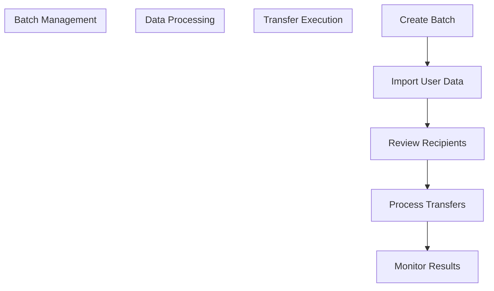
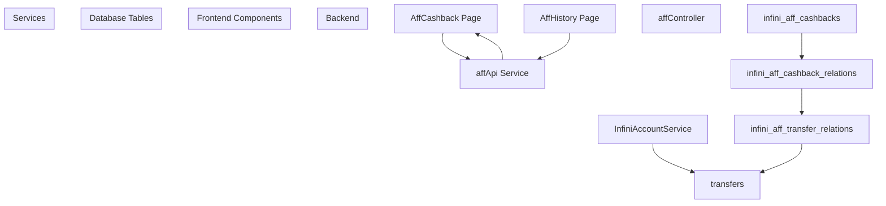
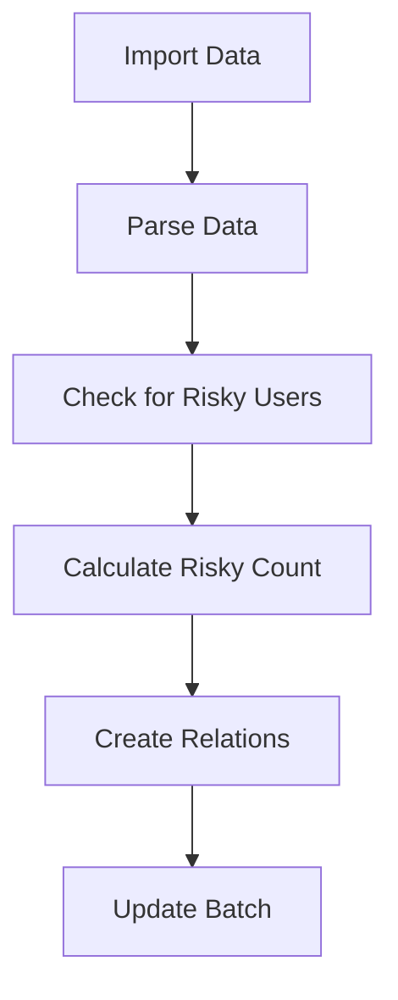
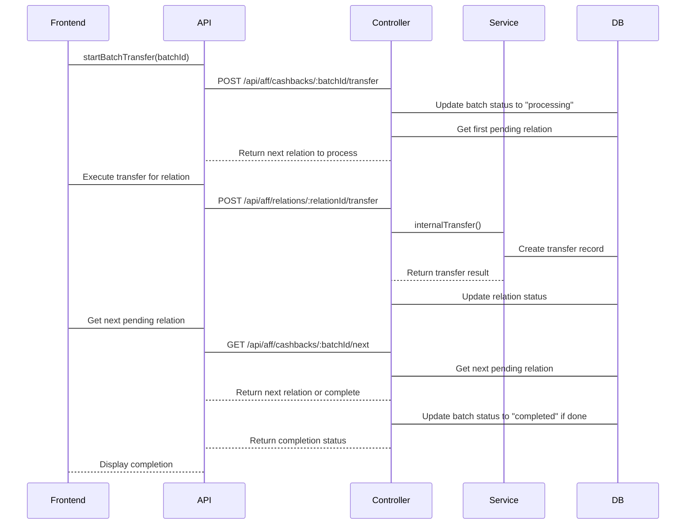
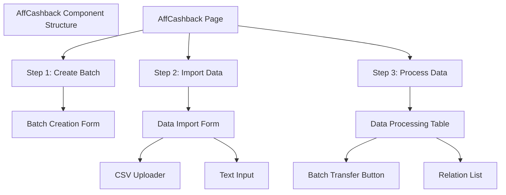
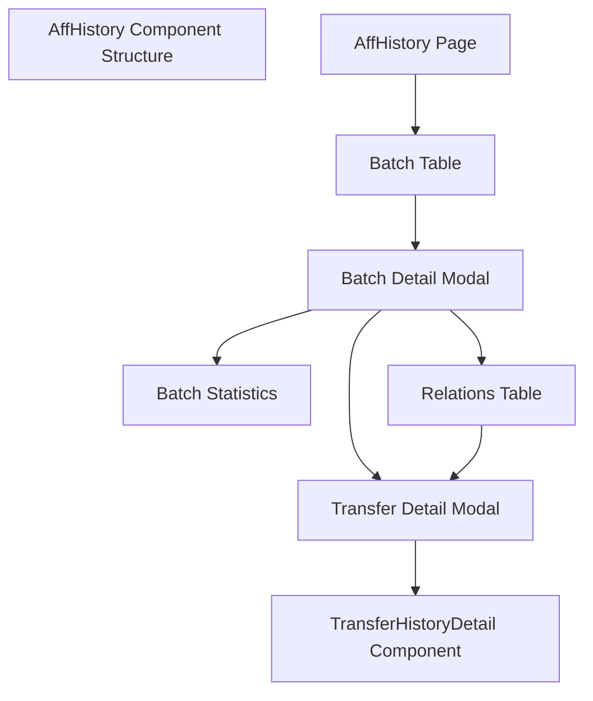
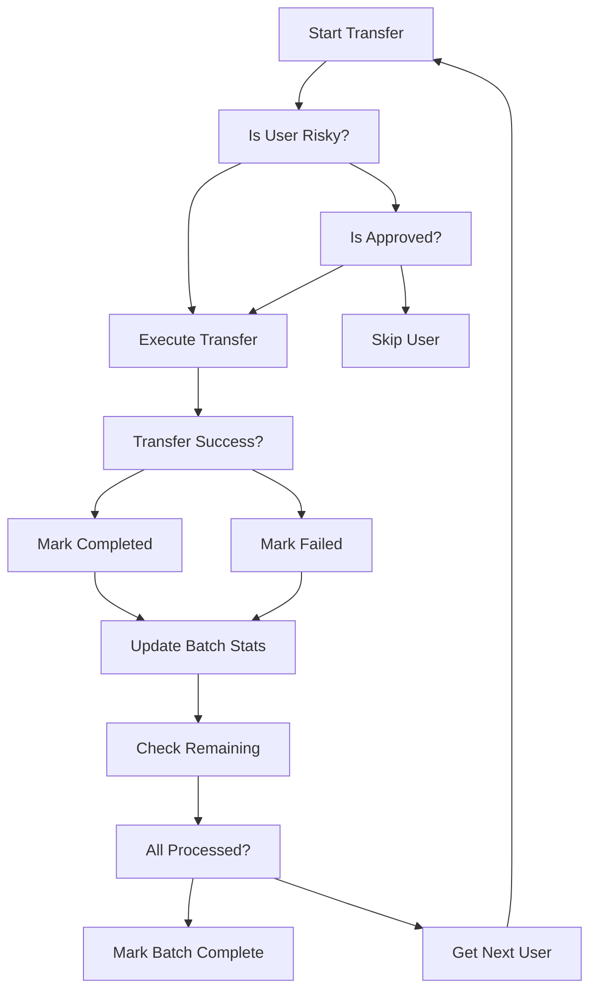

# AFF Cashback System

> **Relevant source files**
> * [backend/src/controllers/affController.ts](https://github.com/clionertr/infini-manager/blob/328b6a21/backend/src/controllers/affController.ts)
> * [frontend/src/pages/AffCashback/index.tsx](https://github.com/clionertr/infini-manager/blob/328b6a21/frontend/src/pages/AffCashback/index.tsx)
> * [frontend/src/pages/AffHistory/index.tsx](https://github.com/clionertr/infini-manager/blob/328b6a21/frontend/src/pages/AffHistory/index.tsx)

The AFF Cashback System is a feature within Infini Manager that enables batch processing of affiliate cashback payments. It provides the ability to create cashback batches, import user data via CSV or text input, review potential risky recipients, and execute transfers to multiple users efficiently.

## System Overview

The AFF Cashback System consists of two main interfaces:

1. The batch creation and processing interface where cashbacks are configured and executed
2. The history interface where past cashback operations can be reviewed and managed

The system provides a structured workflow for processing affiliate cashbacks:



Sources: [frontend/src/pages/AffCashback/index.tsx L79-L1188](https://github.com/clionertr/infini-manager/blob/328b6a21/frontend/src/pages/AffCashback/index.tsx#L79-L1188)

 [frontend/src/pages/AffHistory/index.tsx L93-L708](https://github.com/clionertr/infini-manager/blob/328b6a21/frontend/src/pages/AffHistory/index.tsx#L93-L708)

## System Architecture

The AFF Cashback system integrates several components across the frontend and backend:



Sources: [frontend/src/pages/AffCashback/index.tsx L5-L35](https://github.com/clionertr/infini-manager/blob/328b6a21/frontend/src/pages/AffCashback/index.tsx#L5-L35)

 [frontend/src/pages/AffHistory/index.tsx L5-L34](https://github.com/clionertr/infini-manager/blob/328b6a21/frontend/src/pages/AffHistory/index.tsx#L5-L34)

 [backend/src/controllers/affController.ts L5-L17](https://github.com/clionertr/infini-manager/blob/328b6a21/backend/src/controllers/affController.ts#L5-L17)

## Batch Creation and Management

The cashback process begins with creating a batch, which serves as a container for a set of cashback transfers.

### Batch Creation Process

1. **Select a source account**: Choose an account with sufficient balance for the transfers
2. **Provide batch details**: Name the batch and set default cashback amount
3. **Configure options**: Enable/disable automatic 2FA handling

Each batch maintains several status indicators:

* Total number of records
* Success count
* Failed count
* Risky user count

```
#mermaid-bbwtoscobvr{font-family:ui-sans-serif,-apple-system,system-ui,Segoe UI,Helvetica;font-size:16px;fill:#333;}@keyframes edge-animation-frame{from{stroke-dashoffset:0;}}@keyframes dash{to{stroke-dashoffset:0;}}#mermaid-bbwtoscobvr .edge-animation-slow{stroke-dasharray:9,5!important;stroke-dashoffset:900;animation:dash 50s linear infinite;stroke-linecap:round;}#mermaid-bbwtoscobvr .edge-animation-fast{stroke-dasharray:9,5!important;stroke-dashoffset:900;animation:dash 20s linear infinite;stroke-linecap:round;}#mermaid-bbwtoscobvr .error-icon{fill:#dddddd;}#mermaid-bbwtoscobvr .error-text{fill:#222222;stroke:#222222;}#mermaid-bbwtoscobvr .edge-thickness-normal{stroke-width:1px;}#mermaid-bbwtoscobvr .edge-thickness-thick{stroke-width:3.5px;}#mermaid-bbwtoscobvr .edge-pattern-solid{stroke-dasharray:0;}#mermaid-bbwtoscobvr .edge-thickness-invisible{stroke-width:0;fill:none;}#mermaid-bbwtoscobvr .edge-pattern-dashed{stroke-dasharray:3;}#mermaid-bbwtoscobvr .edge-pattern-dotted{stroke-dasharray:2;}#mermaid-bbwtoscobvr .marker{fill:#999;stroke:#999;}#mermaid-bbwtoscobvr .marker.cross{stroke:#999;}#mermaid-bbwtoscobvr svg{font-family:ui-sans-serif,-apple-system,system-ui,Segoe UI,Helvetica;font-size:16px;}#mermaid-bbwtoscobvr p{margin:0;}#mermaid-bbwtoscobvr defs #statediagram-barbEnd{fill:#999;stroke:#999;}#mermaid-bbwtoscobvr g.stateGroup text{fill:#dddddd;stroke:none;font-size:10px;}#mermaid-bbwtoscobvr g.stateGroup text{fill:#333;stroke:none;font-size:10px;}#mermaid-bbwtoscobvr g.stateGroup .state-title{font-weight:bolder;fill:#333;}#mermaid-bbwtoscobvr g.stateGroup rect{fill:#ffffff;stroke:#dddddd;}#mermaid-bbwtoscobvr g.stateGroup line{stroke:#999;stroke-width:1;}#mermaid-bbwtoscobvr .transition{stroke:#999;stroke-width:1;fill:none;}#mermaid-bbwtoscobvr .stateGroup .composit{fill:#f4f4f4;border-bottom:1px;}#mermaid-bbwtoscobvr .stateGroup .alt-composit{fill:#e0e0e0;border-bottom:1px;}#mermaid-bbwtoscobvr .state-note{stroke:#e6d280;fill:#fff5ad;}#mermaid-bbwtoscobvr .state-note text{fill:#333;stroke:none;font-size:10px;}#mermaid-bbwtoscobvr .stateLabel .box{stroke:none;stroke-width:0;fill:#ffffff;opacity:0.5;}#mermaid-bbwtoscobvr .edgeLabel .label rect{fill:#ffffff;opacity:0.5;}#mermaid-bbwtoscobvr .edgeLabel{background-color:#ffffff;text-align:center;}#mermaid-bbwtoscobvr .edgeLabel p{background-color:#ffffff;}#mermaid-bbwtoscobvr .edgeLabel rect{opacity:0.5;background-color:#ffffff;fill:#ffffff;}#mermaid-bbwtoscobvr .edgeLabel .label text{fill:#333;}#mermaid-bbwtoscobvr .label div .edgeLabel{color:#333;}#mermaid-bbwtoscobvr .stateLabel text{fill:#333;font-size:10px;font-weight:bold;}#mermaid-bbwtoscobvr .node circle.state-start{fill:#999;stroke:#999;}#mermaid-bbwtoscobvr .node .fork-join{fill:#999;stroke:#999;}#mermaid-bbwtoscobvr .node circle.state-end{fill:#dddddd;stroke:#f4f4f4;stroke-width:1.5;}#mermaid-bbwtoscobvr .end-state-inner{fill:#f4f4f4;stroke-width:1.5;}#mermaid-bbwtoscobvr .node rect{fill:#ffffff;stroke:#dddddd;stroke-width:1px;}#mermaid-bbwtoscobvr .node polygon{fill:#ffffff;stroke:#dddddd;stroke-width:1px;}#mermaid-bbwtoscobvr #statediagram-barbEnd{fill:#999;}#mermaid-bbwtoscobvr .statediagram-cluster rect{fill:#ffffff;stroke:#dddddd;stroke-width:1px;}#mermaid-bbwtoscobvr .cluster-label,#mermaid-bbwtoscobvr .nodeLabel{color:#333;}#mermaid-bbwtoscobvr .statediagram-cluster rect.outer{rx:5px;ry:5px;}#mermaid-bbwtoscobvr .statediagram-state .divider{stroke:#dddddd;}#mermaid-bbwtoscobvr .statediagram-state .title-state{rx:5px;ry:5px;}#mermaid-bbwtoscobvr .statediagram-cluster.statediagram-cluster .inner{fill:#f4f4f4;}#mermaid-bbwtoscobvr .statediagram-cluster.statediagram-cluster-alt .inner{fill:#f8f8f8;}#mermaid-bbwtoscobvr .statediagram-cluster .inner{rx:0;ry:0;}#mermaid-bbwtoscobvr .statediagram-state rect.basic{rx:5px;ry:5px;}#mermaid-bbwtoscobvr .statediagram-state rect.divider{stroke-dasharray:10,10;fill:#f8f8f8;}#mermaid-bbwtoscobvr .note-edge{stroke-dasharray:5;}#mermaid-bbwtoscobvr .statediagram-note rect{fill:#fff5ad;stroke:#e6d280;stroke-width:1px;rx:0;ry:0;}#mermaid-bbwtoscobvr .statediagram-note rect{fill:#fff5ad;stroke:#e6d280;stroke-width:1px;rx:0;ry:0;}#mermaid-bbwtoscobvr .statediagram-note text{fill:#333;}#mermaid-bbwtoscobvr .statediagram-note .nodeLabel{color:#333;}#mermaid-bbwtoscobvr .statediagram .edgeLabel{color:red;}#mermaid-bbwtoscobvr #dependencyStart,#mermaid-bbwtoscobvr #dependencyEnd{fill:#999;stroke:#999;stroke-width:1;}#mermaid-bbwtoscobvr .statediagramTitleText{text-anchor:middle;font-size:18px;fill:#333;}#mermaid-bbwtoscobvr :root{--mermaid-font-family:"trebuchet ms",verdana,arial,sans-serif;}Create BatchStart TransfersAll Transfers DoneTransfer ErrorsManual CloseManual Close"pending""processing""completed""failed""closed"
```

Sources: [frontend/src/pages/AffCashback/index.tsx L697-L796](https://github.com/clionertr/infini-manager/blob/328b6a21/frontend/src/pages/AffCashback/index.tsx#L697-L796)

 [backend/src/controllers/affController.ts L21-L88](https://github.com/clionertr/infini-manager/blob/328b6a21/backend/src/controllers/affController.ts#L21-L88)

## Data Import and Validation

The system provides two methods for importing user data:

1. **CSV file upload**: Standard CSV format with headers
2. **Text input**: Space-separated or custom-delimited text

### Data Format

The imported data requires the following fields:

| Field | Description | Required |
| --- | --- | --- |
| UID | Infini user identifier | Yes |
| Register Date | User registration date | No |
| Card Count | Number of cards issued | No |
| Card Date | Date when cards were issued | No |

### Risky User Identification

The system automatically flags users as risky if they appear in multiple cashback batches. This provides protection against duplicate cashbacks and requires manual approval.



Sources: [frontend/src/pages/AffCashback/index.tsx L794-L1006](https://github.com/clionertr/infini-manager/blob/328b6a21/frontend/src/pages/AffCashback/index.tsx#L794-L1006)

 [backend/src/controllers/affController.ts L93-L237](https://github.com/clionertr/infini-manager/blob/328b6a21/backend/src/controllers/affController.ts#L93-L237)

 [backend/src/controllers/affController.ts L1269-L1356](https://github.com/clionertr/infini-manager/blob/328b6a21/backend/src/controllers/affController.ts#L1269-L1356)

## Cashback Processing

After user data is imported, the system prepares the data for review and processing.

### Review and Adjustment

The interface provides a table view with the following capabilities:

* Approve risky users
* Ignore specific users
* Adjust cashback amounts
* View user details (registration date, card count, etc.)

### Batch Transfer Execution

The system supports two transfer execution approaches:

1. **Batch processing**: Execute all transfers sequentially
2. **Individual processing**: Manually trigger transfers for specific users



Sources: [frontend/src/pages/AffCashback/index.tsx L1008-L1164](https://github.com/clionertr/infini-manager/blob/328b6a21/frontend/src/pages/AffCashback/index.tsx#L1008-L1164)

 [backend/src/controllers/affController.ts L551-L826](https://github.com/clionertr/infini-manager/blob/328b6a21/backend/src/controllers/affController.ts#L551-L826)

## API Endpoints

The AFF Cashback system exposes the following key API endpoints:

| Endpoint | Method | Description |
| --- | --- | --- |
| `/api/aff/cashbacks` | POST | Create new cashback batch |
| `/api/aff/cashbacks` | GET | List all cashback batches |
| `/api/aff/cashbacks/:batchId/parse` | POST | Parse and import user data |
| `/api/aff/cashbacks/:batchId/relations` | GET | Get all relations for a batch |
| `/api/aff/cashbacks/:batchId/transfer` | POST | Start batch transfer |
| `/api/aff/cashbacks/:batchId/next` | GET | Get next pending relation |
| `/api/aff/relations/:relationId/status` | PUT | Update relation status |
| `/api/aff/relations/:relationId/amount` | PUT | Update relation amount |
| `/api/aff/relations/:relationId/transfer` | POST | Execute transfer for relation |

Sources: [backend/src/controllers/affController.ts L21-L1377](https://github.com/clionertr/infini-manager/blob/328b6a21/backend/src/controllers/affController.ts#L21-L1377)

## Database Schema

The AFF Cashback system uses three primary database tables:

### infini_aff_cashbacks

Stores information about each cashback batch:

| Column | Type | Description |
| --- | --- | --- |
| id | integer | Primary key |
| account_id | integer | Source account ID |
| batch_name | string | Batch identifier |
| default_amount | float | Default cashback amount |
| is_auto_2fa | boolean | Whether to handle 2FA automatically |
| status | string | Batch status (pending, processing, completed, failed, closed) |
| total_count | integer | Total number of relations |
| success_count | integer | Number of successful transfers |
| failed_count | integer | Number of failed transfers |
| risky_count | integer | Number of risky users |
| total_amount | float | Total amount transferred |
| created_at | datetime | Creation timestamp |
| completed_at | datetime | Completion timestamp |

### infini_aff_cashback_relations

Links batch to recipient users:

| Column | Type | Description |
| --- | --- | --- |
| id | integer | Primary key |
| aff_cashback_id | integer | References infini_aff_cashbacks |
| infini_uid | string | Recipient user ID |
| sequence_number | string | Import sequence number |
| amount | float | Transfer amount |
| is_risky | boolean | Whether user is risky |
| is_approved | boolean | Whether risky user is approved |
| is_ignored | boolean | Whether to ignore this user |
| status | string | Relation status |
| transfer_id | integer | References transfers table |
| register_date | datetime | User registration date |
| card_count | integer | Number of cards |
| card_date | datetime | Card issuance date |

### infini_aff_transfer_relations

Associates transfers with cashback relations:

| Column | Type | Description |
| --- | --- | --- |
| id | integer | Primary key |
| aff_cashback_id | integer | References infini_aff_cashbacks |
| aff_relation_id | integer | References infini_aff_cashback_relations |
| transfer_id | integer | References transfers table |
| status | string | Transfer status |
| created_at | datetime | Creation timestamp |

Sources: [backend/src/controllers/affController.ts L64-L72](https://github.com/clionertr/infini-manager/blob/328b6a21/backend/src/controllers/affController.ts#L64-L72)

 [backend/src/controllers/affController.ts L195-L209](https://github.com/clionertr/infini-manager/blob/328b6a21/backend/src/controllers/affController.ts#L195-L209)

 [backend/src/controllers/affController.ts L634-L641](https://github.com/clionertr/infini-manager/blob/328b6a21/backend/src/controllers/affController.ts#L634-L641)

## User Interface Components

The AFF Cashback system is comprised of two main interfaces:

### 1. AFF Cashback Page

The main interface for creating and managing cashback batches, consisting of three main steps:

1. **Create Batch**

* Select source account
* Configure batch details and options
2. **Import Data**

* Upload CSV file or enter text data
* Configure data format and field mapping
3. **Process Data**

* Review imported data
* Approve risky users
* Adjust cashback amounts
* Execute transfers

The interface uses a step-by-step approach with a progress indicator to guide users through the process.



Sources: [frontend/src/pages/AffCashback/index.tsx L1166-L1188](https://github.com/clionertr/infini-manager/blob/328b6a21/frontend/src/pages/AffCashback/index.tsx#L1166-L1188)

 [frontend/src/pages/AffCashback/index.tsx L697-L796](https://github.com/clionertr/infini-manager/blob/328b6a21/frontend/src/pages/AffCashback/index.tsx#L697-L796)

 [frontend/src/pages/AffCashback/index.tsx L794-L1006](https://github.com/clionertr/infini-manager/blob/328b6a21/frontend/src/pages/AffCashback/index.tsx#L794-L1006)

 [frontend/src/pages/AffCashback/index.tsx L1008-L1164](https://github.com/clionertr/infini-manager/blob/328b6a21/frontend/src/pages/AffCashback/index.tsx#L1008-L1164)

### 2. AFF History Page

The interface for reviewing and managing past cashback batches:

* View all batches with pagination
* See detailed batch statistics
* Review individual relations within a batch
* View transfer details for each relation
* Manually mark batches as completed or closed



Sources: [frontend/src/pages/AffHistory/index.tsx L93-L708](https://github.com/clionertr/infini-manager/blob/328b6a21/frontend/src/pages/AffHistory/index.tsx#L93-L708)

 [frontend/src/pages/AffHistory/index.tsx L606-L705](https://github.com/clionertr/infini-manager/blob/328b6a21/frontend/src/pages/AffHistory/index.tsx#L606-L705)

## Error Handling and Risk Management

The system includes several safeguards and error handling mechanisms:

1. **Risky User Detection**: Users who appear in multiple batches are flagged for manual review
2. **Transfer Error Handling**: Failed transfers don't stop the batch process
3. **Manual Approval**: Risky users require explicit approval before transfer
4. **Batch Closure**: Batches can be manually closed to prevent further processing
5. **Status Tracking**: All transfers have clear status indicators



Sources: [backend/src/controllers/affController.ts L551-L710](https://github.com/clionertr/infini-manager/blob/328b6a21/backend/src/controllers/affController.ts#L551-L710)

 [frontend/src/pages/AffCashback/index.tsx L402-L480](https://github.com/clionertr/infini-manager/blob/328b6a21/frontend/src/pages/AffCashback/index.tsx#L402-L480)

## Integration with Other Systems

The AFF Cashback system integrates with several other components of the Infini Manager:

1. **Account Management**: Uses infini accounts as source for transfers
2. **Transfer System**: Leverages the internal transfer functionality
3. **2FA System**: Optionally handles 2FA verification during transfers
4. **Transfer History**: Links to the transfer history view

This tight integration allows for a seamless experience when processing affiliate cashbacks while maintaining all security and verification standards.

Sources: [frontend/src/pages/AffCashback/index.tsx

30](https://github.com/clionertr/infini-manager/blob/328b6a21/frontend/src/pages/AffCashback/index.tsx#L30-L30)

 [backend/src/controllers/affController.ts L5-L17](https://github.com/clionertr/infini-manager/blob/328b6a21/backend/src/controllers/affController.ts#L5-L17)