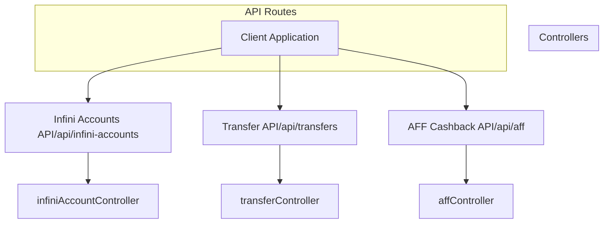
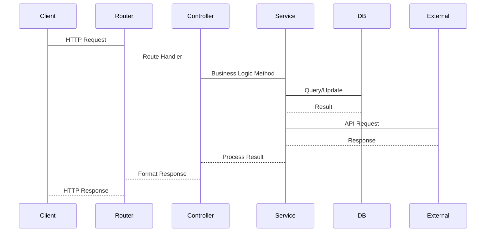
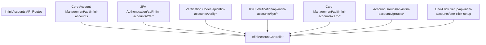
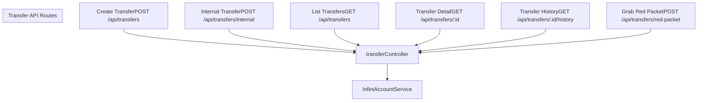
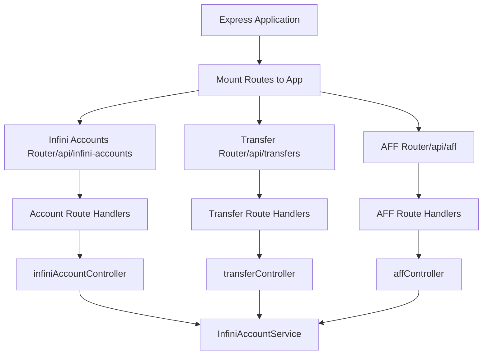

# API Routes

> **Relevant source files**
> * [backend/src/controllers/affController.ts](https://github.com/clionertr/infini-manager/blob/328b6a21/backend/src/controllers/affController.ts)
> * [backend/src/controllers/infiniAccountController.ts](https://github.com/clionertr/infini-manager/blob/328b6a21/backend/src/controllers/infiniAccountController.ts)
> * [backend/src/controllers/transferController.ts](https://github.com/clionertr/infini-manager/blob/328b6a21/backend/src/controllers/transferController.ts)
> * [backend/src/routes/infiniAccounts.ts](https://github.com/clionertr/infini-manager/blob/328b6a21/backend/src/routes/infiniAccounts.ts)

This page documents the available API routes in the Infini Manager system, their functionalities, and how they are organized. The API serves as the interface between the frontend application and the backend services, enabling operations related to Infini accounts, transfers, and affiliate cashbacks.

For information about controllers that implement the business logic for these routes, see [Controllers](/clionertr/infini-manager/3.2-controllers).

## API Structure Overview

The Infini Manager API is organized into several logical groupings based on functionality. Each route group corresponds to specific controllers that handle the business logic.



Sources: [backend/src/routes/infiniAccounts.ts](https://github.com/clionertr/infini-manager/blob/328b6a21/backend/src/routes/infiniAccounts.ts)

 [backend/src/controllers/infiniAccountController.ts](https://github.com/clionertr/infini-manager/blob/328b6a21/backend/src/controllers/infiniAccountController.ts)

 [backend/src/controllers/transferController.ts](https://github.com/clionertr/infini-manager/blob/328b6a21/backend/src/controllers/transferController.ts)

 [backend/src/controllers/affController.ts](https://github.com/clionertr/infini-manager/blob/328b6a21/backend/src/controllers/affController.ts)

## API Request Flow

The following diagram illustrates how API requests flow through the system:



Sources: [backend/src/routes/infiniAccounts.ts](https://github.com/clionertr/infini-manager/blob/328b6a21/backend/src/routes/infiniAccounts.ts)

 [backend/src/controllers/infiniAccountController.ts](https://github.com/clionertr/infini-manager/blob/328b6a21/backend/src/controllers/infiniAccountController.ts)

## Infini Accounts API Routes

The Infini Accounts API provides endpoints for managing Infini accounts, including account creation, synchronization, 2FA setup, KYC verification, and card management.

### Base URL: /api/infini-accounts

#### Core Account Management

| Method | Endpoint | Description | Controller Function |
| --- | --- | --- | --- |
| GET | `/` | Get all Infini accounts | `getAllInfiniAccounts` |
| GET | `/:id` | Get single account by ID | `getInfiniAccountById` |
| POST | `/` | Create new Infini account | `createInfiniAccount` |
| PUT | `/:id` | Update account information | `updateInfiniAccount` |
| DELETE | `/:id` | Delete account | `deleteInfiniAccount` |
| POST | `/:id/sync` | Synchronize single account | `syncInfiniAccount` |
| POST | `/sync-all` | Synchronize all accounts | `syncAllInfiniAccounts` |
| POST | `/sync-all-kyc` | Synchronize all KYC information | `syncAllInfiniAccountsKyc` |
| POST | `/login` | Test account login credentials | `loginInfiniAccount` |

Sources: [backend/src/routes/infiniAccounts.ts L482-L546](https://github.com/clionertr/infini-manager/blob/328b6a21/backend/src/routes/infiniAccounts.ts#L482-L546)

 [backend/src/controllers/infiniAccountController.ts L321-L477](https://github.com/clionertr/infini-manager/blob/328b6a21/backend/src/controllers/infiniAccountController.ts#L321-L477)

#### 2FA Authentication Routes

| Method | Endpoint | Description | Controller Function |
| --- | --- | --- | --- |
| GET | `/2fa/qrcode` | Get 2FA QR code | `getGoogle2faQrcode` |
| POST | `/2fa/verify-email` | Send 2FA verification email | `sendGoogle2faVerificationEmail` |
| POST | `/2fa/bind` | Bind 2FA to account | `bindGoogle2fa` |
| PUT | `/2fa/info/:accountId` | Update 2FA information | `update2faInfo` |

Sources: [backend/src/routes/infiniAccounts.ts L59-L117](https://github.com/clionertr/infini-manager/blob/328b6a21/backend/src/routes/infiniAccounts.ts#L59-L117)

 [backend/src/controllers/infiniAccountController.ts L89-L198](https://github.com/clionertr/infini-manager/blob/328b6a21/backend/src/controllers/infiniAccountController.ts#L89-L198)

 [backend/src/routes/infiniAccounts.ts

1218](https://github.com/clionertr/infini-manager/blob/328b6a21/backend/src/routes/infiniAccounts.ts#L1218-L1218)

 [backend/src/controllers/infiniAccountController.ts L841-L876](https://github.com/clionertr/infini-manager/blob/328b6a21/backend/src/controllers/infiniAccountController.ts#L841-L876)

#### Verification Code Routes

| Method | Endpoint | Description | Controller Function |
| --- | --- | --- | --- |
| POST | `/verify` | Send verification code | `sendVerificationCode` |
| GET | `/verify-code` | Fetch verification code from email | `fetchVerificationCode` |
| POST | `/verify-and-wait` | Send verification code and wait for it | `sendAndWaitVerificationCode` |

Sources: [backend/src/routes/infiniAccounts.ts L144-L427](https://github.com/clionertr/infini-manager/blob/328b6a21/backend/src/routes/infiniAccounts.ts#L144-L427)

 [backend/src/controllers/infiniAccountController.ts L242-L316](https://github.com/clionertr/infini-manager/blob/328b6a21/backend/src/controllers/infiniAccountController.ts#L242-L316)

 [backend/src/controllers/infiniAccountController.ts L203-L233](https://github.com/clionertr/infini-manager/blob/328b6a21/backend/src/controllers/infiniAccountController.ts#L203-L233)

#### KYC Verification Routes

| Method | Endpoint | Description | Controller Function |
| --- | --- | --- | --- |
| POST | `/kyc/upload` | Upload KYC image | `uploadKycImage` |
| POST | `/kyc/passport` | Submit passport KYC | `submitPassportKyc` |
| GET | `/kyc/information/:accountId` | Get KYC information | `getKycInformation` |
| GET | `/kyc/basic/information/:accountId` | Get basic user information | `getBasicInformation` |

Sources: [backend/src/routes/infiniAccounts.ts L173-L375](https://github.com/clionertr/infini-manager/blob/328b6a21/backend/src/routes/infiniAccounts.ts#L173-L375)

 [backend/src/controllers/infiniAccountController.ts L41-L84](https://github.com/clionertr/infini-manager/blob/328b6a21/backend/src/controllers/infiniAccountController.ts#L41-L84)

 [backend/src/controllers/infiniAccountController.ts L488-L648](https://github.com/clionertr/infini-manager/blob/328b6a21/backend/src/controllers/infiniAccountController.ts#L488-L648)

#### Card Management Routes

| Method | Endpoint | Description | Controller Function |
| --- | --- | --- | --- |
| GET | `/card/price/:accountId` | Get card pricing | `getCardPrice` |
| GET | `/card/available/:accountId` | Get available card types | `getAvailableCardTypes` |
| POST | `/card/create/:accountId` | Create a card | `createCard` |
| GET | `/card/list/:accountId` | Get account's card list | `getCardList` |

Sources: [backend/src/routes/infiniAccounts.ts L998-L1173](https://github.com/clionertr/infini-manager/blob/328b6a21/backend/src/routes/infiniAccounts.ts#L998-L1173)

 [backend/src/controllers/infiniAccountController.ts L690-L834](https://github.com/clionertr/infini-manager/blob/328b6a21/backend/src/controllers/infiniAccountController.ts#L690-L834)

#### Account Groups Routes

| Method | Endpoint | Description | Controller Function |
| --- | --- | --- | --- |
| GET | `/groups` | Get all account groups | `getAllAccountGroups` |
| GET | `/groups/:id` | Get group by ID | `getAccountGroupById` |
| POST | `/groups` | Create account group | `createAccountGroup` |
| PUT | `/groups/:id` | Update account group | `updateAccountGroup` |
| DELETE | `/groups/:id` | Delete account group | `deleteAccountGroup` |
| POST | `/groups/account/add` | Add account to group | `addAccountToGroup` |
| POST | `/groups/accounts/add` | Add multiple accounts to group | `addAccountsToGroup` |
| POST | `/groups/account/remove` | Remove account from group | `removeAccountFromGroup` |
| POST | `/groups/accounts/remove` | Remove multiple accounts from group | `removeAccountsFromGroup` |

Sources: [backend/src/routes/infiniAccounts.ts L561-L1510](https://github.com/clionertr/infini-manager/blob/328b6a21/backend/src/routes/infiniAccounts.ts#L561-L1510)

 [backend/src/controllers/infiniAccountController.ts L881-L1127](https://github.com/clionertr/infini-manager/blob/328b6a21/backend/src/controllers/infiniAccountController.ts#L881-L1127)

#### One-Click Setup Route

| Method | Endpoint | Description | Controller Function |
| --- | --- | --- | --- |
| POST | `/one-click-setup` | Automated account setup | `oneClickAccountSetup` |

Sources: [backend/src/routes/infiniAccounts.ts

1604](https://github.com/clionertr/infini-manager/blob/328b6a21/backend/src/routes/infiniAccounts.ts#L1604-L1604)

 [backend/src/controllers/infiniAccountController.ts L1133-L1679](https://github.com/clionertr/infini-manager/blob/328b6a21/backend/src/controllers/infiniAccountController.ts#L1133-L1679)



Sources: [backend/src/routes/infiniAccounts.ts](https://github.com/clionertr/infini-manager/blob/328b6a21/backend/src/routes/infiniAccounts.ts)

 [backend/src/controllers/infiniAccountController.ts](https://github.com/clionertr/infini-manager/blob/328b6a21/backend/src/controllers/infiniAccountController.ts)

## Transfer API Routes

The Transfer API provides endpoints for managing fund transfers between accounts, including internal transfers, retrieving transfer records, and handling red packets.

### Base URL: /api/transfers

| Method | Endpoint | Description | Controller Function |
| --- | --- | --- | --- |
| POST | `/` | Create a new transfer | `createTransfer` |
| POST | `/internal` | Execute internal transfer | `executeInternalTransfer` |
| GET | `/` | Get list of transfers | `getTransfers` |
| GET | `/:id` | Get transfer by ID | `getTransferById` |
| GET | `/:id/history` | Get transfer history | `getTransferHistory` |
| POST | `/red-packet` | Grab a red packet | `grabRedPacket` |

Sources: [backend/src/controllers/transferController.ts L18-L394](https://github.com/clionertr/infini-manager/blob/328b6a21/backend/src/controllers/transferController.ts#L18-L394)



Sources: [backend/src/controllers/transferController.ts](https://github.com/clionertr/infini-manager/blob/328b6a21/backend/src/controllers/transferController.ts)

## AFF Cashback API Routes

The AFF (Affiliate) Cashback API provides endpoints for managing affiliate cashback operations, including batch processing, data parsing, and executing transfers.

### Base URL: /api/aff

| Method | Endpoint | Description | Controller Function |
| --- | --- | --- | --- |
| POST | `/cashbacks` | Create cashback batch | `createAffCashback` |
| POST | `/cashbacks/:batchId/parse` | Parse AFF data | `parseAffData` |
| GET | `/cashbacks` | Get all cashback batches | `getAffCashbacks` |
| GET | `/cashbacks/:id` | Get batch by ID | `getAffCashbackById` |
| GET | `/cashbacks/:batchId/relations` | Get batch relations | `getAffCashbackRelations` |
| POST | `/cashbacks/:batchId/start` | Start batch transfer | `startBatchTransfer` |
| GET | `/cashbacks/:batchId/next` | Get next pending relation | `getNextPendingRelation` |
| POST | `/relations/:relationId/transfer` | Execute transfer | `executeTransfer` |
| PUT | `/relations/:relationId/status` | Update relation status | `updateRelationStatus` |
| PUT | `/relations/:relationId/amount` | Update AFF amount | `updateAffAmount` |
| PUT | `/cashbacks/:batchId/amount` | Update all pending amounts | `updateAllPendingAmount` |
| POST | `/cashbacks/:batchId/close` | Close cashback batch | `closeCashback` |
| POST | `/cashbacks/:batchId/complete` | Mark batch as completed | `markCashbackAsCompleted` |
| GET | `/max-batch-id` | Get maximum batch ID | `getMaxBatchId` |

Sources: [backend/src/controllers/affController.ts L21-L1377](https://github.com/clionertr/infini-manager/blob/328b6a21/backend/src/controllers/affController.ts#L21-L1377)

```mermaid
flowchart TD

subgraph AFF_Cashback_API_Routes ["AFF Cashback API Routes"]
end

CreateBatch["Create BatchPOST /api/aff/cashbacks"]
ParseData["Parse DataPOST /api/aff/cashbacks/:batchId/parse"]
GetBatches["Get BatchesGET /api/aff/cashbacks"]
GetBatch["Get BatchGET /api/aff/cashbacks/:id"]
GetRelations["Get RelationsGET /api/aff/cashbacks/:batchId/relations"]
StartTransfer["Start TransferPOST /api/aff/cashbacks/:batchId/start"]
GetNextRelation["Get Next RelationGET /api/aff/cashbacks/:batchId/next"]
ExecuteTransfer["Execute TransferPOST /api/aff/relations/:relationId/transfer"]
UpdateStatus["Update StatusPUT /api/aff/relations/:relationId/status"]
UpdateAmount["Update AmountPUT /api/aff/relations/:relationId/amount"]
UpdateAllAmounts["Update All AmountsPUT /api/aff/cashbacks/:batchId/amount"]
CloseBatch["Close BatchPOST /api/aff/cashbacks/:batchId/close"]
CompleteBatch["Complete BatchPOST /api/aff/cashbacks/:batchId/complete"]
AffController["affController"]
InfiniAccountService["InfiniAccountService"]

    CreateBatch --> AffController
    ParseData --> AffController
    GetBatches --> AffController
    GetBatch --> AffController
    GetRelations --> AffController
    StartTransfer --> AffController
    GetNextRelation --> AffController
    ExecuteTransfer --> AffController
    UpdateStatus --> AffController
    UpdateAmount --> AffController
    UpdateAllAmounts --> AffController
    CloseBatch --> AffController
    CompleteBatch --> AffController
    AffController --> InfiniAccountService
```



Sources: [backend/src/controllers/affController.ts](https://github.com/clionertr/infini-manager/blob/328b6a21/backend/src/controllers/affController.ts)

## API Response Format

All API endpoints follow a consistent response format, ensuring that client applications can handle responses uniformly. The standard response structure is:

```
{
  "success": true|false,
  "message": "Optional message describing the result",
  "data": {
    // Response data (when applicable)
  }
}
```

### Success Responses

For successful operations, the `success` field is set to `true`, and the `data` field contains the response data. The HTTP status code is typically:

* 200 for successful GET, PUT, PATCH, and DELETE operations
* 201 for successful POST operations that create resources

### Error Responses

For failed operations, the `success` field is set to `false`, and the `message` field contains error details. The HTTP status code indicates the type of error:

* 400 Bad Request: Invalid input
* 401 Unauthorized: Authentication required
* 403 Forbidden: Insufficient permissions
* 404 Not Found: Resource not found
* 500 Internal Server Error: Server-side error

Example error handling from controllers:

```
// Error handling pattern used in controllers
try {
  // Process request
  // ...
  
  if (response.success) {
    res.json(response);
  } else {
    res.status(500).json(response);
  }
} catch (error) {
  console.error('Operation failed:', error);
  res.status(500).json({
    success: false,
    message: `Operation failed: ${(error as Error).message}`
  });
}
```

Sources: [backend/src/controllers/infiniAccountController.ts L77-L84](https://github.com/clionertr/infini-manager/blob/328b6a21/backend/src/controllers/infiniAccountController.ts#L77-L84)

 [backend/src/controllers/affController.ts L84-L87](https://github.com/clionertr/infini-manager/blob/328b6a21/backend/src/controllers/affController.ts#L84-L87)

 [backend/src/controllers/transferController.ts L67-L70](https://github.com/clionertr/infini-manager/blob/328b6a21/backend/src/controllers/transferController.ts#L67-L70)

## API Route Implementation

The API routes are implemented using Express.js. Each logical group of routes is defined in its own router file. The routes are then imported and mounted in the main application.

Here's an overview of how routes are implemented:



Sources: [backend/src/routes/infiniAccounts.ts L4-L1605](https://github.com/clionertr/infini-manager/blob/328b6a21/backend/src/routes/infiniAccounts.ts#L4-L1605)

## Summary

The Infini Manager API provides a comprehensive set of endpoints for managing Infini accounts, transfers, and affiliate cashbacks. The API follows RESTful principles and provides a consistent response format across all endpoints. The routes are organized into logical groups based on functionality, each with its dedicated controller for handling business logic.

Key features of the API include:

* Account management (creation, update, deletion, synchronization)
* 2FA authentication
* KYC verification
* Card management
* Fund transfers
* AFF cashback processing
* Account grouping

This API serves as the bridge between the frontend application and the backend services, enabling all the core functionality of the Infini Manager system.