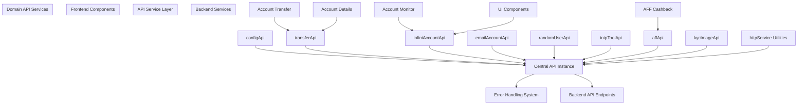
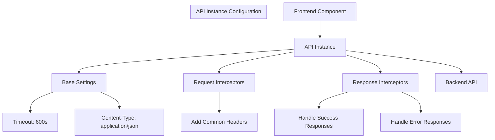
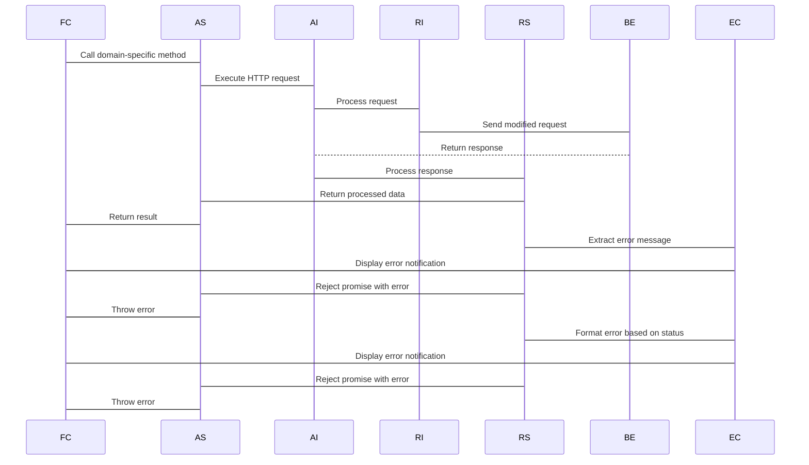
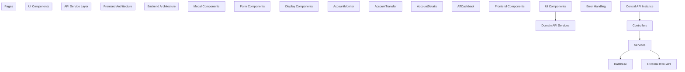

# API Service Layer

> **Relevant source files**
> * [frontend/src/services/api.ts](https://github.com/clionertr/infini-manager/blob/328b6a21/frontend/src/services/api.ts)

The API Service Layer is a centralized frontend service that organizes all API communications between the frontend application and the backend services. It provides a consistent interface for making API requests, handles error scenarios uniformly, and organizes endpoints into logical domain-specific groups.

This layer acts as an abstraction over the direct HTTP calls, ensuring that all API interactions follow consistent patterns, error handling, and logging throughout the application.

## Core Architecture

The API Service Layer is built around a central axios instance that handles all HTTP communications. This instance is configured with default settings and enhanced with request and response interceptors to provide consistent error handling.



Sources: [frontend/src/services/api.ts L8-L20](https://github.com/clionertr/infini-manager/blob/328b6a21/frontend/src/services/api.ts#L8-L20)

 [frontend/src/services/api.ts L1051-L1168](https://github.com/clionertr/infini-manager/blob/328b6a21/frontend/src/services/api.ts#L1051-L1168)

## Central API Instance

The foundation of the API Service Layer is a centralized axios instance that handles all HTTP communications:



The API instance is configured with:

* A 10-minute timeout for long-running operations
* JSON content type header by default
* Error interceptors that provide consistent error handling
* Configurable base URL from application settings

Sources: [frontend/src/services/api.ts L15-L24](https://github.com/clionertr/infini-manager/blob/328b6a21/frontend/src/services/api.ts#L15-L24)

## Domain-Specific API Services

The API Service Layer organizes endpoints into domain-specific API services, each responsible for a particular functionality area:

| API Service | Description | Key Functionality |
| --- | --- | --- |
| configApi | System configuration management | Get/set application configuration values |
| transferApi | Fund transfer operations | Execute transfers, manage transfer records |
| infiniAccountApi | Infini account management | Account creation, 2FA setup, KYC verification |
| emailAccountApi | Email account management | Create/update email accounts for verification |
| randomUserApi | Random user generation | Generate user information for account creation |
| totpToolApi | Two-factor authentication tools | Generate TOTP codes and QR codes |
| affApi | Affiliate cashback system | Manage cashback batches and transfers |
| kycImageApi | KYC image management | Store and retrieve KYC verification images |

Each service encapsulates related API endpoints and provides a clean interface for components to interact with specific backend functionality.

Sources: [frontend/src/services/api.ts L30-L1049](https://github.com/clionertr/infini-manager/blob/328b6a21/frontend/src/services/api.ts#L30-L1049)

## Request and Response Flow

The API Service Layer implements a comprehensive request and response flow with built-in error handling:



This flow ensures that:

1. All requests pass through a consistent pipeline
2. Error handling is standardized across the application
3. Error messages are displayed to users in a consistent format
4. Components can handle specific error cases when needed

Sources: [frontend/src/services/api.ts L1051-L1168](https://github.com/clionertr/infini-manager/blob/328b6a21/frontend/src/services/api.ts#L1051-L1168)

## Error Handling Architecture

The API Service Layer implements a robust error handling system through axios interceptors:

### Request Interceptor

* Intercepts outgoing requests
* Can add common headers or authentication tokens
* Handles request configuration errors

### Response Interceptor

* Processes all responses before they reach components
* Handles both HTTP errors and application-level errors
* Extracts error messages from different response formats
* Displays user-friendly error notifications
* Still allows components to catch and handle specific errors

The error handling system distinguishes between different types of errors:

1. Application-level errors (HTTP 200, but `success: false` in response)
2. HTTP errors with specific status codes (400, 401, 403, etc.)
3. Network errors (no response from server)
4. Request configuration errors

Sources: [frontend/src/services/api.ts L1051-L1168](https://github.com/clionertr/infini-manager/blob/328b6a21/frontend/src/services/api.ts#L1051-L1168)

## API Services Details

### Configuration API (configApi)

Manages system-wide configuration values:

* `getAllConfigs()`: Retrieve all configuration settings
* `getConfigByKey(key)`: Get a specific configuration value
* `upsertConfig(key, value, description)`: Create or update a configuration
* `deleteConfig(key)`: Remove a configuration

Sources: [frontend/src/services/api.ts L30-L78](https://github.com/clionertr/infini-manager/blob/328b6a21/frontend/src/services/api.ts#L30-L78)

### Transfer API (transferApi)

Handles all fund transfer operations:

* `executeInternalTransfer(...)`: Execute transfers between accounts
* `grabRedPacket(accountId, code)`: Claim a red packet for an account
* `batchGrabRedPacket(accountIds, code)`: Claim a red packet for multiple accounts
* `getTransfers(accountId, status, page, pageSize)`: Get transfer records with pagination
* `getTransferById(id)`: Get details of a specific transfer
* `getTransferHistory(id)`: Get the timeline of a transfer's status changes

Sources: [frontend/src/services/api.ts L84-L250](https://github.com/clionertr/infini-manager/blob/328b6a21/frontend/src/services/api.ts#L84-L250)

### Infini Account API (infiniAccountApi)

Manages all operations related to Infini accounts:

* Account registration and verification
* Two-factor authentication (2FA) setup
* KYC (Know Your Customer) verification
* Account information management
* One-click account setup with automated processes
* Account grouping and organization

This is the most comprehensive service, handling everything from account creation to verification and organization.

Sources: [frontend/src/services/api.ts L256-L590](https://github.com/clionertr/infini-manager/blob/328b6a21/frontend/src/services/api.ts#L256-L590)

### Email Account API (emailAccountApi)

Manages email accounts used for verification and communication:

* `getAllEmailAccounts()`: List all email accounts
* `getEmailAccountById(id)`: Get a specific email account's details
* `createEmailAccount(data)`: Create a new email account
* `updateEmailAccount(id, data)`: Update an existing email account
* `deleteEmailAccount(id)`: Remove an email account
* `testEmailAccount(id)`: Test email functionality
* `getTestResult(testId)`: Check email test results

Sources: [frontend/src/services/api.ts L596-L680](https://github.com/clionertr/infini-manager/blob/328b6a21/frontend/src/services/api.ts#L596-L680)

### Other Specialized APIs

The API Service Layer also includes specialized services for:

* Random user generation (`randomUserApi`)
* TOTP tools for 2FA management (`totpToolApi`)
* Affiliate cashback processing (`affApi`)
* KYC image management (`kycImageApi`)

These services provide focused functionality for specific application features, making the code more modular and maintainable.

Sources: [frontend/src/services/api.ts L685-L1049](https://github.com/clionertr/infini-manager/blob/328b6a21/frontend/src/services/api.ts#L685-L1049)

## Utility Methods

The API Service Layer also provides convenient utility methods through the `httpService` object:

```
httpService.get<T>(url, params?, config?)
httpService.post<T>(url, data?, config?)
httpService.put<T>(url, data?, config?)
httpService.delete<T>(url, config?)
```

These methods offer simpler access to HTTP operations while still leveraging the centralized error handling provided by the API instance.

Sources: [frontend/src/services/api.ts L1174-L1237](https://github.com/clionertr/infini-manager/blob/328b6a21/frontend/src/services/api.ts#L1174-L1237)

## Usage Patterns

The API Service Layer can be used in three main ways:

### 1. Domain-Specific API Services (Recommended)

```
import { infiniAccountApi } from '../../services/api';

async function createAccount() {
  try {
    const response = await infiniAccountApi.createAccount(email, password);
    // Handle success
  } catch (error) {
    // Handle specific error cases (global handling already done)
  }
}
```

### 2. Direct API Instance

```
import api from '../../services/api';

async function customApiCall() {
  try {
    const response = await api.get('/custom/endpoint');
    // Handle response
  } catch (error) {
    // Handle specific error cases
  }
}
```

### 3. HTTP Service Utilities

```
import { httpService } from '../../services/api';

async function getData() {
  try {
    const data = await httpService.get('/endpoint');
    // Process data
  } catch (error) {
    // Handle specific errors
  }
}
```

Sources: [frontend/src/services/api.ts L1246-L1274](https://github.com/clionertr/infini-manager/blob/328b6a21/frontend/src/services/api.ts#L1246-L1274)

## Integration with System Architecture

The API Service Layer plays a central role in the overall system architecture, connecting the frontend components to the backend services:



The API Service Layer acts as the bridge between frontend components and backend services, providing a clean separation of concerns while ensuring consistent communication patterns.

Sources: [frontend/src/services/api.ts L1-L24](https://github.com/clionertr/infini-manager/blob/328b6a21/frontend/src/services/api.ts#L1-L24)

## Conclusion

The API Service Layer is a critical part of the Infini Manager system's architecture, providing:

1. **Organization**: Structured access to backend functionality through domain-specific services
2. **Consistency**: Unified error handling and response processing
3. **Abstraction**: Clean separation between UI components and API communication details
4. **Maintainability**: Centralized location for API-related logic and configuration

This approach simplifies the rest of the application code by encapsulating all API-related complexity in a single, well-structured service layer.