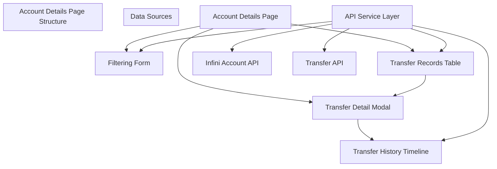
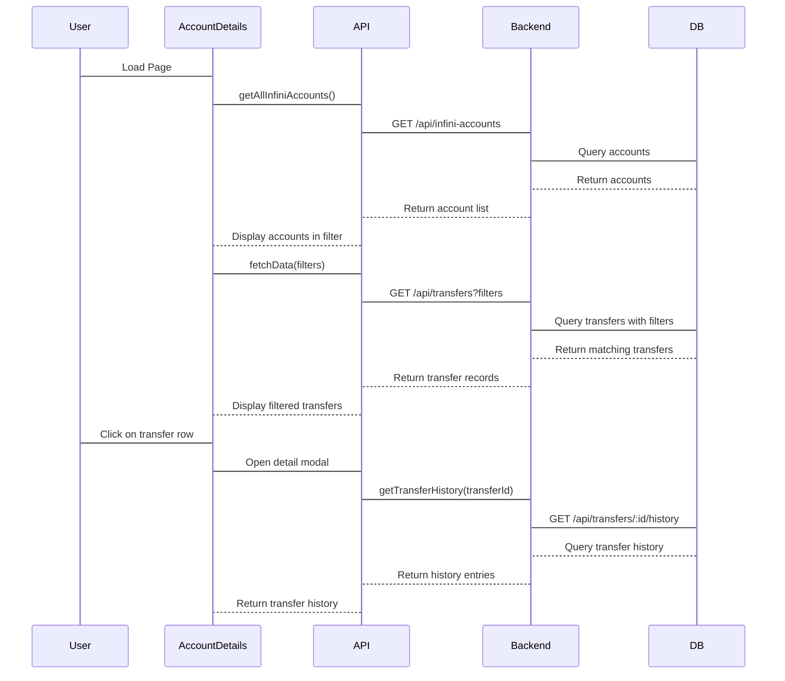
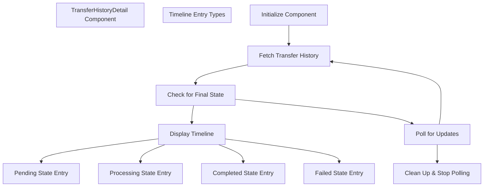

# Account Details

> **Relevant source files**
> * [frontend/src/components/TransferHistoryDetail.tsx](https://github.com/clionertr/infini-manager/blob/328b6a21/frontend/src/components/TransferHistoryDetail.tsx)
> * [frontend/src/pages/AccountDetails/index.tsx](https://github.com/clionertr/infini-manager/blob/328b6a21/frontend/src/pages/AccountDetails/index.tsx)

The Account Details page provides a comprehensive view of all transfer records in the Infini Manager system. It allows administrators to track, filter, and analyze transfer transactions between accounts with a detailed history view of each transfer's processing stages.

For information about initiating transfers, see [Account Transfer System](/clionertr/infini-manager/2.3-account-transfer-system).

## Overview

The Account Details page serves as a centralized dashboard for monitoring all transfer transactions. It offers powerful filtering capabilities, detailed record views, and real-time processing status updates.



Sources: [frontend/src/pages/AccountDetails/index.tsx L65-L741](https://github.com/clionertr/infini-manager/blob/328b6a21/frontend/src/pages/AccountDetails/index.tsx#L65-L741)

 [frontend/src/components/TransferHistoryDetail.tsx L1-L590](https://github.com/clionertr/infini-manager/blob/328b6a21/frontend/src/components/TransferHistoryDetail.tsx#L1-L590)

## Key Features

### Comprehensive Filtering System

The Account Details page includes a sophisticated filtering system that allows users to narrow down transfer records based on multiple criteria:

| Filter Type | Description | Implementation |
| --- | --- | --- |
| Account Search | Filter by source or target account using email, UID, or ID | Search type dropdown + keyword field |
| Status | Filter by transfer status (completed, pending, processing, failed) | Status dropdown |
| Source | Filter by transfer source (manual, affiliate, batch, scheduled) | Source dropdown |
| Date Range | Filter transfers within a specific date period | Date range picker |
| Amount Range | Filter transfers by amount (min/max values) | Amount min/max inputs |

Sources: [frontend/src/pages/AccountDetails/index.tsx L462-L578](https://github.com/clionertr/infini-manager/blob/328b6a21/frontend/src/pages/AccountDetails/index.tsx#L462-L578)

### Transfer Records Table

The main table displays transfer records with the following key information:

* Transfer ID
* Source account (email/ID)
* Target type (email, UID)
* Target identifier
* Amount
* Source type (manual, affiliate, batch, scheduled)
* Status (with color-coded indicators)
* Remarks
* Creation and completion timestamps

Sources: [frontend/src/pages/AccountDetails/index.tsx L362-L458](https://github.com/clionertr/infini-manager/blob/328b6a21/frontend/src/pages/AccountDetails/index.tsx#L362-L458)

### Detailed Transfer View

Clicking on any transfer record opens a detailed modal view that shows:

1. Comprehensive transfer information in a structured format
2. A timeline of the transfer's processing history
3. Real-time status updates for transfers in progress

Sources: [frontend/src/pages/AccountDetails/index.tsx L602-L738](https://github.com/clionertr/infini-manager/blob/328b6a21/frontend/src/pages/AccountDetails/index.tsx#L602-L738)

## System Architecture



Sources: [frontend/src/pages/AccountDetails/index.tsx L100-L199](https://github.com/clionertr/infini-manager/blob/328b6a21/frontend/src/pages/AccountDetails/index.tsx#L100-L199)

 [frontend/src/pages/AccountDetails/index.tsx L329-L345](https://github.com/clionertr/infini-manager/blob/328b6a21/frontend/src/pages/AccountDetails/index.tsx#L329-L345)

## Transfer History Timeline Component

The `TransferHistoryDetail` component displays a chronological timeline of all processing steps for a transfer. This component:

1. Shows real-time updates for transfers still in progress using a polling mechanism
2. Displays the complete processing history with timestamps
3. Provides detailed information about each processing stage
4. Stops polling automatically when a transfer reaches a final state (completed or failed)



Sources: [frontend/src/components/TransferHistoryDetail.tsx L66-L590](https://github.com/clionertr/infini-manager/blob/328b6a21/frontend/src/components/TransferHistoryDetail.tsx#L66-L590)

### Timeline Status Visualization

The timeline visualizes each stage of a transfer with appropriate status indicators:

| Status | Description | Visual Indicator |
| --- | --- | --- |
| Pending | Initial transfer record creation | Yellow warning indicator |
| Processing | Transfer being processed by the system | Blue processing indicator |
| Completed | Successfully completed transfer | Green success indicator |
| Failed | Failed transfer with error details | Red error indicator |

Each timeline entry includes:

* Timestamp
* Status indicator
* Descriptive message
* Detailed information relevant to that processing stage

Sources: [frontend/src/components/TransferHistoryDetail.tsx L437-L578](https://github.com/clionertr/infini-manager/blob/328b6a21/frontend/src/components/TransferHistoryDetail.tsx#L437-L578)

## Data Fetching and Pagination

The Account Details page implements efficient data fetching with pagination:

1. Initial page load fetches the first batch of transfer records
2. Pagination controls allow navigating through large result sets
3. When filters are applied, the page resets to the first page
4. Table parameters (page, size, etc.) are tracked in component state

```
#mermaid-366zpn3noyo{font-family:ui-sans-serif,-apple-system,system-ui,Segoe UI,Helvetica;font-size:16px;fill:#333;}@keyframes edge-animation-frame{from{stroke-dashoffset:0;}}@keyframes dash{to{stroke-dashoffset:0;}}#mermaid-366zpn3noyo .edge-animation-slow{stroke-dasharray:9,5!important;stroke-dashoffset:900;animation:dash 50s linear infinite;stroke-linecap:round;}#mermaid-366zpn3noyo .edge-animation-fast{stroke-dasharray:9,5!important;stroke-dashoffset:900;animation:dash 20s linear infinite;stroke-linecap:round;}#mermaid-366zpn3noyo .error-icon{fill:#dddddd;}#mermaid-366zpn3noyo .error-text{fill:#222222;stroke:#222222;}#mermaid-366zpn3noyo .edge-thickness-normal{stroke-width:1px;}#mermaid-366zpn3noyo .edge-thickness-thick{stroke-width:3.5px;}#mermaid-366zpn3noyo .edge-pattern-solid{stroke-dasharray:0;}#mermaid-366zpn3noyo .edge-thickness-invisible{stroke-width:0;fill:none;}#mermaid-366zpn3noyo .edge-pattern-dashed{stroke-dasharray:3;}#mermaid-366zpn3noyo .edge-pattern-dotted{stroke-dasharray:2;}#mermaid-366zpn3noyo .marker{fill:#999;stroke:#999;}#mermaid-366zpn3noyo .marker.cross{stroke:#999;}#mermaid-366zpn3noyo svg{font-family:ui-sans-serif,-apple-system,system-ui,Segoe UI,Helvetica;font-size:16px;}#mermaid-366zpn3noyo p{margin:0;}#mermaid-366zpn3noyo defs #statediagram-barbEnd{fill:#999;stroke:#999;}#mermaid-366zpn3noyo g.stateGroup text{fill:#dddddd;stroke:none;font-size:10px;}#mermaid-366zpn3noyo g.stateGroup text{fill:#333;stroke:none;font-size:10px;}#mermaid-366zpn3noyo g.stateGroup .state-title{font-weight:bolder;fill:#333;}#mermaid-366zpn3noyo g.stateGroup rect{fill:#ffffff;stroke:#dddddd;}#mermaid-366zpn3noyo g.stateGroup line{stroke:#999;stroke-width:1;}#mermaid-366zpn3noyo .transition{stroke:#999;stroke-width:1;fill:none;}#mermaid-366zpn3noyo .stateGroup .composit{fill:#f4f4f4;border-bottom:1px;}#mermaid-366zpn3noyo .stateGroup .alt-composit{fill:#e0e0e0;border-bottom:1px;}#mermaid-366zpn3noyo .state-note{stroke:#e6d280;fill:#fff5ad;}#mermaid-366zpn3noyo .state-note text{fill:#333;stroke:none;font-size:10px;}#mermaid-366zpn3noyo .stateLabel .box{stroke:none;stroke-width:0;fill:#ffffff;opacity:0.5;}#mermaid-366zpn3noyo .edgeLabel .label rect{fill:#ffffff;opacity:0.5;}#mermaid-366zpn3noyo .edgeLabel{background-color:#ffffff;text-align:center;}#mermaid-366zpn3noyo .edgeLabel p{background-color:#ffffff;}#mermaid-366zpn3noyo .edgeLabel rect{opacity:0.5;background-color:#ffffff;fill:#ffffff;}#mermaid-366zpn3noyo .edgeLabel .label text{fill:#333;}#mermaid-366zpn3noyo .label div .edgeLabel{color:#333;}#mermaid-366zpn3noyo .stateLabel text{fill:#333;font-size:10px;font-weight:bold;}#mermaid-366zpn3noyo .node circle.state-start{fill:#999;stroke:#999;}#mermaid-366zpn3noyo .node .fork-join{fill:#999;stroke:#999;}#mermaid-366zpn3noyo .node circle.state-end{fill:#dddddd;stroke:#f4f4f4;stroke-width:1.5;}#mermaid-366zpn3noyo .end-state-inner{fill:#f4f4f4;stroke-width:1.5;}#mermaid-366zpn3noyo .node rect{fill:#ffffff;stroke:#dddddd;stroke-width:1px;}#mermaid-366zpn3noyo .node polygon{fill:#ffffff;stroke:#dddddd;stroke-width:1px;}#mermaid-366zpn3noyo #statediagram-barbEnd{fill:#999;}#mermaid-366zpn3noyo .statediagram-cluster rect{fill:#ffffff;stroke:#dddddd;stroke-width:1px;}#mermaid-366zpn3noyo .cluster-label,#mermaid-366zpn3noyo .nodeLabel{color:#333;}#mermaid-366zpn3noyo .statediagram-cluster rect.outer{rx:5px;ry:5px;}#mermaid-366zpn3noyo .statediagram-state .divider{stroke:#dddddd;}#mermaid-366zpn3noyo .statediagram-state .title-state{rx:5px;ry:5px;}#mermaid-366zpn3noyo .statediagram-cluster.statediagram-cluster .inner{fill:#f4f4f4;}#mermaid-366zpn3noyo .statediagram-cluster.statediagram-cluster-alt .inner{fill:#f8f8f8;}#mermaid-366zpn3noyo .statediagram-cluster .inner{rx:0;ry:0;}#mermaid-366zpn3noyo .statediagram-state rect.basic{rx:5px;ry:5px;}#mermaid-366zpn3noyo .statediagram-state rect.divider{stroke-dasharray:10,10;fill:#f8f8f8;}#mermaid-366zpn3noyo .note-edge{stroke-dasharray:5;}#mermaid-366zpn3noyo .statediagram-note rect{fill:#fff5ad;stroke:#e6d280;stroke-width:1px;rx:0;ry:0;}#mermaid-366zpn3noyo .statediagram-note rect{fill:#fff5ad;stroke:#e6d280;stroke-width:1px;rx:0;ry:0;}#mermaid-366zpn3noyo .statediagram-note text{fill:#333;}#mermaid-366zpn3noyo .statediagram-note .nodeLabel{color:#333;}#mermaid-366zpn3noyo .statediagram .edgeLabel{color:red;}#mermaid-366zpn3noyo #dependencyStart,#mermaid-366zpn3noyo #dependencyEnd{fill:#999;stroke:#999;stroke-width:1;}#mermaid-366zpn3noyo .statediagramTitleText{text-anchor:middle;font-size:18px;fill:#333;}#mermaid-366zpn3noyo :root{--mermaid-font-family:"trebuchet ms",verdana,arial,sans-serif;}User InteractionsPage LoadGet Account ListGet Initial TransfersShow ResultsUser Sets FiltersUser Changes PageUser Clicks RecordReset to Page 1Fetch With FiltersUpdate Page ParametersFetch New PageOpen Detail ModalGet Transfer HistoryShow TimelineIf Not Final StateAfter DelayInitialFetchAccountsFetchTransfersDisplayTableApplyFiltersChangePageSelectRecordResetPageUpdatePageParamsShowDetailFetchHistoryDisplayTimelinePollUpdates
```

Sources: [frontend/src/pages/AccountDetails/index.tsx L202-L261](https://github.com/clionertr/infini-manager/blob/328b6a21/frontend/src/pages/AccountDetails/index.tsx#L202-L261)

## Implementation Details

### API Integration

The Account Details page integrates with two primary API services:

1. `infiniAccountApi` - For fetching account information
2. `transferApi` - For retrieving transfer records and history

Key API endpoints utilized:

* `GET /api/infini-accounts` - Fetches all accounts for filtering
* `GET /api/transfers` - Retrieves transfer records with filter parameters
* `GET /api/transfers/:id/history` - Fetches the history timeline for a specific transfer

Sources: [frontend/src/pages/AccountDetails/index.tsx

7](https://github.com/clionertr/infini-manager/blob/328b6a21/frontend/src/pages/AccountDetails/index.tsx#L7-L7)

 [frontend/src/pages/AccountDetails/index.tsx L84-L97](https://github.com/clionertr/infini-manager/blob/328b6a21/frontend/src/pages/AccountDetails/index.tsx#L84-L97)

 [frontend/src/pages/AccountDetails/index.tsx L100-L199](https://github.com/clionertr/infini-manager/blob/328b6a21/frontend/src/pages/AccountDetails/index.tsx#L100-L199)

### Component State Management

The page manages several key state variables:

1. `data` - Stores the transfer records displayed in the table
2. `accounts` - Stores account information for filtering
3. `tableParams` - Tracks pagination and sorting parameters
4. `selectedRecord` - Stores the currently selected transfer record
5. `transferHistory` - Stores the history timeline entries for the selected transfer

Sources: [frontend/src/pages/AccountDetails/index.tsx L66-L81](https://github.com/clionertr/infini-manager/blob/328b6a21/frontend/src/pages/AccountDetails/index.tsx#L66-L81)

### Advanced Filtering and Search

The filtering system supports complex query parameters:

* Multiple filter criteria can be combined
* Different search types (source account, target account, etc.)
* Date range filtering with precise start/end dates
* Amount range filtering with minimum and maximum values

The form's values are converted into API query parameters when submitting the search.

Sources: [frontend/src/pages/AccountDetails/index.tsx L104-L176](https://github.com/clionertr/infini-manager/blob/328b6a21/frontend/src/pages/AccountDetails/index.tsx#L104-L176)

## Related Components

### TransferHistoryDetail Component

This reusable component provides a detailed timeline view for any transfer. It features:

1. Automatic polling for transfers in progress
2. Intelligent polling termination when a final state is reached
3. Detailed display of each processing stage
4. Color-coded status indicators for different transfer states

This component is also used elsewhere in the application where transfer history visualization is needed.

Sources: [frontend/src/components/TransferHistoryDetail.tsx L1-L590](https://github.com/clionertr/infini-manager/blob/328b6a21/frontend/src/components/TransferHistoryDetail.tsx#L1-L590)