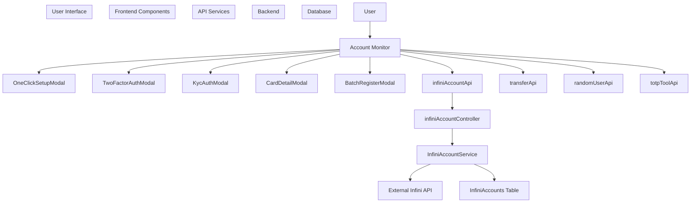
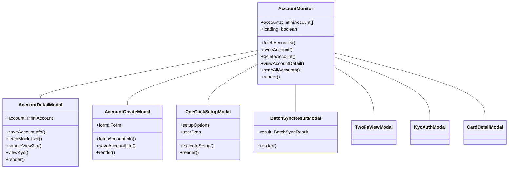
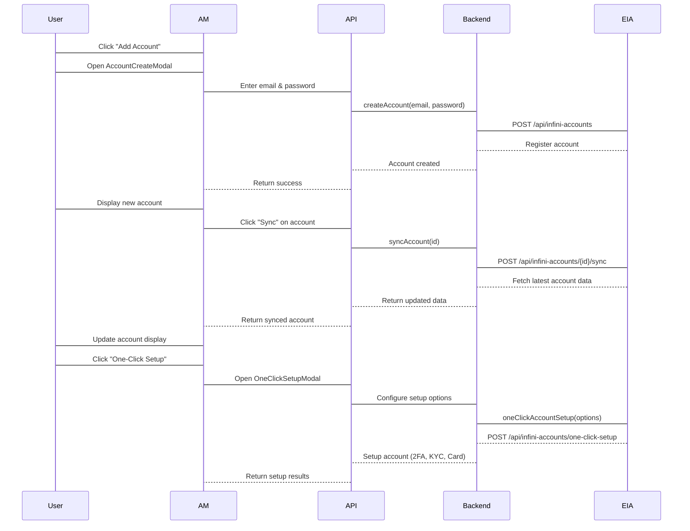
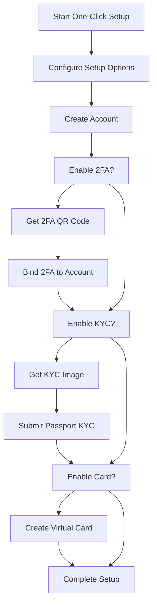
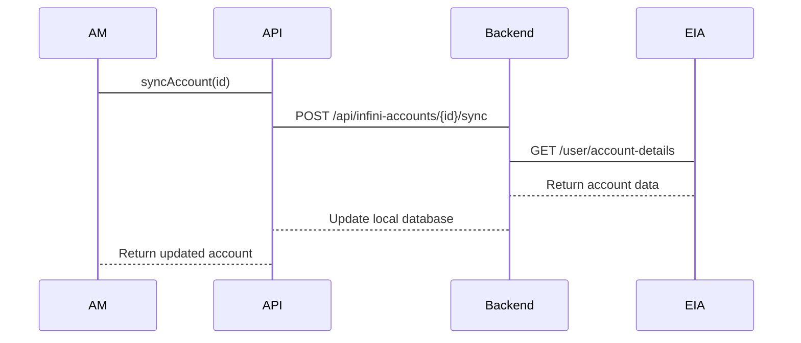
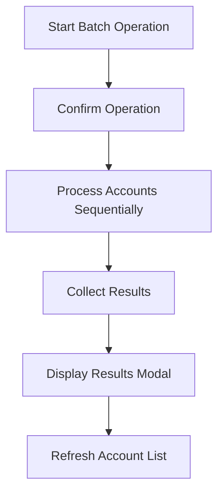

# Account Monitor

> **Relevant source files**
> * [frontend/src/pages/AccountMonitor/index.tsx](https://github.com/clionertr/infini-manager/blob/328b6a21/frontend/src/pages/AccountMonitor/index.tsx)
> * [frontend/src/services/api.ts](https://github.com/clionertr/infini-manager/blob/328b6a21/frontend/src/services/api.ts)

## Purpose and Scope

The Account Monitor is a core component of the Infini Manager frontend that provides comprehensive account management functionality for Infini accounts. It serves as the primary interface for monitoring, creating, configuring, and administering user accounts within the Infini system.

This page details the Account Monitor component's architecture, features, and integration with other system components. For information about managing account transfers, see [Account Transfer System](/clionertr/infini-manager/2.3-account-transfer-system), and for API service integration details, see [API Service Layer](/clionertr/infini-manager/2.2-api-service-layer).

Sources: [frontend/src/pages/AccountMonitor/index.tsx L1-L4](https://github.com/clionertr/infini-manager/blob/328b6a21/frontend/src/pages/AccountMonitor/index.tsx#L1-L4)

## System Overview

The Account Monitor component sits at the center of the account management workflow in the Infini Manager system. It connects the user interface with backend services to provide a comprehensive account management experience.



Sources: [frontend/src/pages/AccountMonitor/index.tsx L69-L80](https://github.com/clionertr/infini-manager/blob/328b6a21/frontend/src/pages/AccountMonitor/index.tsx#L69-L80)

 [frontend/src/services/api.ts L256-L590](https://github.com/clionertr/infini-manager/blob/328b6a21/frontend/src/services/api.ts#L256-L590)

## Main Features and Functionality

The Account Monitor provides the following core functionality:

| Feature | Description |
| --- | --- |
| Account List | Displays all Infini accounts with real-time status, balances, and verification levels |
| Account Creation | Allows manual creation or one-click setup of new accounts |
| Account Synchronization | Syncs account information with the external Infini API |
| 2FA Management | Enables viewing and configuring two-factor authentication |
| KYC Verification | Handles KYC identity verification process |
| Card Management | Supports virtual card creation and management |
| Balance Monitoring | Tracks available balance, red packet balance, and other financial metrics |
| Batch Operations | Supports batch registration and synchronization of multiple accounts |
| Account Grouping | Organizes accounts into logical groups |

Sources: [frontend/src/pages/AccountMonitor/index.tsx L2076-L2889](https://github.com/clionertr/infini-manager/blob/328b6a21/frontend/src/pages/AccountMonitor/index.tsx#L2076-L2889)

## Component Architecture

The Account Monitor is implemented as a React functional component with several nested modal components that handle specific operations.



Sources: [frontend/src/pages/AccountMonitor/index.tsx L224-L1078](https://github.com/clionertr/infini-manager/blob/328b6a21/frontend/src/pages/AccountMonitor/index.tsx#L224-L1078)

 [frontend/src/pages/AccountMonitor/index.tsx L1082-L1142](https://github.com/clionertr/infini-manager/blob/328b6a21/frontend/src/pages/AccountMonitor/index.tsx#L1082-L1142)

 [frontend/src/pages/AccountMonitor/index.tsx L1145-L1353](https://github.com/clionertr/infini-manager/blob/328b6a21/frontend/src/pages/AccountMonitor/index.tsx#L1145-L1353)

## Key Interfaces and Data Models

The Account Monitor component works with several key data models:

### InfiniAccount Interface

This interface represents the core account data structure used throughout the system.

```
interface InfiniAccount {
  id: number;
  userId: string;
  email: string;
  password?: string;
  uid?: string;
  invitationCode?: string;
  availableBalance: number;
  withdrawingAmount: number;
  redPacketBalance: number;
  totalConsumptionAmount: number;
  totalEarnBalance: number;
  dailyConsumption: number;
  status?: string;
  userType?: number;
  google2faIsBound: boolean;
  googlePasswordIsSet: boolean;
  isKol: boolean;
  isProtected: boolean;
  cookieExpiresAt?: string;
  infiniCreatedAt?: number;
  lastSyncAt: string;
  createdAt?: string;
  updatedAt?: string;
  mockUserId?: number;
  twoFaInfo?: TwoFaInfo;
  verificationLevel?: number;
  verification_level?: number;
  groups?: AccountGroup[];
}
```

### Account Group Interface

Used for organizing accounts into logical groups.

```
interface AccountGroup {
  id: string;
  name: string;
  description: string | null;
  isDefault: boolean;
  accountCount?: number;
}
```

### TwoFaInfo Interface

Contains information related to two-factor authentication.

```
interface TwoFaInfo {
  qrCodeUrl?: string;
  secretKey?: string;
  recoveryCodes?: string[];
}
```

Sources: [frontend/src/pages/AccountMonitor/index.tsx L125-L175](https://github.com/clionertr/infini-manager/blob/328b6a21/frontend/src/pages/AccountMonitor/index.tsx#L125-L175)

 [frontend/src/pages/AccountMonitor/index.tsx L140-L145](https://github.com/clionertr/infini-manager/blob/328b6a21/frontend/src/pages/AccountMonitor/index.tsx#L140-L145)

## Account Monitoring Table

The central UI element of the Account Monitor is a data table that displays account information with the following columns:

| Column | Description | Functionality |
| --- | --- | --- |
| Index | Sequential number | Basic identification |
| Email | Account email address | Sortable, filterable, copyable |
| User ID | Unique identifier | Copyable |
| KYC Status | Verification level | Filterable, color-coded tags |
| Available Balance | Current balance | Sortable, color-coded by threshold |
| Red Packet Balance | Red packet funds | Sortable, color-coded by threshold |
| Account Status | Active/Suspended/etc. | Filterable, color-coded tags |
| Account Security | 2FA and protection status | Filterable tags |
| Groups | Account groupings | Filterable tags |
| Last Sync Time | Time of last sync | Sortable, formatted timestamp |
| Actions | Operation buttons | Sync, view, delete operations |

The table supports:

* Column resizing
* Column visibility toggling
* Custom sorting
* Filtering
* Batch operations

Sources: [frontend/src/pages/AccountMonitor/index.tsx L2530-L2888](https://github.com/clionertr/infini-manager/blob/328b6a21/frontend/src/pages/AccountMonitor/index.tsx#L2530-L2888)

## Account Management Workflow

The following diagram illustrates the typical workflow for creating and managing an account through the Account Monitor:



Sources: [frontend/src/pages/AccountMonitor/index.tsx L1145-L1353](https://github.com/clionertr/infini-manager/blob/328b6a21/frontend/src/pages/AccountMonitor/index.tsx#L1145-L1353)

 [frontend/src/pages/AccountMonitor/index.tsx L224-L1078](https://github.com/clionertr/infini-manager/blob/328b6a21/frontend/src/pages/AccountMonitor/index.tsx#L224-L1078)

 [frontend/src/services/api.ts L438-L457](https://github.com/clionertr/infini-manager/blob/328b6a21/frontend/src/services/api.ts#L438-L457)

## One-Click Setup Process

The Account Monitor provides a powerful "One-Click Setup" feature that automates account configuration through the OneClickSetupModal component. This process can include:

1. Account creation with random credentials
2. Two-factor authentication setup
3. KYC verification
4. Virtual card creation



Sources: [frontend/src/pages/AccountMonitor/index.tsx

79](https://github.com/clionertr/infini-manager/blob/328b6a21/frontend/src/pages/AccountMonitor/index.tsx#L79-L79)

 [frontend/src/services/api.ts L438-L457](https://github.com/clionertr/infini-manager/blob/328b6a21/frontend/src/services/api.ts#L438-L457)

## API Integration

The Account Monitor component integrates with several API services defined in the API Service Layer:

### Key API Services

1. **infiniAccountApi**: Core account management operations

* Creation, retrieval, update, and deletion of accounts
* 2FA and KYC management
* Account grouping
2. **transferApi**: Handles fund transfers between accounts
3. **randomUserApi**: Generates random user data for account creation
4. **totpToolApi**: Manages TOTP (Time-based One-Time Password) for 2FA

### API Request Flow Example - Account Synchronization



Sources: [frontend/src/pages/AccountMonitor/index.tsx

70](https://github.com/clionertr/infini-manager/blob/328b6a21/frontend/src/pages/AccountMonitor/index.tsx#L70-L70)

 [frontend/src/services/api.ts L256-L590](https://github.com/clionertr/infini-manager/blob/328b6a21/frontend/src/services/api.ts#L256-L590)

## Account Detail Management

When viewing account details, the Account Monitor provides a comprehensive interface for managing various aspects of an Infini account:

### Account Detail Areas

1. **Basic Information**: Email, password, user ID, invitation code
2. **Balance Information**: Available balance, withdrawing amount, red packet balance, etc.
3. **Security Configuration**: 2FA status, Google password status, protection status
4. **KYC Verification**: Verification level and identity information
5. **Card Management**: Virtual card details and operations

### Account Detail Modals

The Account Monitor uses several modal components to manage specific account functions:

| Modal Component | Purpose |
| --- | --- |
| AccountDetailModal | View and edit account basic information |
| TwoFaViewModal | View and manage 2FA configuration |
| KycAuthModal | Submit KYC verification |
| KycViewModal | View KYC verification status and details |
| CardApplyModal | Apply for virtual cards |
| CardDetailModal | View and manage card details |

Sources: [frontend/src/pages/AccountMonitor/index.tsx L224-L1078](https://github.com/clionertr/infini-manager/blob/328b6a21/frontend/src/pages/AccountMonitor/index.tsx#L224-L1078)

## Batch Operations

The Account Monitor provides functionality for batch operations on multiple accounts:

1. **Batch Synchronization**: Update information for all accounts simultaneously
2. **Batch KYC Synchronization**: Update KYC status for all accounts
3. **Batch Registration**: Create multiple accounts at once

The batch operations usually follow this pattern:



Sources: [frontend/src/pages/AccountMonitor/index.tsx L1080-L1142](https://github.com/clionertr/infini-manager/blob/328b6a21/frontend/src/pages/AccountMonitor/index.tsx#L1080-L1142)

 [frontend/src/pages/AccountMonitor/index.tsx L2179-L2226](https://github.com/clionertr/infini-manager/blob/328b6a21/frontend/src/pages/AccountMonitor/index.tsx#L2179-L2226)

## Tables and Column Management

The Account Monitor includes sophisticated table management features that allow users to:

1. Customize which columns are visible
2. Resize columns to fit content
3. Change column order through drag-and-drop
4. Persist column preferences for future sessions

The customization settings are stored using the `configApi` service, ensuring user preferences are maintained across sessions.

Sources: [frontend/src/pages/AccountMonitor/index.tsx L2119-L2168](https://github.com/clionertr/infini-manager/blob/328b6a21/frontend/src/pages/AccountMonitor/index.tsx#L2119-L2168)

 [frontend/src/pages/AccountMonitor/index.tsx L2530-L2888](https://github.com/clionertr/infini-manager/blob/328b6a21/frontend/src/pages/AccountMonitor/index.tsx#L2530-L2888)

## Account Filtering and Search

The Account Monitor provides powerful filtering capabilities:

1. **Text Search**: Filter accounts by email, userID, or status
2. **KYC Status Filter**: Filter by verification level
3. **Account Status Filter**: Filter by active/suspended status
4. **Security Filter**: Filter by 2FA and protection status
5. **Group Filter**: Filter by account group membership

These filters can be combined to narrow down the account list for more effective management.

Sources: [frontend/src/pages/AccountMonitor/index.tsx L2544-L2572](https://github.com/clionertr/infini-manager/blob/328b6a21/frontend/src/pages/AccountMonitor/index.tsx#L2544-L2572)

 [frontend/src/pages/AccountMonitor/index.tsx L2621-L2641](https://github.com/clionertr/infini-manager/blob/328b6a21/frontend/src/pages/AccountMonitor/index.tsx#L2621-L2641)

## Integration with Other Components

The Account Monitor integrates with several other components in the Infini Manager system:

1. **API Service Layer**: For all backend communication
2. **Account Transfer System**: For transferring funds between accounts
3. **Account Details**: For viewing detailed transaction history
4. **UI Components**: Shared modals and controls

This integration provides a seamless experience when moving between different functions of the application.

Sources: [frontend/src/pages/AccountMonitor/index.tsx L70-L80](https://github.com/clionertr/infini-manager/blob/328b6a21/frontend/src/pages/AccountMonitor/index.tsx#L70-L80)

## Summary

The Account Monitor is a comprehensive management interface for Infini accounts, providing visualization, creation, configuration, and administration capabilities. It integrates with multiple API services to provide a complete account management solution, including 2FA setup, KYC verification, and card management. The component's sophisticated table features allow for efficient handling of large numbers of accounts through customization, filtering, and batch operations.