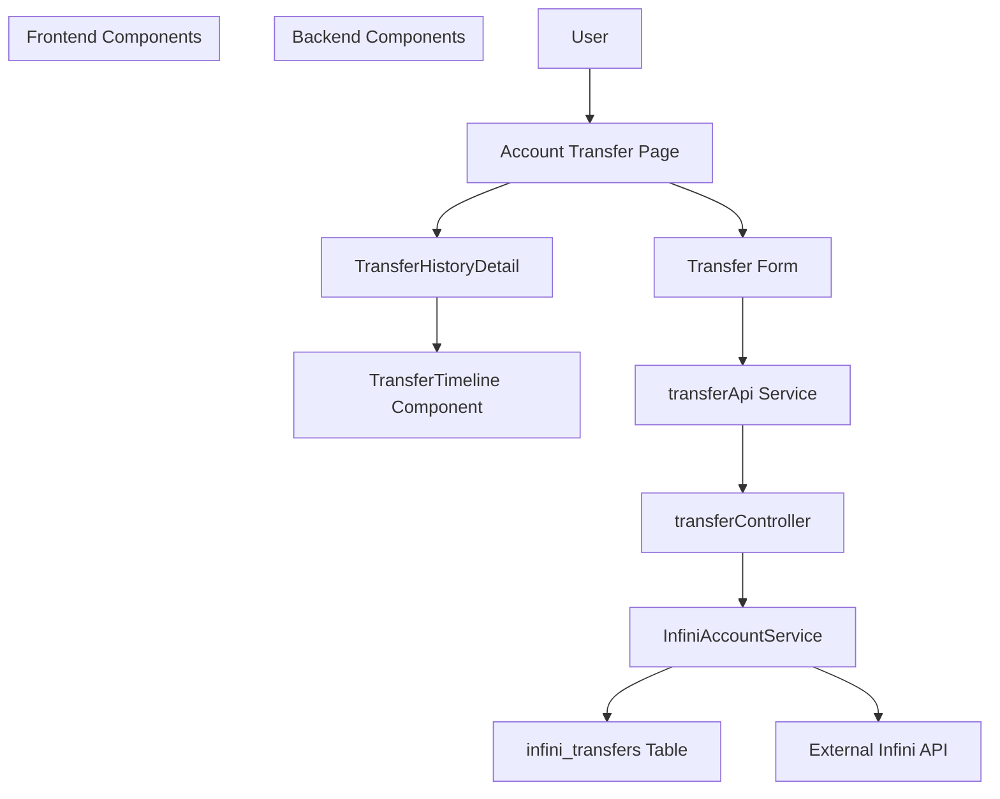
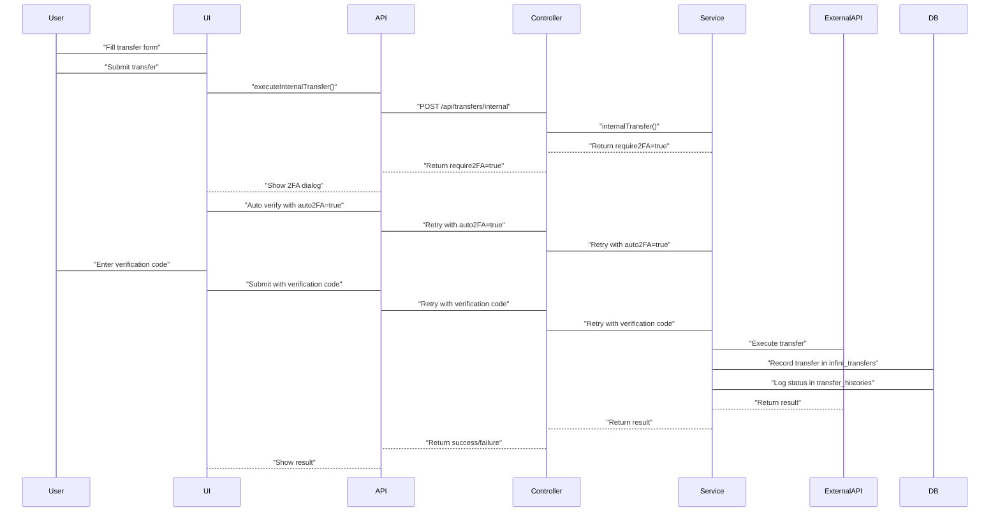
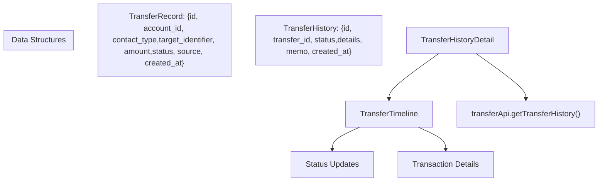

# Account Transfer System

> **Relevant source files**
> * [backend/src/controllers/transferController.ts](https://github.com/clionertr/infini-manager/blob/328b6a21/backend/src/controllers/transferController.ts)
> * [frontend/src/components/TransferHistoryDetail.tsx](https://github.com/clionertr/infini-manager/blob/328b6a21/frontend/src/components/TransferHistoryDetail.tsx)
> * [frontend/src/components/TransferTimeline.tsx](https://github.com/clionertr/infini-manager/blob/328b6a21/frontend/src/components/TransferTimeline.tsx)
> * [frontend/src/pages/AccountTransfer/index.tsx](https://github.com/clionertr/infini-manager/blob/328b6a21/frontend/src/pages/AccountTransfer/index.tsx)

The Account Transfer System is a core component of the Infini Manager platform that enables users to transfer funds between accounts. This page documents the technical implementation of the transfer system, including its architecture, workflows, and key components.

For information about account details and viewing account information, see [Account Details](/clionertr/infini-manager/2.4-account-details). For batch transfers related to the affiliate system, see [AFF Cashback System](/clionertr/infini-manager/2.5-aff-cashback-system).

## 1. System Overview

The Account Transfer System allows users to:

* Transfer funds between internal Infini accounts
* Send funds to external Infini accounts via UID or email
* View detailed transfer history and status updates
* Handle 2FA verification requirements during transfers
* Track transfer status through a real-time timeline



Sources: [frontend/src/pages/AccountTransfer/index.tsx L1-L119](https://github.com/clionertr/infini-manager/blob/328b6a21/frontend/src/pages/AccountTransfer/index.tsx#L1-L119)

 [frontend/src/components/TransferHistoryDetail.tsx L1-L65](https://github.com/clionertr/infini-manager/blob/328b6a21/frontend/src/components/TransferHistoryDetail.tsx#L1-L65)

 [backend/src/controllers/transferController.ts L1-L20](https://github.com/clionertr/infini-manager/blob/328b6a21/backend/src/controllers/transferController.ts#L1-L20)

## 2. Transfer Types and Workflow

The system supports two main transfer types:

### 2.1 Internal Transfers

Internal transfers move funds between accounts within the Infini Manager system. The source and target are specified using internal account IDs.

### 2.2 External Transfers

External transfers send funds to accounts outside the system, identified by either:

* **UID**: The recipient's Infini platform user ID
* **Email**: The recipient's email address registered on the Infini platform

### 2.3 Transfer Process Flow



Sources: [frontend/src/pages/AccountTransfer/index.tsx L282-L445](https://github.com/clionertr/infini-manager/blob/328b6a21/frontend/src/pages/AccountTransfer/index.tsx#L282-L445)

 [backend/src/controllers/transferController.ts L76-L123](https://github.com/clionertr/infini-manager/blob/328b6a21/backend/src/controllers/transferController.ts#L76-L123)

## 3. Frontend Implementation

### 3.1 Transfer Form Component

The transfer form is the main interface for initiating transfers. It provides:

* Source account selection (with balance display)
* Target type selection (internal/external)
* Target account selection or identifier input
* Amount input
* Source type selection (manual, affiliate, batch, scheduled)
* Optional remarks/memo field
* Auto 2FA toggle

**Key Implementation Details:**

| Component Function | Description |
| --- | --- |
| `handleSubmit` | Processes form submission and initiates the transfer request |
| `handleTargetTypeChange` | Switches between internal and external transfer interfaces |
| `handleSourceChange` | Updates the displayed balance when source account changes |
| `handleVerifySubmit` | Handles 2FA verification code submission |
| `showTransferTimeline` | Displays transfer history for completed transfers |

Sources: [frontend/src/pages/AccountTransfer/index.tsx L119-L282](https://github.com/clionertr/infini-manager/blob/328b6a21/frontend/src/pages/AccountTransfer/index.tsx#L119-L282)

 [frontend/src/pages/AccountTransfer/index.tsx L571-L617](https://github.com/clionertr/infini-manager/blob/328b6a21/frontend/src/pages/AccountTransfer/index.tsx#L571-L617)

### 3.2 Transfer History Components

The system includes two key components for displaying transfer history:

1. **TransferHistoryDetail**: A high-level component that displays transfer details and status updates
2. **TransferTimeline**: A timeline visualization showing the chronological progression of transfer status changes



Sources: [frontend/src/components/TransferHistoryDetail.tsx L48-L60](https://github.com/clionertr/infini-manager/blob/328b6a21/frontend/src/components/TransferHistoryDetail.tsx#L48-L60)

 [frontend/src/components/TransferTimeline.tsx L108-L134](https://github.com/clionertr/infini-manager/blob/328b6a21/frontend/src/components/TransferTimeline.tsx#L108-L134)

### 3.3 Transfer Status Tracking

The system tracks transfers through multiple status stages, which are visualized in the timeline component:

```
#mermaid-t1ibx4hv5wt{font-family:ui-sans-serif,-apple-system,system-ui,Segoe UI,Helvetica;font-size:16px;fill:#333;}@keyframes edge-animation-frame{from{stroke-dashoffset:0;}}@keyframes dash{to{stroke-dashoffset:0;}}#mermaid-t1ibx4hv5wt .edge-animation-slow{stroke-dasharray:9,5!important;stroke-dashoffset:900;animation:dash 50s linear infinite;stroke-linecap:round;}#mermaid-t1ibx4hv5wt .edge-animation-fast{stroke-dasharray:9,5!important;stroke-dashoffset:900;animation:dash 20s linear infinite;stroke-linecap:round;}#mermaid-t1ibx4hv5wt .error-icon{fill:#dddddd;}#mermaid-t1ibx4hv5wt .error-text{fill:#222222;stroke:#222222;}#mermaid-t1ibx4hv5wt .edge-thickness-normal{stroke-width:1px;}#mermaid-t1ibx4hv5wt .edge-thickness-thick{stroke-width:3.5px;}#mermaid-t1ibx4hv5wt .edge-pattern-solid{stroke-dasharray:0;}#mermaid-t1ibx4hv5wt .edge-thickness-invisible{stroke-width:0;fill:none;}#mermaid-t1ibx4hv5wt .edge-pattern-dashed{stroke-dasharray:3;}#mermaid-t1ibx4hv5wt .edge-pattern-dotted{stroke-dasharray:2;}#mermaid-t1ibx4hv5wt .marker{fill:#999;stroke:#999;}#mermaid-t1ibx4hv5wt .marker.cross{stroke:#999;}#mermaid-t1ibx4hv5wt svg{font-family:ui-sans-serif,-apple-system,system-ui,Segoe UI,Helvetica;font-size:16px;}#mermaid-t1ibx4hv5wt p{margin:0;}#mermaid-t1ibx4hv5wt defs #statediagram-barbEnd{fill:#999;stroke:#999;}#mermaid-t1ibx4hv5wt g.stateGroup text{fill:#dddddd;stroke:none;font-size:10px;}#mermaid-t1ibx4hv5wt g.stateGroup text{fill:#333;stroke:none;font-size:10px;}#mermaid-t1ibx4hv5wt g.stateGroup .state-title{font-weight:bolder;fill:#333;}#mermaid-t1ibx4hv5wt g.stateGroup rect{fill:#ffffff;stroke:#dddddd;}#mermaid-t1ibx4hv5wt g.stateGroup line{stroke:#999;stroke-width:1;}#mermaid-t1ibx4hv5wt .transition{stroke:#999;stroke-width:1;fill:none;}#mermaid-t1ibx4hv5wt .stateGroup .composit{fill:#f4f4f4;border-bottom:1px;}#mermaid-t1ibx4hv5wt .stateGroup .alt-composit{fill:#e0e0e0;border-bottom:1px;}#mermaid-t1ibx4hv5wt .state-note{stroke:#e6d280;fill:#fff5ad;}#mermaid-t1ibx4hv5wt .state-note text{fill:#333;stroke:none;font-size:10px;}#mermaid-t1ibx4hv5wt .stateLabel .box{stroke:none;stroke-width:0;fill:#ffffff;opacity:0.5;}#mermaid-t1ibx4hv5wt .edgeLabel .label rect{fill:#ffffff;opacity:0.5;}#mermaid-t1ibx4hv5wt .edgeLabel{background-color:#ffffff;text-align:center;}#mermaid-t1ibx4hv5wt .edgeLabel p{background-color:#ffffff;}#mermaid-t1ibx4hv5wt .edgeLabel rect{opacity:0.5;background-color:#ffffff;fill:#ffffff;}#mermaid-t1ibx4hv5wt .edgeLabel .label text{fill:#333;}#mermaid-t1ibx4hv5wt .label div .edgeLabel{color:#333;}#mermaid-t1ibx4hv5wt .stateLabel text{fill:#333;font-size:10px;font-weight:bold;}#mermaid-t1ibx4hv5wt .node circle.state-start{fill:#999;stroke:#999;}#mermaid-t1ibx4hv5wt .node .fork-join{fill:#999;stroke:#999;}#mermaid-t1ibx4hv5wt .node circle.state-end{fill:#dddddd;stroke:#f4f4f4;stroke-width:1.5;}#mermaid-t1ibx4hv5wt .end-state-inner{fill:#f4f4f4;stroke-width:1.5;}#mermaid-t1ibx4hv5wt .node rect{fill:#ffffff;stroke:#dddddd;stroke-width:1px;}#mermaid-t1ibx4hv5wt .node polygon{fill:#ffffff;stroke:#dddddd;stroke-width:1px;}#mermaid-t1ibx4hv5wt #statediagram-barbEnd{fill:#999;}#mermaid-t1ibx4hv5wt .statediagram-cluster rect{fill:#ffffff;stroke:#dddddd;stroke-width:1px;}#mermaid-t1ibx4hv5wt .cluster-label,#mermaid-t1ibx4hv5wt .nodeLabel{color:#333;}#mermaid-t1ibx4hv5wt .statediagram-cluster rect.outer{rx:5px;ry:5px;}#mermaid-t1ibx4hv5wt .statediagram-state .divider{stroke:#dddddd;}#mermaid-t1ibx4hv5wt .statediagram-state .title-state{rx:5px;ry:5px;}#mermaid-t1ibx4hv5wt .statediagram-cluster.statediagram-cluster .inner{fill:#f4f4f4;}#mermaid-t1ibx4hv5wt .statediagram-cluster.statediagram-cluster-alt .inner{fill:#f8f8f8;}#mermaid-t1ibx4hv5wt .statediagram-cluster .inner{rx:0;ry:0;}#mermaid-t1ibx4hv5wt .statediagram-state rect.basic{rx:5px;ry:5px;}#mermaid-t1ibx4hv5wt .statediagram-state rect.divider{stroke-dasharray:10,10;fill:#f8f8f8;}#mermaid-t1ibx4hv5wt .note-edge{stroke-dasharray:5;}#mermaid-t1ibx4hv5wt .statediagram-note rect{fill:#fff5ad;stroke:#e6d280;stroke-width:1px;rx:0;ry:0;}#mermaid-t1ibx4hv5wt .statediagram-note rect{fill:#fff5ad;stroke:#e6d280;stroke-width:1px;rx:0;ry:0;}#mermaid-t1ibx4hv5wt .statediagram-note text{fill:#333;}#mermaid-t1ibx4hv5wt .statediagram-note .nodeLabel{color:#333;}#mermaid-t1ibx4hv5wt .statediagram .edgeLabel{color:red;}#mermaid-t1ibx4hv5wt #dependencyStart,#mermaid-t1ibx4hv5wt #dependencyEnd{fill:#999;stroke:#999;stroke-width:1;}#mermaid-t1ibx4hv5wt .statediagramTitleText{text-anchor:middle;font-size:18px;fill:#333;}#mermaid-t1ibx4hv5wt :root{--mermaid-font-family:"trebuchet ms",verdana,arial,sans-serif;}"Transfer initiated""Validation successful""Transfer successful""Transfer error""Validation failed"pendingprocessingcompletedfailed
```

Each status transition is recorded in the `transfer_histories` table with a timestamp and relevant details.

Sources: [frontend/src/components/TransferHistoryDetail.tsx L347-L360](https://github.com/clionertr/infini-manager/blob/328b6a21/frontend/src/components/TransferHistoryDetail.tsx#L347-L360)

 [frontend/src/components/TransferTimeline.tsx L416-L431](https://github.com/clionertr/infini-manager/blob/328b6a21/frontend/src/components/TransferTimeline.tsx#L416-L431)

## 4. Backend Implementation

### 4.1 Transfer Controller

The `transferController` is responsible for handling all transfer-related API endpoints, validating input, and orchestrating the transfer operations.

Key methods:

| Method | URL | Purpose |
| --- | --- | --- |
| `executeInternalTransfer` | POST /api/transfers/internal | Executes transfer between accounts |
| `getTransfers` | GET /api/transfers | Retrieves transfers with optional filtering |
| `getTransferHistory` | GET /api/transfers/:id/history | Gets complete history for a specific transfer |
| `grabRedPacket` | POST /api/transfers/red-packet | Handles red packet claiming |

Sources: [backend/src/controllers/transferController.ts L76-L123](https://github.com/clionertr/infini-manager/blob/328b6a21/backend/src/controllers/transferController.ts#L76-L123)

 [backend/src/controllers/transferController.ts L298-L316](https://github.com/clionertr/infini-manager/blob/328b6a21/backend/src/controllers/transferController.ts#L298-L316)

### 4.2 Transfer Data Model

```
#mermaid-ha3gcx1a75l{font-family:ui-sans-serif,-apple-system,system-ui,Segoe UI,Helvetica;font-size:16px;fill:#333;}@keyframes edge-animation-frame{from{stroke-dashoffset:0;}}@keyframes dash{to{stroke-dashoffset:0;}}#mermaid-ha3gcx1a75l .edge-animation-slow{stroke-dasharray:9,5!important;stroke-dashoffset:900;animation:dash 50s linear infinite;stroke-linecap:round;}#mermaid-ha3gcx1a75l .edge-animation-fast{stroke-dasharray:9,5!important;stroke-dashoffset:900;animation:dash 20s linear infinite;stroke-linecap:round;}#mermaid-ha3gcx1a75l .error-icon{fill:#dddddd;}#mermaid-ha3gcx1a75l .error-text{fill:#222222;stroke:#222222;}#mermaid-ha3gcx1a75l .edge-thickness-normal{stroke-width:1px;}#mermaid-ha3gcx1a75l .edge-thickness-thick{stroke-width:3.5px;}#mermaid-ha3gcx1a75l .edge-pattern-solid{stroke-dasharray:0;}#mermaid-ha3gcx1a75l .edge-thickness-invisible{stroke-width:0;fill:none;}#mermaid-ha3gcx1a75l .edge-pattern-dashed{stroke-dasharray:3;}#mermaid-ha3gcx1a75l .edge-pattern-dotted{stroke-dasharray:2;}#mermaid-ha3gcx1a75l .marker{fill:#999;stroke:#999;}#mermaid-ha3gcx1a75l .marker.cross{stroke:#999;}#mermaid-ha3gcx1a75l svg{font-family:ui-sans-serif,-apple-system,system-ui,Segoe UI,Helvetica;font-size:16px;}#mermaid-ha3gcx1a75l p{margin:0;}#mermaid-ha3gcx1a75l .entityBox{fill:#ffffff;stroke:#dddddd;}#mermaid-ha3gcx1a75l .relationshipLabelBox{fill:#dddddd;opacity:0.7;background-color:#dddddd;}#mermaid-ha3gcx1a75l .relationshipLabelBox rect{opacity:0.5;}#mermaid-ha3gcx1a75l .labelBkg{background-color:rgba(221, 221, 221, 0.5);}#mermaid-ha3gcx1a75l .edgeLabel .label{fill:#dddddd;font-size:14px;}#mermaid-ha3gcx1a75l .label{font-family:ui-sans-serif,-apple-system,system-ui,Segoe UI,Helvetica;color:#333;}#mermaid-ha3gcx1a75l .edge-pattern-dashed{stroke-dasharray:8,8;}#mermaid-ha3gcx1a75l .node rect,#mermaid-ha3gcx1a75l .node circle,#mermaid-ha3gcx1a75l .node ellipse,#mermaid-ha3gcx1a75l .node polygon{fill:#ffffff;stroke:#dddddd;stroke-width:1px;}#mermaid-ha3gcx1a75l .relationshipLine{stroke:#999;stroke-width:1;fill:none;}#mermaid-ha3gcx1a75l .marker{fill:none!important;stroke:#999!important;stroke-width:1;}#mermaid-ha3gcx1a75l :root{--mermaid-font-family:"trebuchet ms",verdana,arial,sans-serif;}hasinitiatesinfini_transfersidstringPKaccount_idstringFKcontact_typestringtarget_identifierstringamountstringstatusstringsourcestringremarksstringcreated_atdatetimecompleted_atdatetimetransfer_historiesidstringPKtransfer_idstringFKstatusstringdetailsjsonmemostringcreated_atdatetimeinfini_accountsidstringPKemailstringuidstringavailable_balancedecimal
```

The system uses two primary tables:

* `infini_transfers`: Stores the main transfer record
* `transfer_histories`: Stores a chronological log of status changes and processing events

Sources: [backend/src/controllers/transferController.ts L152-L158](https://github.com/clionertr/infini-manager/blob/328b6a21/backend/src/controllers/transferController.ts#L152-L158)

 [frontend/src/components/TransferTimeline.tsx L11-L24](https://github.com/clionertr/infini-manager/blob/328b6a21/frontend/src/components/TransferTimeline.tsx#L11-L24)

## 5. Security Features

### 5.1 Two-Factor Authentication

The transfer system integrates with Infini's 2FA requirements:

1. When a transfer requires 2FA verification, the frontend presents a verification dialog
2. Users can choose between:
* **Auto 2FA**: System attempts to automatically retrieve and apply the verification code
* **Manual Entry**: User enters the verification code from their authenticator app

Implementation details:

* The `auto2FA` parameter in the transfer API indicates whether to attempt automatic verification
* If auto verification fails, the system falls back to manual verification

Sources: [frontend/src/pages/AccountTransfer/index.tsx L446-L568](https://github.com/clionertr/infini-manager/blob/328b6a21/frontend/src/pages/AccountTransfer/index.tsx#L446-L568)

 [backend/src/controllers/transferController.ts L83-L117](https://github.com/clionertr/infini-manager/blob/328b6a21/backend/src/controllers/transferController.ts#L83-L117)

### 5.2 Duplicate Transfer Prevention

The system includes safeguards against duplicate transfers:

1. Backend detects potential duplicates based on similar parameters within a time window
2. When detected, the frontend presents a confirmation dialog
3. Users can choose to force the transfer or cancel

This is implemented via the `isForced` parameter in the API, which bypasses the duplicate checks when set to `true`.

Sources: [frontend/src/pages/AccountTransfer/index.tsx L384-L434](https://github.com/clionertr/infini-manager/blob/328b6a21/frontend/src/pages/AccountTransfer/index.tsx#L384-L434)

## 6. Real-Time Updates

The transfer history component includes an automatic polling mechanism to provide real-time updates on transfer status:

1. After a transfer is initiated, the timeline automatically appears
2. The component periodically polls the backend for status updates
3. For pending transfers, the polling continues until a final state (completed/failed) is reached
4. Users can adjust polling interval or pause/resume polling as needed

Sources: [frontend/src/components/TransferHistoryDetail.tsx L116-L219](https://github.com/clionertr/infini-manager/blob/328b6a21/frontend/src/components/TransferHistoryDetail.tsx#L116-L219)

 [frontend/src/components/TransferTimeline.tsx L351-L368](https://github.com/clionertr/infini-manager/blob/328b6a21/frontend/src/components/TransferTimeline.tsx#L351-L368)

## 7. Integration Points

The Account Transfer System integrates with several other components:

1. **Account Monitor System**: Provides the account list data used for selecting source and target accounts
2. **API Service Layer**: The `transferApi` methods abstract the HTTP calls to the backend
3. **InfiniAccountService**: Handles the actual transfer logic and manages connections to the external Infini API

Sources: [frontend/src/pages/AccountTransfer/index.tsx L178-L197](https://github.com/clionertr/infini-manager/blob/328b6a21/frontend/src/pages/AccountTransfer/index.tsx#L178-L197)