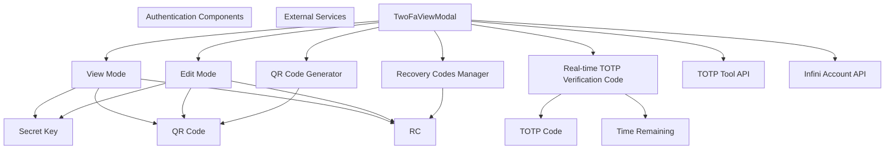
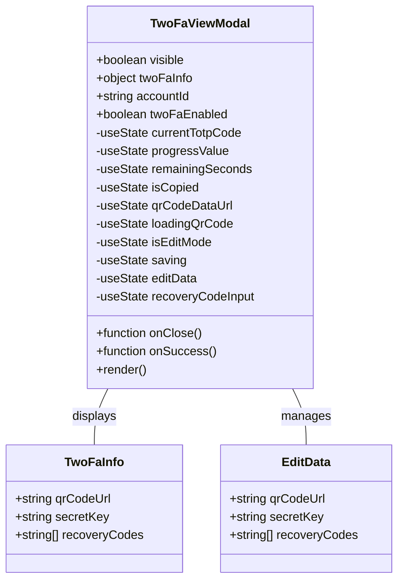
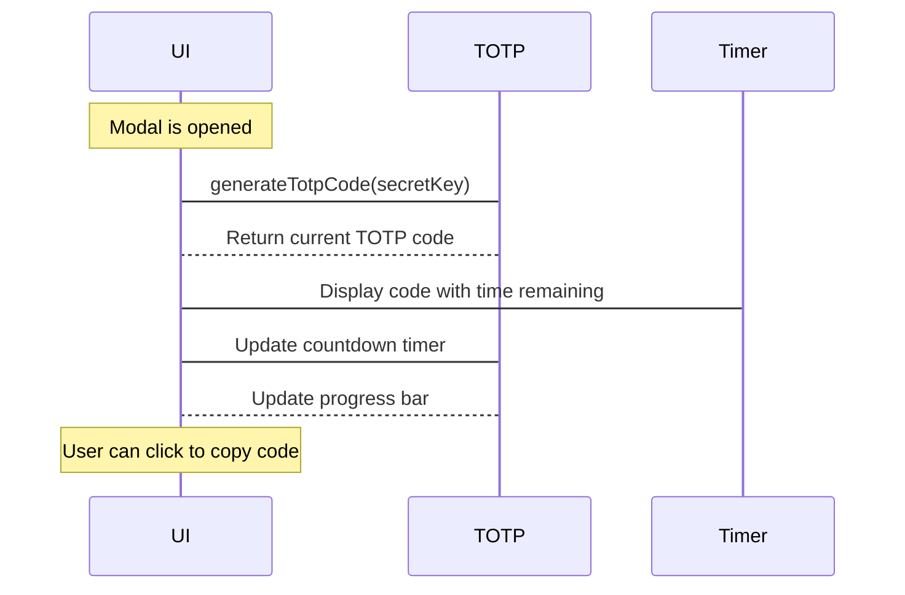
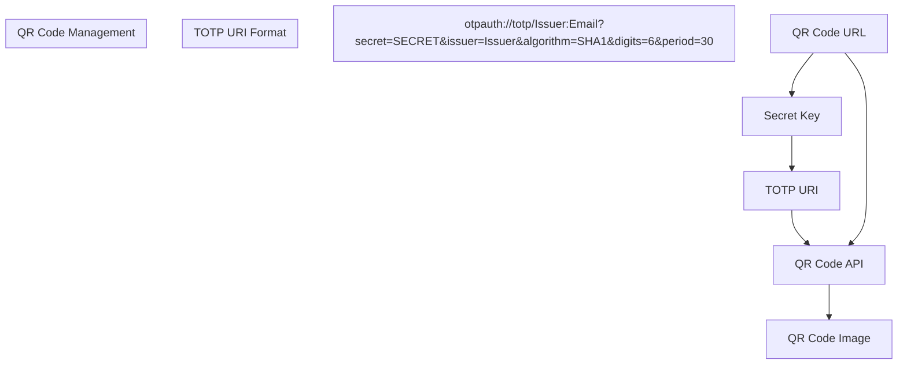

# Authentication Components

> **Relevant source files**
> * [frontend/src/components/TwoFaViewModal.tsx](https://github.com/clionertr/infini-manager/blob/328b6a21/frontend/src/components/TwoFaViewModal.tsx)

This document details the authentication-related UI components in the Infini Manager frontend, specifically focusing on the Two-Factor Authentication (2FA) management interfaces. These components enable viewing, editing, and testing 2FA configurations for Infini accounts.

For information about the backend authentication services, see [InfiniAccountService](/clionertr/infini-manager/3.1-infiniaccountservice). For KYC verification components, see [KYC and Card Components](/clionertr/infini-manager/2.6.3-kyc-and-card-components).

## 1. Authentication Components Overview

The authentication components in Infini Manager provide a comprehensive interface for managing two-factor authentication settings. The primary component is the Two-Factor Authentication View Modal, which offers both viewing and editing capabilities for 2FA information.



Sources: [frontend/src/components/TwoFaViewModal.tsx L1-L104](https://github.com/clionertr/infini-manager/blob/328b6a21/frontend/src/components/TwoFaViewModal.tsx#L1-L104)

## 2. TwoFaViewModal Component

The `TwoFaViewModal` is the primary component handling 2FA management, designed as a modal dialog that provides a comprehensive interface for viewing and maintaining 2FA information.

### 2.1 Component Structure



Sources: [frontend/src/components/TwoFaViewModal.tsx L88-L99](https://github.com/clionertr/infini-manager/blob/328b6a21/frontend/src/components/TwoFaViewModal.tsx#L88-L99)

 [frontend/src/components/TwoFaViewModal.tsx L122-L130](https://github.com/clionertr/infini-manager/blob/328b6a21/frontend/src/components/TwoFaViewModal.tsx#L122-L130)

### 2.2 Functional States

The TwoFaViewModal operates in three primary states:

1. **No 2FA Information and 2FA Disabled** - Shows a prompt that 2FA is not configured
2. **2FA Enabled but Missing Information** - Allows entering of 2FA information for existing 2FA setup
3. **Complete 2FA Information** - Provides full viewing and editing capabilities

Each state has different UI representations and functionalities:

| State | Conditions | Available Actions |
| --- | --- | --- |
| No 2FA | `!has2FaData && !twoFaEnabled` | Close modal only |
| Enabled w/o Info | `!has2FaData && twoFaEnabled` | Enter edit mode, add 2FA details |
| Complete | `has2FaData` | View details, copy information, edit settings, test TOTP codes |

Sources: [frontend/src/components/TwoFaViewModal.tsx L430-L449](https://github.com/clionertr/infini-manager/blob/328b6a21/frontend/src/components/TwoFaViewModal.tsx#L430-L449)

 [frontend/src/components/TwoFaViewModal.tsx L452-L723](https://github.com/clionertr/infini-manager/blob/328b6a21/frontend/src/components/TwoFaViewModal.tsx#L452-L723)

 [frontend/src/components/TwoFaViewModal.tsx L726-L1046](https://github.com/clionertr/infini-manager/blob/328b6a21/frontend/src/components/TwoFaViewModal.tsx#L726-L1046)

## 3. Real-time TOTP Code Generation

The component includes real-time TOTP code generation with a visual countdown timer. This allows users to verify their 2FA setup and generate valid authentication codes without requiring an external authenticator app.



The TOTP code generator includes:

1. A 30-second countdown timer
2. Visual progress bar showing time until next code refresh
3. One-click copy functionality for the current code
4. Automatic code regeneration when the time expires

Sources: [frontend/src/components/TwoFaViewModal.tsx L214-L228](https://github.com/clionertr/infini-manager/blob/328b6a21/frontend/src/components/TwoFaViewModal.tsx#L214-L228)

 [frontend/src/components/TwoFaViewModal.tsx L231-L270](https://github.com/clionertr/infini-manager/blob/328b6a21/frontend/src/components/TwoFaViewModal.tsx#L231-L270)

 [frontend/src/components/TwoFaViewModal.tsx L990-L1041](https://github.com/clionertr/infini-manager/blob/328b6a21/frontend/src/components/TwoFaViewModal.tsx#L990-L1041)

## 4. QR Code Generation and Management

The component provides comprehensive QR code management for 2FA setup:

1. **Display of existing QR codes** - Shows QR codes stored in account information
2. **Dynamic QR code generation** - Generates QR codes from secret keys
3. **Visual QR code rendering** - Converts QR code URLs to scannable images

### 4.1 QR Code Generation Flow



Sources: [frontend/src/components/TwoFaViewModal.tsx L154-L158](https://github.com/clionertr/infini-manager/blob/328b6a21/frontend/src/components/TwoFaViewModal.tsx#L154-L158)

 [frontend/src/components/TwoFaViewModal.tsx L194-L211](https://github.com/clionertr/infini-manager/blob/328b6a21/frontend/src/components/TwoFaViewModal.tsx#L194-L211)

## 5. Recovery Codes Management

The component provides a dedicated interface for managing recovery codes:

1. **Viewing existing recovery codes** - Displays stored recovery codes with copy functionality
2. **Adding new recovery codes** - Interface for adding single or multiple recovery codes
3. **Bulk import support** - Parses space or newline-separated recovery codes
4. **Removal of individual codes** - Allows deletion of specific recovery codes

Sources: [frontend/src/components/TwoFaViewModal.tsx L324-L366](https://github.com/clionertr/infini-manager/blob/328b6a21/frontend/src/components/TwoFaViewModal.tsx#L324-L366)

 [frontend/src/components/TwoFaViewModal.tsx L855-L938](https://github.com/clionertr/infini-manager/blob/328b6a21/frontend/src/components/TwoFaViewModal.tsx#L855-L938)

## 6. Integration with Backend Services

The TwoFaViewModal component integrates with two primary backend services:

1. **TOTP Tool API** - For generating TOTP codes and QR code images
2. **Infini Account API** - For saving updated 2FA information

### 6.1 API Integration Flow

```

```

Sources: [frontend/src/components/TwoFaViewModal.tsx

38](https://github.com/clionertr/infini-manager/blob/328b6a21/frontend/src/components/TwoFaViewModal.tsx#L38-L38)

 [frontend/src/components/TwoFaViewModal.tsx L214-L228](https://github.com/clionertr/infini-manager/blob/328b6a21/frontend/src/components/TwoFaViewModal.tsx#L214-L228)

 [frontend/src/components/TwoFaViewModal.tsx L194-L211](https://github.com/clionertr/infini-manager/blob/328b6a21/frontend/src/components/TwoFaViewModal.tsx#L194-L211)

 [frontend/src/components/TwoFaViewModal.tsx L369-L417](https://github.com/clionertr/infini-manager/blob/328b6a21/frontend/src/components/TwoFaViewModal.tsx#L369-L417)

## 7. Usage in Account Management

The TwoFaViewModal is typically invoked from the Account Monitor page or related components when users need to:

1. View existing 2FA setup for an account
2. Configure a new 2FA setup
3. Troubleshoot 2FA issues by viewing/testing codes
4. Recover account access using recovery codes

The component requires the following props to function properly:

| Prop | Type | Description |
| --- | --- | --- |
| visible | boolean | Controls modal visibility |
| onClose | function | Callback when modal is closed |
| twoFaInfo | object | Contains 2FA data (qrCodeUrl, secretKey, recoveryCodes) |
| accountId | string | ID of the account being modified |
| twoFaEnabled | boolean | Whether 2FA is enabled for the account |
| onSuccess | function | Callback when changes are saved successfully |

Sources: [frontend/src/components/TwoFaViewModal.tsx L88-L99](https://github.com/clionertr/infini-manager/blob/328b6a21/frontend/src/components/TwoFaViewModal.tsx#L88-L99)

## 8. Security Considerations

The TwoFaViewModal implements several security-focused features:

1. **Clipboard security** - Temporary visual indication when sensitive data is copied
2. **Recovery code management** - Secure handling of recovery codes with individual deletion capability
3. **Non-persistent TOTP codes** - Codes are generated on-demand and not stored
4. **Editable 2FA information** - Allows correcting or updating 2FA setup without complete reconfiguration

Sources: [frontend/src/components/TwoFaViewModal.tsx L174-L191](https://github.com/clionertr/infini-manager/blob/328b6a21/frontend/src/components/TwoFaViewModal.tsx#L174-L191)

 [frontend/src/components/TwoFaViewModal.tsx L673-L693](https://github.com/clionertr/infini-manager/blob/328b6a21/frontend/src/components/TwoFaViewModal.tsx#L673-L693)