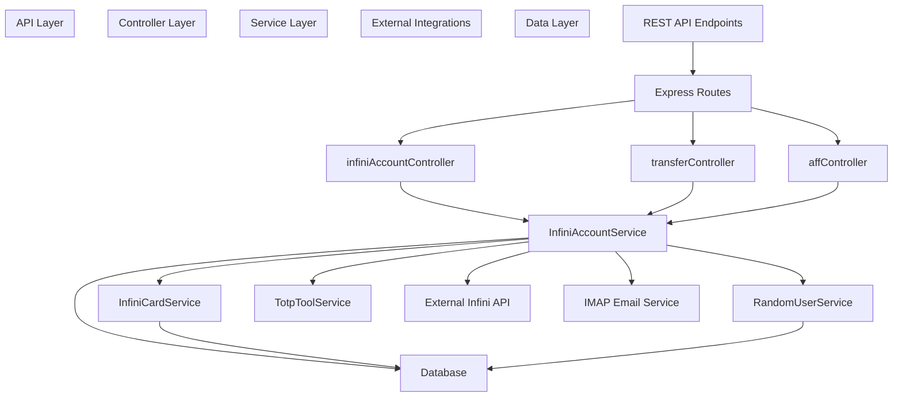
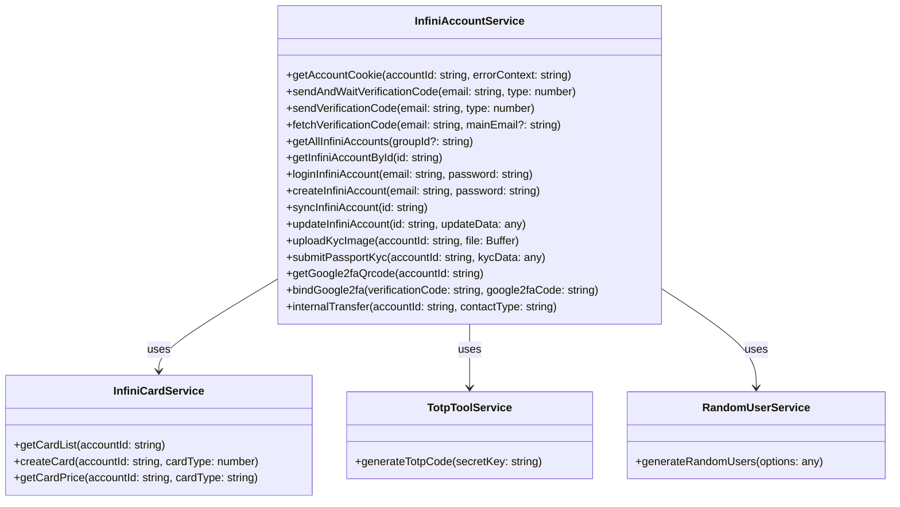
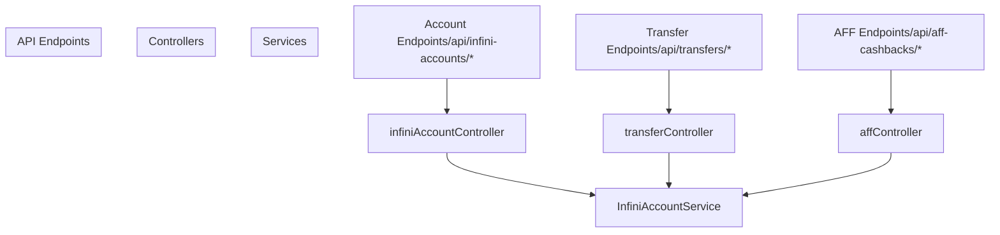

# Backend Architecture

> **Relevant source files**
> * [backend/src/controllers/affController.ts](https://github.com/clionertr/infini-manager/blob/328b6a21/backend/src/controllers/affController.ts)
> * [backend/src/controllers/infiniAccountController.ts](https://github.com/clionertr/infini-manager/blob/328b6a21/backend/src/controllers/infiniAccountController.ts)
> * [backend/src/controllers/transferController.ts](https://github.com/clionertr/infini-manager/blob/328b6a21/backend/src/controllers/transferController.ts)
> * [backend/src/service/InfiniAccountService.ts](https://github.com/clionertr/infini-manager/blob/328b6a21/backend/src/service/InfiniAccountService.ts)

This document provides a comprehensive overview of the Infini Manager backend system architecture, detailing its components, interactions, and technical implementation. For information about the frontend architecture, see [Frontend Architecture](/clionertr/infini-manager/2-frontend-architecture).

## 1. Architecture Overview

The Infini Manager backend follows a layered architecture pattern with clear separation of concerns between different components. It provides REST API endpoints for account management, transfers, affiliate cashbacks, and integration with external services.



Sources: [backend/src/service/InfiniAccountService.ts L25-L52](https://github.com/clionertr/infini-manager/blob/328b6a21/backend/src/service/InfiniAccountService.ts#L25-L52)

 [backend/src/controllers/infiniAccountController.ts L1-L37](https://github.com/clionertr/infini-manager/blob/328b6a21/backend/src/controllers/infiniAccountController.ts#L1-L37)

 [backend/src/controllers/transferController.ts L1-L14](https://github.com/clionertr/infini-manager/blob/328b6a21/backend/src/controllers/transferController.ts#L1-L14)

 [backend/src/controllers/affController.ts L1-L17](https://github.com/clionertr/infini-manager/blob/328b6a21/backend/src/controllers/affController.ts#L1-L17)

## 2. Core Services

### 2.1 InfiniAccountService

The `InfiniAccountService` is the central service in the backend architecture, handling most business logic related to Infini accounts, authentication, and operations.



Sources: [backend/src/service/InfiniAccountService.ts L25-L1012](https://github.com/clionertr/infini-manager/blob/328b6a21/backend/src/service/InfiniAccountService.ts#L25-L1012)

### 2.2 Service Responsibilities

The backend services handle specific functional domains:

| Service | Primary Responsibilities |
| --- | --- |
| **InfiniAccountService** | Account management, authentication, 2FA, KYC verification, transfers, cashbacks |
| **InfiniCardService** | Card management, creation, pricing |
| **TotpToolService** | TOTP code generation for 2FA |
| **RandomUserService** | Random user generation for testing/automation |

Sources: [backend/src/service/InfiniAccountService.ts L17-L19](https://github.com/clionertr/infini-manager/blob/328b6a21/backend/src/service/InfiniAccountService.ts#L17-L19)

 [backend/src/controllers/infiniAccountController.ts L8-L14](https://github.com/clionertr/infini-manager/blob/328b6a21/backend/src/controllers/infiniAccountController.ts#L8-L14)

## 3. Controller Layer

Controllers act as intermediaries between HTTP requests and services. They handle request validation, invoke appropriate service methods, and format responses.



Sources: [backend/src/controllers/infiniAccountController.ts L1-L37](https://github.com/clionertr/infini-manager/blob/328b6a21/backend/src/controllers/infiniAccountController.ts#L1-L37)

 [backend/src/controllers/transferController.ts L1-L14](https://github.com/clionertr/infini-manager/blob/328b6a21/backend/src/controllers/transferController.ts#L1-L14)

 [backend/src/controllers/affController.ts L1-L17](https://github.com/clionertr/infini-manager/blob/328b6a21/backend/src/controllers/affController.ts#L1-L17)

### 3.1 infiniAccountController

Handles account-related operations including:

* Account creation, updating, and deletion
* Account authentication and profile management
* 2FA setup and verification
* KYC verification
* Account grouping
* One-click account setup

Sources: [backend/src/controllers/infiniAccountController.ts L39-L1679](https://github.com/clionertr/infini-manager/blob/328b6a21/backend/src/controllers/infiniAccountController.ts#L39-L1679)

### 3.2 transferController

Manages transfer operations:

* Internal transfers between accounts
* Transfer history tracking
* Red packet handling

Sources: [backend/src/controllers/transferController.ts L18-L394](https://github.com/clionertr/infini-manager/blob/328b6a21/backend/src/controllers/transferController.ts#L18-L394)

### 3.3 affController

Controls affiliate cashback functionality:

* Creating and managing cashback batches
* Parsing cashback data from CSV/text
* Processing batch transfers
* Managing cashback relations

Sources: [backend/src/controllers/affController.ts L21-L1377](https://github.com/clionertr/infini-manager/blob/328b6a21/backend/src/controllers/affController.ts#L21-L1377)

## 4. Database Schema

The system uses a relational database (supporting both SQLite and MySQL) with the following core tables:

```
#mermaid-63o1hptz5cj{font-family:ui-sans-serif,-apple-system,system-ui,Segoe UI,Helvetica;font-size:16px;fill:#333;}@keyframes edge-animation-frame{from{stroke-dashoffset:0;}}@keyframes dash{to{stroke-dashoffset:0;}}#mermaid-63o1hptz5cj .edge-animation-slow{stroke-dasharray:9,5!important;stroke-dashoffset:900;animation:dash 50s linear infinite;stroke-linecap:round;}#mermaid-63o1hptz5cj .edge-animation-fast{stroke-dasharray:9,5!important;stroke-dashoffset:900;animation:dash 20s linear infinite;stroke-linecap:round;}#mermaid-63o1hptz5cj .error-icon{fill:#dddddd;}#mermaid-63o1hptz5cj .error-text{fill:#222222;stroke:#222222;}#mermaid-63o1hptz5cj .edge-thickness-normal{stroke-width:1px;}#mermaid-63o1hptz5cj .edge-thickness-thick{stroke-width:3.5px;}#mermaid-63o1hptz5cj .edge-pattern-solid{stroke-dasharray:0;}#mermaid-63o1hptz5cj .edge-thickness-invisible{stroke-width:0;fill:none;}#mermaid-63o1hptz5cj .edge-pattern-dashed{stroke-dasharray:3;}#mermaid-63o1hptz5cj .edge-pattern-dotted{stroke-dasharray:2;}#mermaid-63o1hptz5cj .marker{fill:#999;stroke:#999;}#mermaid-63o1hptz5cj .marker.cross{stroke:#999;}#mermaid-63o1hptz5cj svg{font-family:ui-sans-serif,-apple-system,system-ui,Segoe UI,Helvetica;font-size:16px;}#mermaid-63o1hptz5cj p{margin:0;}#mermaid-63o1hptz5cj .entityBox{fill:#ffffff;stroke:#dddddd;}#mermaid-63o1hptz5cj .relationshipLabelBox{fill:#dddddd;opacity:0.7;background-color:#dddddd;}#mermaid-63o1hptz5cj .relationshipLabelBox rect{opacity:0.5;}#mermaid-63o1hptz5cj .labelBkg{background-color:rgba(221, 221, 221, 0.5);}#mermaid-63o1hptz5cj .edgeLabel .label{fill:#dddddd;font-size:14px;}#mermaid-63o1hptz5cj .label{font-family:ui-sans-serif,-apple-system,system-ui,Segoe UI,Helvetica;color:#333;}#mermaid-63o1hptz5cj .edge-pattern-dashed{stroke-dasharray:8,8;}#mermaid-63o1hptz5cj .node rect,#mermaid-63o1hptz5cj .node circle,#mermaid-63o1hptz5cj .node ellipse,#mermaid-63o1hptz5cj .node polygon{fill:#ffffff;stroke:#dddddd;stroke-width:1px;}#mermaid-63o1hptz5cj .relationshipLine{stroke:#999;stroke-width:1;fill:none;}#mermaid-63o1hptz5cj .marker{fill:none!important;stroke:#999!important;stroke-width:1;}#mermaid-63o1hptz5cj :root{--mermaid-font-family:"trebuchet ms",verdana,arial,sans-serif;}hasinitiatesbelongs_tocontainslogsmanagescontainsinfini_accountsidintPKuser_idstringemailstringpasswordstringuidstringinvitation_codestringavailable_balancedecimalcookiestringcookie_expires_atdatetimegoogle_2fa_is_boundbooleanverification_levelintstatusstringinfini_2fa_infoidintPKinfini_account_idintFKqr_code_urlstringsecret_keystringrecovery_codesjsoninfini_account_groupsidintPKnamestringdescriptionstringis_defaultbooleaninfini_account_group_relationsidintPKinfini_account_idintFKgroup_idintFKinfini_transfersidintPKaccount_idintFKtarget_identifierstringcontact_typestringamountdecimalstatusstringremarksstringinfini_transfer_historiesidintPKtransfer_idintFKstatusstringmessagestringcreated_atdatetimeinfini_aff_cashbacksidintPKaccount_idintFKbatch_namestringdefault_amountdecimalstatusstringtotal_countintsuccess_countintfailed_countintinfini_aff_cashback_relationsidintPKaff_cashback_idintFKinfini_uidstringamountdecimalstatusstringis_riskybooleantransfer_idintFK
```

Sources: [backend/src/service/InfiniAccountService.ts L34-L47](https://github.com/clionertr/infini-manager/blob/328b6a21/backend/src/service/InfiniAccountService.ts#L34-L47)

 [backend/src/service/InfiniAccountService.ts L558-L647](https://github.com/clionertr/infini-manager/blob/328b6a21/backend/src/service/InfiniAccountService.ts#L558-L647)

 [backend/src/controllers/transferController.ts L152-L161](https://github.com/clionertr/infini-manager/blob/328b6a21/backend/src/controllers/transferController.ts#L152-L161)

 [backend/src/controllers/affController.ts L39-L72](https://github.com/clionertr/infini-manager/blob/328b6a21/backend/src/controllers/affController.ts#L39-L72)

## 5. Core Workflows

### 5.1 Account Creation and Setup

```

```

Sources: [backend/src/controllers/infiniAccountController.ts L402-L430](https://github.com/clionertr/infini-manager/blob/328b6a21/backend/src/controllers/infiniAccountController.ts#L402-L430)

 [backend/src/controllers/infiniAccountController.ts L1133-L1372](https://github.com/clionertr/infini-manager/blob/328b6a21/backend/src/controllers/infiniAccountController.ts#L1133-L1372)

 [backend/src/service/InfiniAccountService.ts L866-L1012](https://github.com/clionertr/infini-manager/blob/328b6a21/backend/src/service/InfiniAccountService.ts#L866-L1012)

### 5.2 Transfer Workflow

```

```

Sources: [backend/src/controllers/transferController.ts L76-L123](https://github.com/clionertr/infini-manager/blob/328b6a21/backend/src/controllers/transferController.ts#L76-L123)

### 5.3 AFF Cashback Process

```

```

Sources: [backend/src/controllers/affController.ts L21-L85](https://github.com/clionertr/infini-manager/blob/328b6a21/backend/src/controllers/affController.ts#L21-L85)

 [backend/src/controllers/affController.ts L93-L237](https://github.com/clionertr/infini-manager/blob/328b6a21/backend/src/controllers/affController.ts#L93-L237)

 [backend/src/controllers/affController.ts L551-L708](https://github.com/clionertr/infini-manager/blob/328b6a21/backend/src/controllers/affController.ts#L551-L708)

 [backend/src/controllers/affController.ts L716-L823](https://github.com/clionertr/infini-manager/blob/328b6a21/backend/src/controllers/affController.ts#L716-L823)

## 6. External API Integration

The backend integrates with the External Infini API for core account functions, exposed through a well-defined interface in the service layer.

```

```

The `InfiniAccountService` interfaces with the external Infini API using the following common endpoints:

| Endpoint | Purpose |
| --- | --- |
| `/user/login` | Authenticate user and get session cookie |
| `/user/verify-email` | Send verification code for registration/2FA |
| `/user/profile` | Get user profile information |
| `/user/registration/email` | Register new user account |
| `/card/kyc/upload_file` | Upload KYC verification image |
| `/account/transfers` | Execute funds transfer |
| `/account/grab_red_packet` | Claim red packet funds |

Sources: [backend/src/service/InfiniAccountService.ts L20-L33](https://github.com/clionertr/infini-manager/blob/328b6a21/backend/src/service/InfiniAccountService.ts#L20-L33)

 [backend/src/service/InfiniAccountService.ts L90-L104](https://github.com/clionertr/infini-manager/blob/328b6a21/backend/src/service/InfiniAccountService.ts#L90-L104)

 [backend/src/service/InfiniAccountService.ts L174-L186](https://github.com/clionertr/infini-manager/blob/328b6a21/backend/src/service/InfiniAccountService.ts#L174-L186)

 [backend/src/controllers/transferController.ts L357-L376](https://github.com/clionertr/infini-manager/blob/328b6a21/backend/src/controllers/transferController.ts#L357-L376)

## 7. Security and Authentication

### 7.1 Cookie-Based Authentication

The system uses cookie-based authentication with the external Infini API, managing cookie lifecycle and expiration:

```

```

Sources: [backend/src/service/InfiniAccountService.ts L32-L138](https://github.com/clionertr/infini-manager/blob/328b6a21/backend/src/service/InfiniAccountService.ts#L32-L138)

### 7.2 Two-Factor Authentication (2FA)

The system supports Google Authenticator-compatible TOTP 2FA for accounts, with the ability to automate 2FA for internal operations.

| 2FA Feature | Implementation |
| --- | --- |
| 2FA Setup | `getGoogle2faQrcode`, `sendGoogle2faVerificationEmail`, `bindGoogle2fa` |
| 2FA for Transfers | Auto-generation of TOTP codes using stored secrets |
| 2FA Recovery | Storage and retrieval of recovery codes |

Sources: [backend/src/controllers/infiniAccountController.ts L89-L198](https://github.com/clionertr/infini-manager/blob/328b6a21/backend/src/controllers/infiniAccountController.ts#L89-L198)

 [backend/src/controllers/infiniAccountController.ts L1379-L1475](https://github.com/clionertr/infini-manager/blob/328b6a21/backend/src/controllers/infiniAccountController.ts#L1379-L1475)

## 8. Error Handling

The backend implements a consistent error handling pattern across the architecture:

1. **Controller Level**: HTTP-specific error handling with appropriate status codes
2. **Service Level**: Business logic error handling with descriptive messages
3. **External API Integration**: Capturing and translating external API errors
4. **Database Operations**: Handling database-related errors

Error responses follow a standard format:

```
{
  "success": false,
  "message": "Descriptive error message",
  "data": null
}
```

Sources: [backend/src/controllers/infiniAccountController.ts L227-L232](https://github.com/clionertr/infini-manager/blob/328b6a21/backend/src/controllers/infiniAccountController.ts#L227-L232)

 [backend/src/controllers/transferController.ts L384-L393](https://github.com/clionertr/infini-manager/blob/328b6a21/backend/src/controllers/transferController.ts#L384-L393)

 [backend/src/controllers/affController.ts L708-L710](https://github.com/clionertr/infini-manager/blob/328b6a21/backend/src/controllers/affController.ts#L708-L710)

## 9. Conclusion

The Infini Manager backend architecture provides a robust foundation for managing Infini accounts, transfers, and cashbacks. The layered design with clear separation between controllers and services ensures maintainable code and testable components. The integration with the external Infini API is well-encapsulated within the service layer, allowing for potential changes in the external API without affecting the rest of the system.

Key architectural strengths include:

* Clear separation of concerns with the controller-service pattern
* Consistent error handling across the system
* Robust authentication management
* Comprehensive logging of operations
* Support for batch operations and transaction history

Sources: [backend/src/service/InfiniAccountService.ts L25-L52](https://github.com/clionertr/infini-manager/blob/328b6a21/backend/src/service/InfiniAccountService.ts#L25-L52)

 [backend/src/controllers/infiniAccountController.ts L1-L37](https://github.com/clionertr/infini-manager/blob/328b6a21/backend/src/controllers/infiniAccountController.ts#L1-L37)

 [backend/src/controllers/transferController.ts L1-L14](https://github.com/clionertr/infini-manager/blob/328b6a21/backend/src/controllers/transferController.ts#L1-L14)

 [backend/src/controllers/affController.ts L1-L17](https://github.com/clionertr/infini-manager/blob/328b6a21/backend/src/controllers/affController.ts#L1-L17)