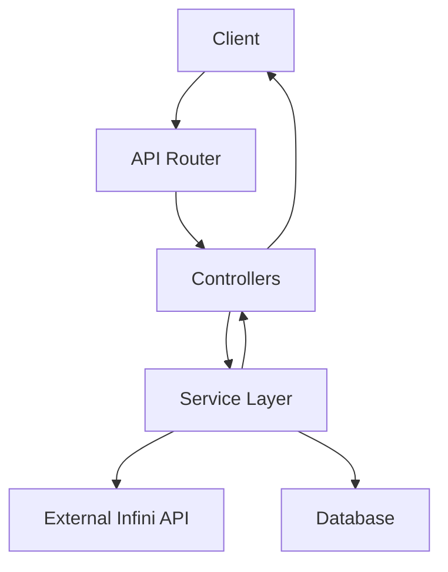
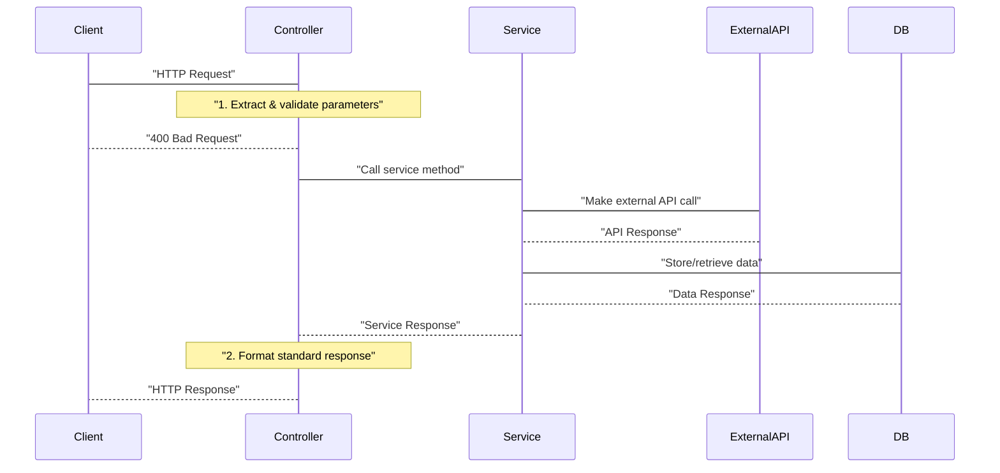
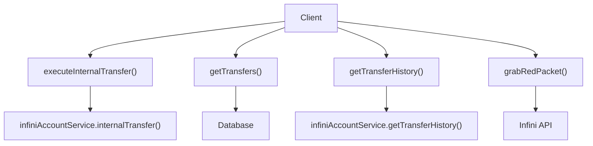
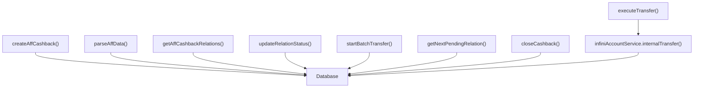
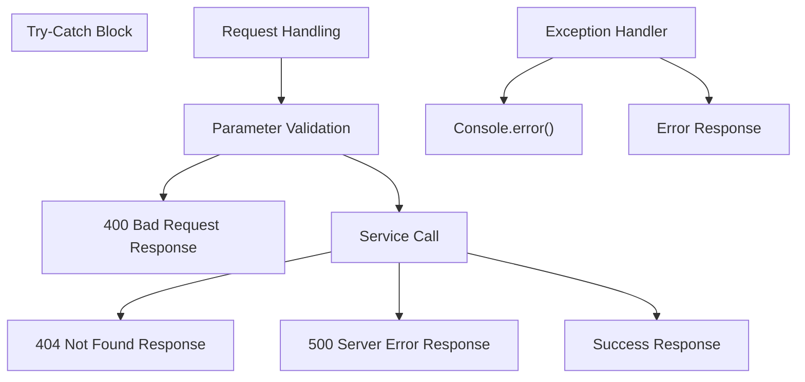
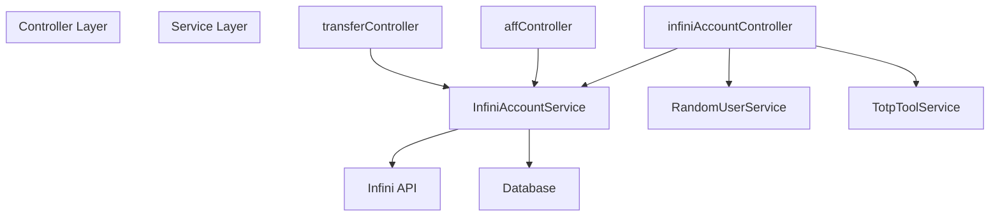

# Controllers

> **Relevant source files**
> * [backend/src/controllers/affController.ts](https://github.com/clionertr/infini-manager/blob/328b6a21/backend/src/controllers/affController.ts)
> * [backend/src/controllers/infiniAccountController.ts](https://github.com/clionertr/infini-manager/blob/328b6a21/backend/src/controllers/infiniAccountController.ts)
> * [backend/src/controllers/transferController.ts](https://github.com/clionertr/infini-manager/blob/328b6a21/backend/src/controllers/transferController.ts)

The Controllers layer in Infini Manager serves as the interface between HTTP requests and business logic. Controllers handle request validation, orchestrate service calls, and format standardized API responses. For information about the services these controllers use, see [InfiniAccountService](/clionertr/infini-manager/3.1-infiniaccountservice), and for available API endpoints, see [API Routes](/clionertr/infini-manager/3.3-api-routes).

## Controller Architecture

Controllers form a critical middleware layer that processes incoming requests before invoking service methods. The following diagram illustrates how controllers fit into the system's architecture:



Sources: [backend/src/controllers/infiniAccountController.ts L1-L16](https://github.com/clionertr/infini-manager/blob/328b6a21/backend/src/controllers/infiniAccountController.ts#L1-L16)

 [backend/src/controllers/transferController.ts L1-L14](https://github.com/clionertr/infini-manager/blob/328b6a21/backend/src/controllers/transferController.ts#L1-L14)

 [backend/src/controllers/affController.ts L1-L17](https://github.com/clionertr/infini-manager/blob/328b6a21/backend/src/controllers/affController.ts#L1-L17)

## Controller Types

The system implements three primary controllers, each responsible for a specific domain of functionality:

| Controller | Primary Responsibility | Key Services Used |
| --- | --- | --- |
| `infiniAccountController` | Account management, authentication, KYC | InfiniAccountService, RandomUserService, TotpToolService |
| `transferController` | Fund transfers between accounts | InfiniAccountService |
| `affController` | Affiliate cashback batch processing | InfiniAccountService |

Sources: [backend/src/controllers/infiniAccountController.ts L8-L14](https://github.com/clionertr/infini-manager/blob/328b6a21/backend/src/controllers/infiniAccountController.ts#L8-L14)

 [backend/src/controllers/transferController.ts L7-L13](https://github.com/clionertr/infini-manager/blob/328b6a21/backend/src/controllers/transferController.ts#L7-L13)

 [backend/src/controllers/affController.ts L7-L16](https://github.com/clionertr/infini-manager/blob/328b6a21/backend/src/controllers/affController.ts#L7-L16)

## Request Flow

The following sequence diagram illustrates the typical flow of a request through the controller layer:



Sources: [backend/src/controllers/infiniAccountController.ts L402-L429](https://github.com/clionertr/infini-manager/blob/328b6a21/backend/src/controllers/infiniAccountController.ts#L402-L429)

 [backend/src/controllers/transferController.ts L76-L123](https://github.com/clionertr/infini-manager/blob/328b6a21/backend/src/controllers/transferController.ts#L76-L123)

 [backend/src/controllers/affController.ts L21-L88](https://github.com/clionertr/infini-manager/blob/328b6a21/backend/src/controllers/affController.ts#L21-L88)

## InfiniAccountController

The `infiniAccountController` is the most extensive controller in the system, handling operations related to Infini account management.

### Key Responsibilities

1. **Account Management**

* Creating and registering accounts
* Retrieving account information
* Synchronizing with external Infini system
* Managing account groups
2. **Authentication and Security**

* 2FA setup and verification
* Verification code handling
* Email verification
3. **KYC Processing**

* Document upload
* Passport verification
* KYC status tracking
4. **Card Management**

* Card creation
* Card information retrieval
* Card pricing
5. **Automated Account Setup**

* One-click account setup with registration, 2FA, KYC, and card creation

### Operation Flow

```mermaid
flowchart TD

subgraph Automated_Setup_Flow ["Automated Setup Flow"]
end

subgraph InfiniAccountService ["InfiniAccountService"]
end

subgraph infiniAccountController ["infiniAccountController"]
end

createAcc["createInfiniAccount"]
oneClick["oneClickAccountSetup"]
syncAcc["syncInfiniAccount"]
setup2FA["bindGoogle2fa"]
setupKYC["submitPassportKyc"]
createCard["createCard"]
accService["createInfiniAccount()"]
syncService["syncInfiniAccount()"]
kycService["submitPassportKyc()"]
cardService["createCard()"]
twoFaService["bindGoogle2fa()"]
setupFlow["setupTwoFactorAuth()setupKycVerification()setupCard()"]

    createAcc --> accService
    oneClick --> setupFlow
    syncAcc --> syncService
    setup2FA --> twoFaService
    setupKYC --> kycService
    createCard --> cardService
```



Sources: [backend/src/controllers/infiniAccountController.ts L402-L429](https://github.com/clionertr/infini-manager/blob/328b6a21/backend/src/controllers/infiniAccountController.ts#L402-L429)

 [backend/src/controllers/infiniAccountController.ts L1133-L1679](https://github.com/clionertr/infini-manager/blob/328b6a21/backend/src/controllers/infiniAccountController.ts#L1133-L1679)

## TransferController

The `transferController` manages fund transfers between accounts and provides access to transfer history.

### Key Responsibilities

1. **Transfer Execution**

* Processing transfers between accounts
* Supporting different target types (UID, email, internal)
* Handling 2FA verification for transfers
2. **Transfer Records**

* Retrieving and filtering transfer records
* Accessing detailed transfer history
* Supporting complex search capabilities
3. **Special Operations**

* Red packet processing

### Key Methods



Sources: [backend/src/controllers/transferController.ts L76-L123](https://github.com/clionertr/infini-manager/blob/328b6a21/backend/src/controllers/transferController.ts#L76-L123)

 [backend/src/controllers/transferController.ts L131-L254](https://github.com/clionertr/infini-manager/blob/328b6a21/backend/src/controllers/transferController.ts#L131-L254)

 [backend/src/controllers/transferController.ts L298-L316](https://github.com/clionertr/infini-manager/blob/328b6a21/backend/src/controllers/transferController.ts#L298-L316)

 [backend/src/controllers/transferController.ts L322-L394](https://github.com/clionertr/infini-manager/blob/328b6a21/backend/src/controllers/transferController.ts#L322-L394)

## AffController

The `affController` handles affiliate cashback operations, allowing batch processing of payments to multiple users.

### Key Responsibilities

1. **Batch Management**

* Creating cashback batches
* Tracking batch status
* Processing batch transfers
2. **Data Processing**

* Parsing CSV and text data
* Validating cashback records
* Risk assessment
3. **Transfer Execution**

* Executing individual transfers
* Batch processing
* Status tracking

### AFF Cashback Flow



Sources: [backend/src/controllers/affController.ts L21-L88](https://github.com/clionertr/infini-manager/blob/328b6a21/backend/src/controllers/affController.ts#L21-L88)

 [backend/src/controllers/affController.ts L93-L237](https://github.com/clionertr/infini-manager/blob/328b6a21/backend/src/controllers/affController.ts#L93-L237)

 [backend/src/controllers/affController.ts L551-L708](https://github.com/clionertr/infini-manager/blob/328b6a21/backend/src/controllers/affController.ts#L551-L708)

 [backend/src/controllers/affController.ts L716-L933](https://github.com/clionertr/infini-manager/blob/328b6a21/backend/src/controllers/affController.ts#L716-L933)

## Standard Response Format

All controllers follow a consistent response format:

```
{
  "success": true|false,
  "message": "Optional status message",
  "data": {
    // Response payload (when success is true)
  }
}
```

HTTP status codes are used appropriately:

* 200: Successful operation
* 201: Resource created
* 400: Bad request/invalid parameters
* 404: Resource not found
* 500: Server error

Sources: [backend/src/controllers/infiniAccountController.ts L41-L83](https://github.com/clionertr/infini-manager/blob/328b6a21/backend/src/controllers/infiniAccountController.ts#L41-L83)

 [backend/src/controllers/transferController.ts L131-L254](https://github.com/clionertr/infini-manager/blob/328b6a21/backend/src/controllers/transferController.ts#L131-L254)

 [backend/src/controllers/affController.ts L21-L88](https://github.com/clionertr/infini-manager/blob/328b6a21/backend/src/controllers/affController.ts#L21-L88)

## Error Handling Patterns

Controllers implement consistent error handling:



All controller methods are wrapped in try-catch blocks to prevent unhandled exceptions. Errors are logged to the console and formatted into standard error responses.

Sources: [backend/src/controllers/infiniAccountController.ts L77-L83](https://github.com/clionertr/infini-manager/blob/328b6a21/backend/src/controllers/infiniAccountController.ts#L77-L83)

 [backend/src/controllers/transferController.ts L384-L393](https://github.com/clionertr/infini-manager/blob/328b6a21/backend/src/controllers/transferController.ts#L384-L393)

 [backend/src/controllers/affController.ts L708-L710](https://github.com/clionertr/infini-manager/blob/328b6a21/backend/src/controllers/affController.ts#L708-L710)

## Middleware Integration

Controllers utilize middleware for specific functionalities:

1. **File Upload Processing**

* Uses `multer` to handle KYC image uploads
* Configures storage, size limits, and file type validation
2. **Error Handling**

* Controllers pass errors to `next()` for centralized error handling in some cases
* Direct error handling in try-catch blocks in other cases

Sources: [backend/src/controllers/infiniAccountController.ts L19-L33](https://github.com/clionertr/infini-manager/blob/328b6a21/backend/src/controllers/infiniAccountController.ts#L19-L33)

 [backend/src/controllers/affController.ts L86-L87](https://github.com/clionertr/infini-manager/blob/328b6a21/backend/src/controllers/affController.ts#L86-L87)

 [backend/src/controllers/transferController.ts L120-L122](https://github.com/clionertr/infini-manager/blob/328b6a21/backend/src/controllers/transferController.ts#L120-L122)

## Controller-Service Relationship

The controllers maintain a clear separation of concerns:



Controllers are responsible for:

* Request handling and parameter validation
* Orchestrating service calls
* Response formatting and error handling

Services handle:

* Business logic implementation
* External API interactions
* Data access operations

Sources: [backend/src/controllers/infiniAccountController.ts L8-L14](https://github.com/clionertr/infini-manager/blob/328b6a21/backend/src/controllers/infiniAccountController.ts#L8-L14)

 [backend/src/controllers/transferController.ts

13](https://github.com/clionertr/infini-manager/blob/328b6a21/backend/src/controllers/transferController.ts#L13-L13)

 [backend/src/controllers/affController.ts

16](https://github.com/clionertr/infini-manager/blob/328b6a21/backend/src/controllers/affController.ts#L16-L16)