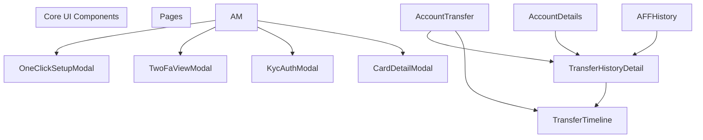
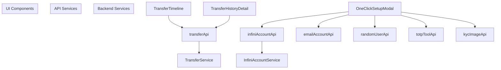
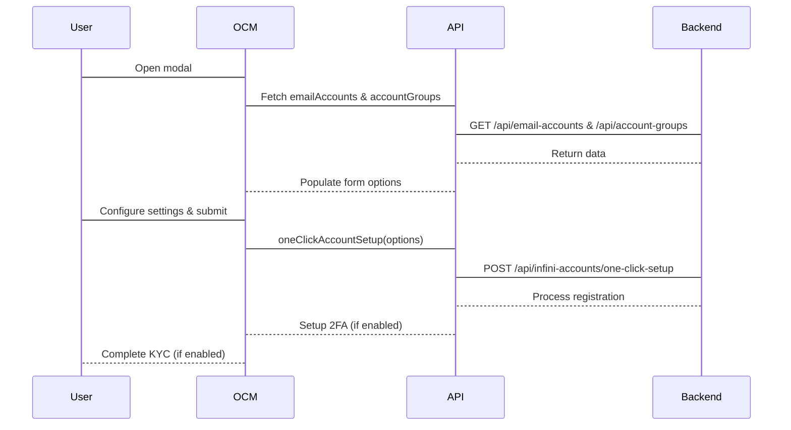
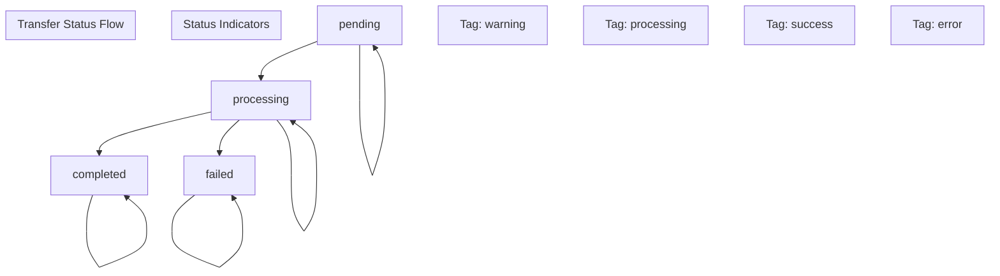
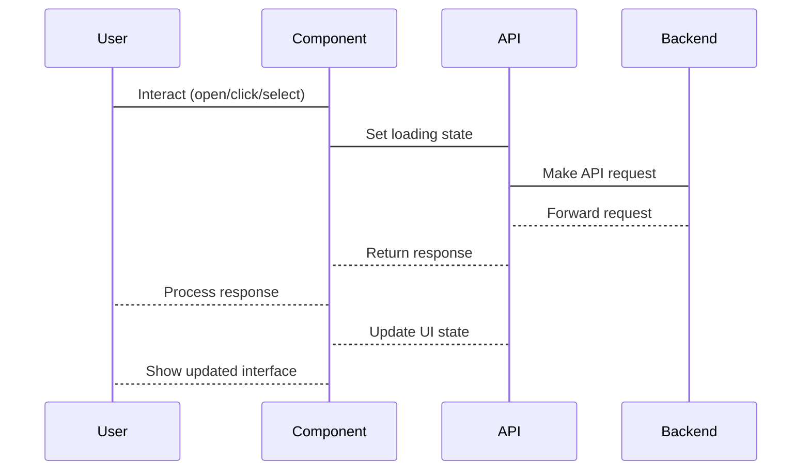

# Core UI Components

> **Relevant source files**
> * [frontend/src/components/OneClickSetupModal.tsx](https://github.com/clionertr/infini-manager/blob/328b6a21/frontend/src/components/OneClickSetupModal.tsx)
> * [frontend/src/components/TransferHistoryDetail.tsx](https://github.com/clionertr/infini-manager/blob/328b6a21/frontend/src/components/TransferHistoryDetail.tsx)
> * [frontend/src/components/TransferTimeline.tsx](https://github.com/clionertr/infini-manager/blob/328b6a21/frontend/src/components/TransferTimeline.tsx)

This page documents the reusable UI components that form the foundation of the Infini Manager frontend. These components provide consistent interfaces for account management, transaction visualization, and automated workflows throughout the application. For information about specific page implementations that use these components, see [Frontend Architecture](/clionertr/infini-manager/2-frontend-architecture).

## Component Overview

The Infini Manager system utilizes a library of reusable UI components to maintain consistency and reduce code duplication. This document focuses on the core components that are used across multiple pages within the application.



Sources: [frontend/src/components/OneClickSetupModal.tsx L1-L553](https://github.com/clionertr/infini-manager/blob/328b6a21/frontend/src/components/OneClickSetupModal.tsx#L1-L553)

 [frontend/src/components/TransferTimeline.tsx L1-L719](https://github.com/clionertr/infini-manager/blob/328b6a21/frontend/src/components/TransferTimeline.tsx#L1-L719)

 [frontend/src/components/TransferHistoryDetail.tsx L1-L590](https://github.com/clionertr/infini-manager/blob/328b6a21/frontend/src/components/TransferHistoryDetail.tsx#L1-L590)

## Component Hierarchy and Data Flow

The diagram below illustrates how the core UI components interact with other parts of the system, including the API service layer and backend services.



Sources: [frontend/src/components/OneClickSetupModal.tsx

35](https://github.com/clionertr/infini-manager/blob/328b6a21/frontend/src/components/OneClickSetupModal.tsx#L35-L35)

 [frontend/src/components/TransferTimeline.tsx

5](https://github.com/clionertr/infini-manager/blob/328b6a21/frontend/src/components/TransferTimeline.tsx#L5-L5)

 [frontend/src/components/TransferHistoryDetail.tsx

4](https://github.com/clionertr/infini-manager/blob/328b6a21/frontend/src/components/TransferHistoryDetail.tsx#L4-L4)

## 1. OneClickSetupModal

The OneClickSetupModal is a complex modal component that enables automated account setup with minimal user interaction.

### Purpose and Features

* Provides a single interface for complete account setup workflow
* Automates random user registration
* Configures two-factor authentication (2FA)
* Performs know-your-customer (KYC) verification
* Creates payment cards
* Groups accounts for better organization

### Component Structure

```

```

Sources: [frontend/src/components/OneClickSetupModal.tsx L38-L62](https://github.com/clionertr/infini-manager/blob/328b6a21/frontend/src/components/OneClickSetupModal.tsx#L38-L62)

 [frontend/src/components/OneClickSetupModal.tsx L110-L551](https://github.com/clionertr/infini-manager/blob/328b6a21/frontend/src/components/OneClickSetupModal.tsx#L110-L551)

### Workflow and State Management

The component manages multiple states throughout the account setup process:

1. Initial form with customization options
2. Processing state during API calls
3. Result display with success/failure information

The modal handles various API interactions with integrated error handling and provides a consistent interface for the account setup process.



Sources: [frontend/src/components/OneClickSetupModal.tsx L251-L334](https://github.com/clionertr/infini-manager/blob/328b6a21/frontend/src/components/OneClickSetupModal.tsx#L251-L334)

## 2. TransferTimeline

The TransferTimeline component visualizes transfer histories in a chronological format, providing real-time updates and detailed information.

### Purpose and Features

* Displays a timeline of transfer records
* Supports real-time polling with customizable intervals
* Provides detailed view of individual transfer records
* Shows transfer statuses with appropriate visual indicators
* Enables manual refresh and automatic updates

### Component Structure

```

```

Sources: [frontend/src/components/TransferTimeline.tsx L136-L154](https://github.com/clionertr/infini-manager/blob/328b6a21/frontend/src/components/TransferTimeline.tsx#L136-L154)

 [frontend/src/components/TransferTimeline.tsx L148-L716](https://github.com/clionertr/infini-manager/blob/328b6a21/frontend/src/components/TransferTimeline.tsx#L148-L716)

### Data Polling and Refresh Mechanism

The component implements a sophisticated polling system that allows for real-time updates of transfer statuses:

1. Initial data load on component mount
2. Periodic polling at configurable intervals
3. Manual refresh capability
4. Automatic continuation until final status is reached

```
#mermaid-zcwbeha5tb8{font-family:ui-sans-serif,-apple-system,system-ui,Segoe UI,Helvetica;font-size:16px;fill:#333;}@keyframes edge-animation-frame{from{stroke-dashoffset:0;}}@keyframes dash{to{stroke-dashoffset:0;}}#mermaid-zcwbeha5tb8 .edge-animation-slow{stroke-dasharray:9,5!important;stroke-dashoffset:900;animation:dash 50s linear infinite;stroke-linecap:round;}#mermaid-zcwbeha5tb8 .edge-animation-fast{stroke-dasharray:9,5!important;stroke-dashoffset:900;animation:dash 20s linear infinite;stroke-linecap:round;}#mermaid-zcwbeha5tb8 .error-icon{fill:#dddddd;}#mermaid-zcwbeha5tb8 .error-text{fill:#222222;stroke:#222222;}#mermaid-zcwbeha5tb8 .edge-thickness-normal{stroke-width:1px;}#mermaid-zcwbeha5tb8 .edge-thickness-thick{stroke-width:3.5px;}#mermaid-zcwbeha5tb8 .edge-pattern-solid{stroke-dasharray:0;}#mermaid-zcwbeha5tb8 .edge-thickness-invisible{stroke-width:0;fill:none;}#mermaid-zcwbeha5tb8 .edge-pattern-dashed{stroke-dasharray:3;}#mermaid-zcwbeha5tb8 .edge-pattern-dotted{stroke-dasharray:2;}#mermaid-zcwbeha5tb8 .marker{fill:#999;stroke:#999;}#mermaid-zcwbeha5tb8 .marker.cross{stroke:#999;}#mermaid-zcwbeha5tb8 svg{font-family:ui-sans-serif,-apple-system,system-ui,Segoe UI,Helvetica;font-size:16px;}#mermaid-zcwbeha5tb8 p{margin:0;}#mermaid-zcwbeha5tb8 defs #statediagram-barbEnd{fill:#999;stroke:#999;}#mermaid-zcwbeha5tb8 g.stateGroup text{fill:#dddddd;stroke:none;font-size:10px;}#mermaid-zcwbeha5tb8 g.stateGroup text{fill:#333;stroke:none;font-size:10px;}#mermaid-zcwbeha5tb8 g.stateGroup .state-title{font-weight:bolder;fill:#333;}#mermaid-zcwbeha5tb8 g.stateGroup rect{fill:#ffffff;stroke:#dddddd;}#mermaid-zcwbeha5tb8 g.stateGroup line{stroke:#999;stroke-width:1;}#mermaid-zcwbeha5tb8 .transition{stroke:#999;stroke-width:1;fill:none;}#mermaid-zcwbeha5tb8 .stateGroup .composit{fill:#f4f4f4;border-bottom:1px;}#mermaid-zcwbeha5tb8 .stateGroup .alt-composit{fill:#e0e0e0;border-bottom:1px;}#mermaid-zcwbeha5tb8 .state-note{stroke:#e6d280;fill:#fff5ad;}#mermaid-zcwbeha5tb8 .state-note text{fill:#333;stroke:none;font-size:10px;}#mermaid-zcwbeha5tb8 .stateLabel .box{stroke:none;stroke-width:0;fill:#ffffff;opacity:0.5;}#mermaid-zcwbeha5tb8 .edgeLabel .label rect{fill:#ffffff;opacity:0.5;}#mermaid-zcwbeha5tb8 .edgeLabel{background-color:#ffffff;text-align:center;}#mermaid-zcwbeha5tb8 .edgeLabel p{background-color:#ffffff;}#mermaid-zcwbeha5tb8 .edgeLabel rect{opacity:0.5;background-color:#ffffff;fill:#ffffff;}#mermaid-zcwbeha5tb8 .edgeLabel .label text{fill:#333;}#mermaid-zcwbeha5tb8 .label div .edgeLabel{color:#333;}#mermaid-zcwbeha5tb8 .stateLabel text{fill:#333;font-size:10px;font-weight:bold;}#mermaid-zcwbeha5tb8 .node circle.state-start{fill:#999;stroke:#999;}#mermaid-zcwbeha5tb8 .node .fork-join{fill:#999;stroke:#999;}#mermaid-zcwbeha5tb8 .node circle.state-end{fill:#dddddd;stroke:#f4f4f4;stroke-width:1.5;}#mermaid-zcwbeha5tb8 .end-state-inner{fill:#f4f4f4;stroke-width:1.5;}#mermaid-zcwbeha5tb8 .node rect{fill:#ffffff;stroke:#dddddd;stroke-width:1px;}#mermaid-zcwbeha5tb8 .node polygon{fill:#ffffff;stroke:#dddddd;stroke-width:1px;}#mermaid-zcwbeha5tb8 #statediagram-barbEnd{fill:#999;}#mermaid-zcwbeha5tb8 .statediagram-cluster rect{fill:#ffffff;stroke:#dddddd;stroke-width:1px;}#mermaid-zcwbeha5tb8 .cluster-label,#mermaid-zcwbeha5tb8 .nodeLabel{color:#333;}#mermaid-zcwbeha5tb8 .statediagram-cluster rect.outer{rx:5px;ry:5px;}#mermaid-zcwbeha5tb8 .statediagram-state .divider{stroke:#dddddd;}#mermaid-zcwbeha5tb8 .statediagram-state .title-state{rx:5px;ry:5px;}#mermaid-zcwbeha5tb8 .statediagram-cluster.statediagram-cluster .inner{fill:#f4f4f4;}#mermaid-zcwbeha5tb8 .statediagram-cluster.statediagram-cluster-alt .inner{fill:#f8f8f8;}#mermaid-zcwbeha5tb8 .statediagram-cluster .inner{rx:0;ry:0;}#mermaid-zcwbeha5tb8 .statediagram-state rect.basic{rx:5px;ry:5px;}#mermaid-zcwbeha5tb8 .statediagram-state rect.divider{stroke-dasharray:10,10;fill:#f8f8f8;}#mermaid-zcwbeha5tb8 .note-edge{stroke-dasharray:5;}#mermaid-zcwbeha5tb8 .statediagram-note rect{fill:#fff5ad;stroke:#e6d280;stroke-width:1px;rx:0;ry:0;}#mermaid-zcwbeha5tb8 .statediagram-note rect{fill:#fff5ad;stroke:#e6d280;stroke-width:1px;rx:0;ry:0;}#mermaid-zcwbeha5tb8 .statediagram-note text{fill:#333;}#mermaid-zcwbeha5tb8 .statediagram-note .nodeLabel{color:#333;}#mermaid-zcwbeha5tb8 .statediagram .edgeLabel{color:red;}#mermaid-zcwbeha5tb8 #dependencyStart,#mermaid-zcwbeha5tb8 #dependencyEnd{fill:#999;stroke:#999;stroke-width:1;}#mermaid-zcwbeha5tb8 .statediagramTitleText{text-anchor:middle;font-size:18px;fill:#333;}#mermaid-zcwbeha5tb8 :root{--mermaid-font-family:"trebuchet ms",verdana,arial,sans-serif;}Component MountInitial Data LoadUpdate Every N msSelect TransferClose DetailStop PollingClose TimelineIdleLoadingPollingDetailView
```

Sources: [frontend/src/components/TransferTimeline.tsx L351-L368](https://github.com/clionertr/infini-manager/blob/328b6a21/frontend/src/components/TransferTimeline.tsx#L351-L368)

 [frontend/src/components/TransferTimeline.tsx L370-L387](https://github.com/clionertr/infini-manager/blob/328b6a21/frontend/src/components/TransferTimeline.tsx#L370-L387)

## 3. TransferHistoryDetail

The TransferHistoryDetail component provides a focused view of a specific transfer's lifecycle, displaying status changes and processing details.

### Purpose and Features

* Shows detailed history of status changes for a transfer
* Displays transaction details in a timeline format
* Formats different status types appropriately
* Implements chain-based polling for real-time updates
* Provides a comprehensive view of transfer processing steps

### Component Structure

```

```

Sources: [frontend/src/components/TransferHistoryDetail.tsx L48-L60](https://github.com/clionertr/infini-manager/blob/328b6a21/frontend/src/components/TransferHistoryDetail.tsx#L48-L60)

 [frontend/src/components/TransferHistoryDetail.tsx L66-L588](https://github.com/clionertr/infini-manager/blob/328b6a21/frontend/src/components/TransferHistoryDetail.tsx#L66-L588)

### Transfer Status Visualization

The component visualizes the lifecycle of a transfer through a timeline, with each status change represented as a node:



Sources: [frontend/src/components/TransferHistoryDetail.tsx L347-L359](https://github.com/clionertr/infini-manager/blob/328b6a21/frontend/src/components/TransferHistoryDetail.tsx#L347-L359)

## 4. Component Interaction Patterns

The core UI components follow consistent patterns for data fetching, state management, and user interaction. These patterns ensure that components behave predictably across the application.

### Data Fetching Pattern

All components follow a similar pattern for data retrieval:

1. Initial data loading on component mount
2. Loading state indicators during API calls
3. Error handling with user feedback
4. Optional polling mechanisms for real-time updates
5. Manual refresh capabilities

### User Interaction Flow



Sources: [frontend/src/components/OneClickSetupModal.tsx L251-L334](https://github.com/clionertr/infini-manager/blob/328b6a21/frontend/src/components/OneClickSetupModal.tsx#L251-L334)

 [frontend/src/components/TransferTimeline.tsx L226-L264](https://github.com/clionertr/infini-manager/blob/328b6a21/frontend/src/components/TransferTimeline.tsx#L226-L264)

 [frontend/src/components/TransferHistoryDetail.tsx L132-L219](https://github.com/clionertr/infini-manager/blob/328b6a21/frontend/src/components/TransferHistoryDetail.tsx#L132-L219)

## 5. Common Component Properties

These core UI components share several common property patterns:

| Property | Type | Purpose | Used In |
| --- | --- | --- | --- |
| visible | boolean | Controls component visibility | All components |
| onClose | function | Handles component dismissal | All components |
| loading | boolean | Indicates data loading state | All components |
| sourceAccountId | string/number | Identifies the account to fetch data for | TransferTimeline, TransferHistoryDetail |
| className | string | Allows CSS class customization | TransferHistoryDetail |
| style | object | Enables inline style customization | TransferHistoryDetail |

Sources: [frontend/src/components/OneClickSetupModal.tsx L40-L44](https://github.com/clionertr/infini-manager/blob/328b6a21/frontend/src/components/OneClickSetupModal.tsx#L40-L44)

 [frontend/src/components/TransferTimeline.tsx L136-L154](https://github.com/clionertr/infini-manager/blob/328b6a21/frontend/src/components/TransferTimeline.tsx#L136-L154)

 [frontend/src/components/TransferHistoryDetail.tsx L48-L60](https://github.com/clionertr/infini-manager/blob/328b6a21/frontend/src/components/TransferHistoryDetail.tsx#L48-L60)

## 6. Styling Approach

The core UI components utilize a combination of Ant Design's styling system and custom styled-components for enhanced visual presentation:

### Styled Components

TransferTimeline and TransferHistoryDetail make extensive use of styled-components for custom styling:

* Container components for layout structuring
* Enhanced card and timeline visualizations
* Responsive design elements
* Custom scrolling behavior

```
// Example of styled-components approach
const TimelineContainer = styled.div`
  height: 100%;
  display: flex;
  flex-direction: column;
  padding: 0 16px;
  background-color: #fafafa;
  border-radius: 8px;
`;
```

Sources: [frontend/src/components/TransferTimeline.tsx L27-L105](https://github.com/clionertr/infini-manager/blob/328b6a21/frontend/src/components/TransferTimeline.tsx#L27-L105)

 [frontend/src/components/TransferHistoryDetail.tsx L10-L45](https://github.com/clionertr/infini-manager/blob/328b6a21/frontend/src/components/TransferHistoryDetail.tsx#L10-L45)

### Ant Design Integration

All components leverage Ant Design components as their foundation:

* Modal, Form, Input, Button from OneClickSetupModal
* Timeline, Card, Typography from TransferTimeline and TransferHistoryDetail
* Space, Tag, Tooltip for content organization

This consistent use of Ant Design ensures visual cohesion across the application while allowing for custom styling where needed.

Sources: [frontend/src/components/OneClickSetupModal.tsx L6-L21](https://github.com/clionertr/infini-manager/blob/328b6a21/frontend/src/components/OneClickSetupModal.tsx#L6-L21)

 [frontend/src/components/TransferTimeline.tsx L2-L3](https://github.com/clionertr/infini-manager/blob/328b6a21/frontend/src/components/TransferTimeline.tsx#L2-L3)

 [frontend/src/components/TransferHistoryDetail.tsx L2-L3](https://github.com/clionertr/infini-manager/blob/328b6a21/frontend/src/components/TransferHistoryDetail.tsx#L2-L3)

## Summary

The core UI components of Infini Manager provide a foundation of reusable interface elements that support the application's functionality. These components encapsulate complex behavior patterns such as automated account setup, transfer visualization, and history tracking while maintaining a consistent user experience.

For details on how these components are used in specific application pages, refer to:

* [Account Monitor](/clionertr/infini-manager/2.1-account-monitor) for OneClickSetupModal usage
* [Account Transfer System](/clionertr/infini-manager/2.3-account-transfer-system) for TransferTimeline integration
* [Account Details](/clionertr/infini-manager/2.4-account-details) for TransferHistoryDetail implementation