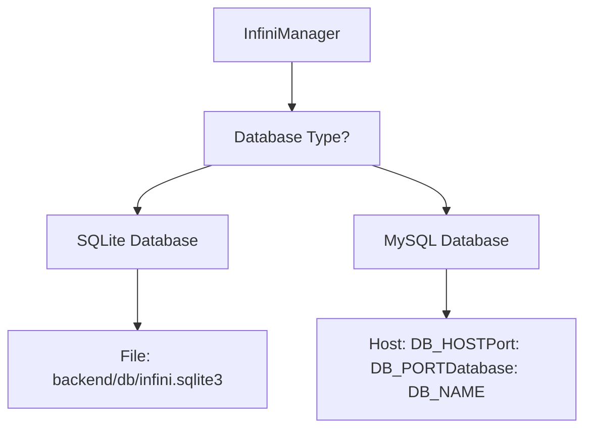
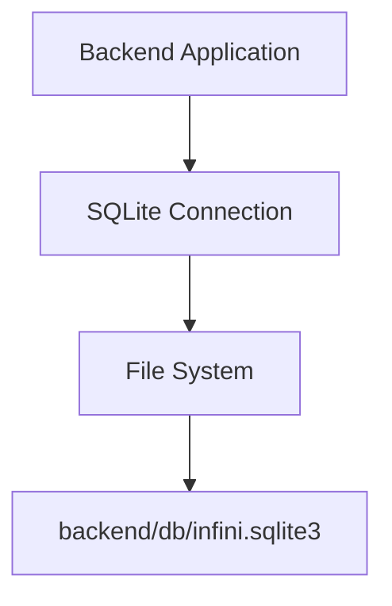
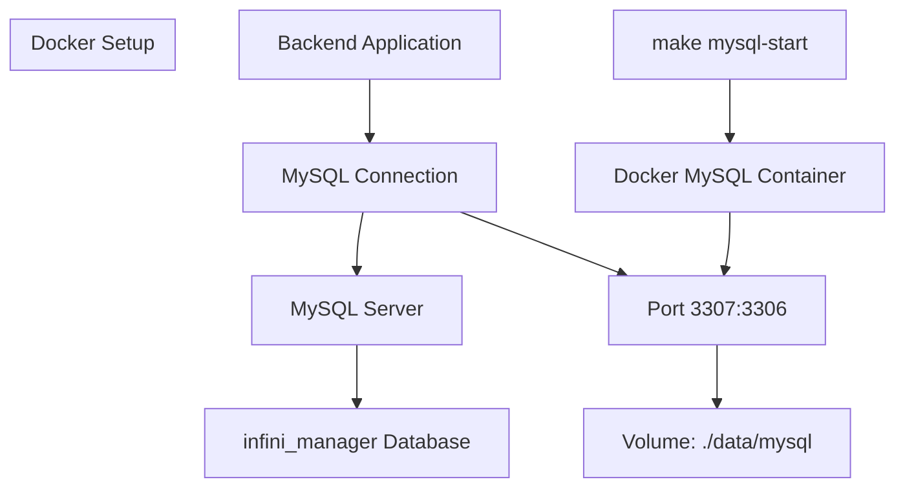
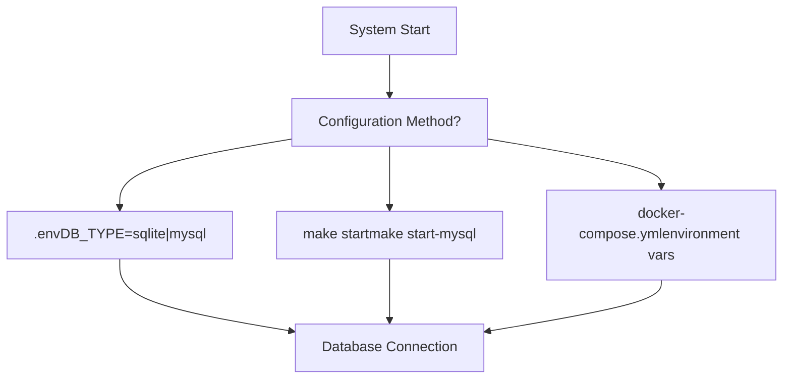
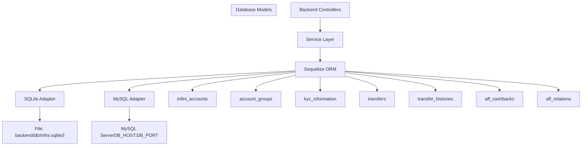
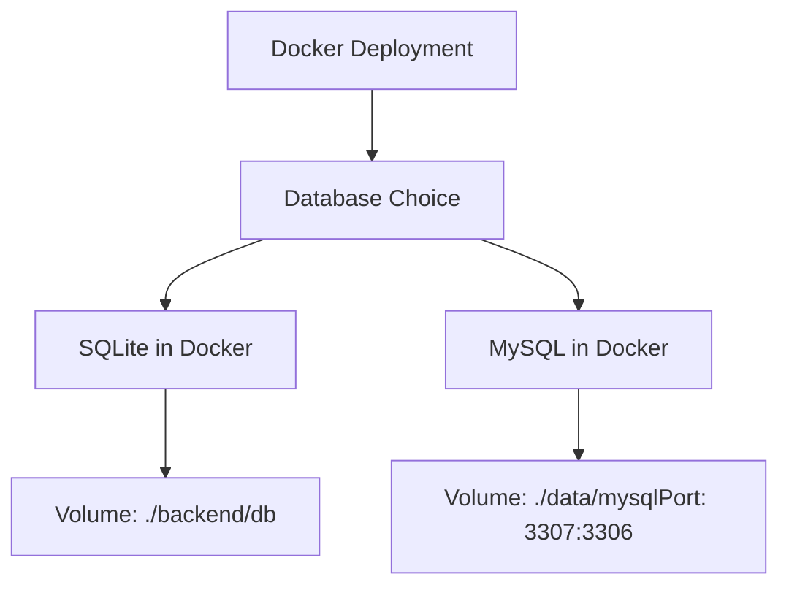

# Database Configuration

> **Relevant source files**
> * [DEVELOPMENT.md](https://github.com/clionertr/infini-manager/blob/328b6a21/DEVELOPMENT.md)
> * [Makefile](https://github.com/clionertr/infini-manager/blob/328b6a21/Makefile)
> * [backend/Dockerfile](https://github.com/clionertr/infini-manager/blob/328b6a21/backend/Dockerfile)
> * [frontend/.env](https://github.com/clionertr/infini-manager/blob/328b6a21/frontend/.env)

This document provides detailed instructions for configuring database options in the Infini Manager system. The application supports two database types: SQLite (default) and MySQL. This page covers configuration options, switching between database types, connection parameters, and common troubleshooting steps.

For information about general deployment options, see [Docker Deployment](/clionertr/infini-manager/4.2-docker-deployment).

## Database Options Overview

Infini Manager supports two database backends:

1. **SQLite** - Default lightweight file-based database, suitable for development and small-scale deployments
2. **MySQL** - Full-featured relational database, recommended for production environments and larger deployments



**Database Selection Decision Flow**

Sources: [DEVELOPMENT.md L145-L155](https://github.com/clionertr/infini-manager/blob/328b6a21/DEVELOPMENT.md#L145-L155)

 [Makefile L77-L150](https://github.com/clionertr/infini-manager/blob/328b6a21/Makefile#L77-L150)

## SQLite Configuration

SQLite is the default database option for Infini Manager. It stores all data in a single file and requires no additional services.

### Configuration Parameters

| Parameter | Description | Default Value |
| --- | --- | --- |
| DB_TYPE | Database type identifier | sqlite |
| SQLITE_FILE | Database file location | backend/db/infini.sqlite3 |

### Setup Steps

1. Ensure the `backend/db` directory exists and has proper write permissions
2. Set `DB_TYPE=sqlite` in your `.env` file
3. The system will automatically create and initialize the SQLite database file on first run

### Advantages and Use Cases

* No additional database server required
* Simple setup and maintenance
* Suitable for development, testing, and small deployments
* Zero-configuration option - works out of the box



**SQLite Configuration Architecture**

Sources: [DEVELOPMENT.md L148-L155](https://github.com/clionertr/infini-manager/blob/328b6a21/DEVELOPMENT.md#L148-L155)

 [backend/Dockerfile L8-L26](https://github.com/clionertr/infini-manager/blob/328b6a21/backend/Dockerfile#L8-L26)

## MySQL Configuration

For production environments or larger deployments, MySQL is recommended for better performance and scalability.

### Configuration Parameters

| Parameter | Description | Default Value |
| --- | --- | --- |
| DB_TYPE | Database type identifier | mysql |
| DB_HOST | MySQL server hostname | localhost |
| DB_PORT | MySQL server port | 3307 (Docker) / 3306 (Standard) |
| DB_USER | MySQL username | root |
| DB_PASSWORD | MySQL password | password |
| DB_NAME | Database name | infini_manager |

### Setup Options

#### Option 1: Local MySQL Server

1. Install and start MySQL server on your machine
2. Create a database for Infini Manager
3. Configure connection parameters in `.env`

```
DB_TYPE=mysql
DB_HOST=localhost
DB_PORT=3306
DB_USER=your_username
DB_PASSWORD=your_password
DB_NAME=infini_manager
```

#### Option 2: Docker MySQL Instance

The project includes a pre-configured MySQL Docker setup:

1. Start the MySQL Docker container:

```
make mysql-start
```
2. The configuration will be set to:

* Host: localhost
* Port: 3307 (mapped to container's 3306)
* User: root
* Password: password
* Database: infini_manager
* Data directory: ./data/mysql
3. Use the MySQL environment configuration:

```
cp backend/.env.mysql backend/.env
```



**MySQL Configuration Architecture**

Sources: [DEVELOPMENT.md L157-L184](https://github.com/clionertr/infini-manager/blob/328b6a21/DEVELOPMENT.md#L157-L184)

 [Makefile L169-L202](https://github.com/clionertr/infini-manager/blob/328b6a21/Makefile#L169-L202)

## Switching Between Database Types

The Infini Manager system allows easy switching between database types.

### Method 1: Direct Environment Variable Modification

Edit the `backend/.env` file and change the `DB_TYPE` value:

```
# For SQLite
DB_TYPE=sqlite

# For MySQL
DB_TYPE=mysql
```

### Method 2: Using Makefile Commands

The project includes commands to start with specific database configurations:

```
# Start with SQLite (default)
make start

# Start with MySQL
make start-mysql
```

### Method 3: Docker Environment Configuration

When using Docker Compose, modify the environment variables in your `docker-compose.yml`:

```
backend:
  environment:
    - DB_TYPE=sqlite  # or mysql
```



**Database Type Switching Options**

Sources: [DEVELOPMENT.md L192-L223](https://github.com/clionertr/infini-manager/blob/328b6a21/DEVELOPMENT.md#L192-L223)

 [Makefile L77-L150](https://github.com/clionertr/infini-manager/blob/328b6a21/Makefile#L77-L150)

## Database Connection Architecture

The Infini Manager system uses a layered architecture to interact with the database:



**Database Connection and Model Architecture**

Sources: [DEVELOPMENT.md L145-L184](https://github.com/clionertr/infini-manager/blob/328b6a21/DEVELOPMENT.md#L145-L184)

## Docker Database Configuration

When deploying with Docker, you have two main options for database configuration:

### SQLite in Docker

For lightweight deployments, SQLite can be used within Docker:

1. The SQLite database file is stored in a volume: `./backend/db/infini.sqlite3`
2. Start the system with SQLite configuration:
```
make docker-sqlite
```

### MySQL in Docker

For more robust deployments, use MySQL within Docker:

1. MySQL data is stored in a volume: `./data/mysql`
2. The MySQL container is exposed on port 3307
3. Start the system with MySQL:
```
# Start just MySQL container
make mysql-start

# Start all services with MySQL 
make start-mysql-all
```



**Docker Database Configuration Options**

Sources: [Makefile L133-L167](https://github.com/clionertr/infini-manager/blob/328b6a21/Makefile#L133-L167)

 [backend/Dockerfile L1-L42](https://github.com/clionertr/infini-manager/blob/328b6a21/backend/Dockerfile#L1-L42)

## Troubleshooting

### Common Database Issues

1. **SQLite File Permission Issues**

* Ensure the `backend/db` directory exists and has proper write permissions
* Check file ownership if running in Docker environment
2. **MySQL Connection Issues**

* Verify MySQL service is running and accessible
* Check connection parameters (host, port, username, password)
* Ensure the database exists and has been properly initialized
* If using Docker, ensure the container is running: `docker ps | grep infini-mysql`
3. **Database Initialization**

* The system automatically creates necessary tables on first run
* If schema changes, you might need to reset the database:
* SQLite: Delete the `backend/db/infini.sqlite3` file
* MySQL: Drop and recreate the database or use the reset script

### Checking Database Status

For MySQL Docker deployment:

```
# Check if MySQL container is running
docker ps | grep infini-mysql

# Connect to MySQL to verify database
docker exec -it infini-mysql mysql -uroot -ppassword infini_manager
```

For general troubleshooting, check the application logs for database connection errors.

Sources: [DEVELOPMENT.md L280-L319](https://github.com/clionertr/infini-manager/blob/328b6a21/DEVELOPMENT.md#L280-L319)

 [Makefile L169-L202](https://github.com/clionertr/infini-manager/blob/328b6a21/Makefile#L169-L202)

## Environment Variables Reference

Here's a complete reference of database-related environment variables:

| Environment Variable | Description | Default | Used For |
| --- | --- | --- | --- |
| DB_TYPE | Database type | sqlite | Selecting database adapter |
| DB_HOST | Database host | localhost | MySQL connection |
| DB_PORT | Database port | 3307 (Docker) or 3306 | MySQL connection |
| DB_USER | Database username | root | MySQL authentication |
| DB_PASSWORD | Database password | password | MySQL authentication |
| DB_NAME | Database name | infini_manager | MySQL database selection |

All these variables are configured in the `backend/.env` file.

Sources: [DEVELOPMENT.md L227-L243](https://github.com/clionertr/infini-manager/blob/328b6a21/DEVELOPMENT.md#L227-L243)