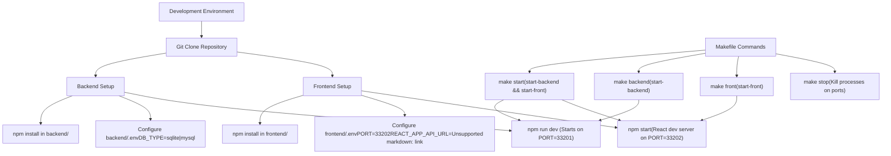
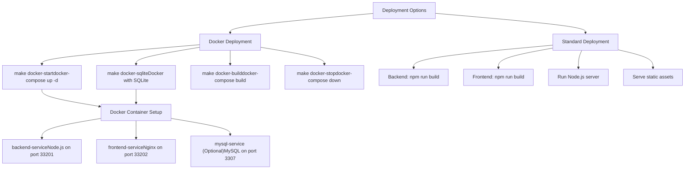
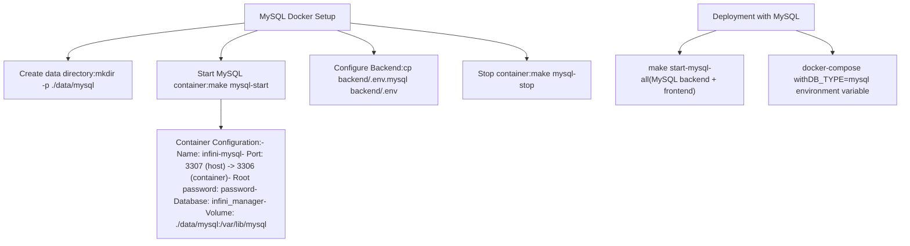
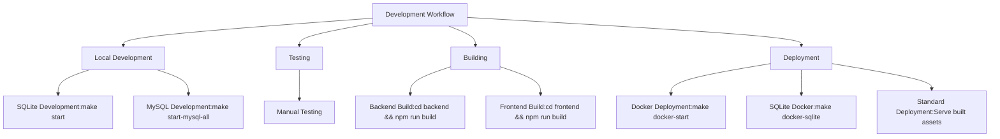

# Development and Deployment

> **Relevant source files**
> * [DEVELOPMENT.md](https://github.com/clionertr/infini-manager/blob/328b6a21/DEVELOPMENT.md)
> * [Makefile](https://github.com/clionertr/infini-manager/blob/328b6a21/Makefile)
> * [backend/Dockerfile](https://github.com/clionertr/infini-manager/blob/328b6a21/backend/Dockerfile)
> * [frontend/.env](https://github.com/clionertr/infini-manager/blob/328b6a21/frontend/.env)

This page provides comprehensive guidance for setting up a development environment and deploying the Infini Manager system. For database-specific configuration details, see [Database Configuration](/clionertr/infini-manager/4.3-database-configuration).

## Overview

Infini Manager supports multiple development and deployment approaches to accommodate different environments and requirements. These include local development, Makefile-facilitated workflows, and Docker-based containerization.

## Development Environment Setup

### Development Workflow



Sources: [Makefile L6-L71](https://github.com/clionertr/infini-manager/blob/328b6a21/Makefile#L6-L71)

 [DEVELOPMENT.md L31-L71](https://github.com/clionertr/infini-manager/blob/328b6a21/DEVELOPMENT.md#L31-L71)

 [frontend/.env L1-L2](https://github.com/clionertr/infini-manager/blob/328b6a21/frontend/.env#L1-L2)

### Prerequisites

* Node.js 14.x or higher
* npm 6.x or higher
* Optional: Docker and Docker Compose (for containerized deployment)
* Optional: MySQL 8.0 (if not using SQLite)

### Manual Setup Method

The most direct approach for development is setting up the application manually:

1. **Clone the repository**

```
git clone https://github.com/clionertr/infini-manager.git
cd infini-manager
```
2. **Backend setup**

```
cd backend
npm install
cp .env.example .env  # Configure environment variables
npm run dev           # Start development server
```
3. **Frontend setup**

```
cd frontend
npm install
npm start             # Start React development server
```

The backend API will be available at [http://localhost:33201](http://localhost:33201), and the frontend will be accessible at [http://localhost:33202](http://localhost:33202).

Sources: [DEVELOPMENT.md L32-L67](https://github.com/clionertr/infini-manager/blob/328b6a21/DEVELOPMENT.md#L32-L67)

### Makefile-Based Setup

The Makefile provides convenient commands to streamline development tasks:

| Command | Description | Implementation Details |
| --- | --- | --- |
| `make start` | Start all services with SQLite | Executes `start-backend` followed by `start-front` |
| `make backend` | Start only backend service | Checks port 33201, installs dependencies if needed, starts backend |
| `make front` | Start only frontend service | Checks port 33202, installs dependencies if needed, starts frontend |
| `make start-mysql` | Start backend with MySQL | Sets up MySQL Docker if needed, copies MySQL config, starts backend |
| `make start-mysql-all` | Start all services with MySQL | Executes `start-mysql` followed by `start-front` |
| `make stop` | Stop all services | Kills processes on ports 33201 and 33202 |

Sources: [Makefile L6-L131](https://github.com/clionertr/infini-manager/blob/328b6a21/Makefile#L6-L131)

 [DEVELOPMENT.md L69-L94](https://github.com/clionertr/infini-manager/blob/328b6a21/DEVELOPMENT.md#L69-L94)

## Deployment Options

### Deployment Architecture



Sources: [Makefile L133-L166](https://github.com/clionertr/infini-manager/blob/328b6a21/Makefile#L133-L166)

 [backend/Dockerfile L1-L42](https://github.com/clionertr/infini-manager/blob/328b6a21/backend/Dockerfile#L1-L42)

 [DEVELOPMENT.md L96-L142](https://github.com/clionertr/infini-manager/blob/328b6a21/DEVELOPMENT.md#L96-L142)

### Docker Deployment

Docker provides an isolated, consistent environment for deployment with minimal setup requirements.

#### 1. Configuration

Ensure the correct environment files are set up:

```
cp backend/.env.example backend/.env
```

#### 2. Deployment Methods

The system provides multiple Docker deployment options:

| Command | Description | Configuration |
| --- | --- | --- |
| `make docker-start` | Standard Docker deployment | Uses settings in docker-compose.yml |
| `make docker-sqlite` | Lightweight SQLite-based deployment | Creates SQLite data directory at backend/db |
| `make docker-build` | Build Docker images | Builds images defined in docker-compose.yml |
| `make docker-logs` | View container logs | Executes docker-compose logs -f |
| `make docker-stop` | Stop all containers | Executes docker-compose down |

The Docker backend container is built from an Alpine-based Node.js image with SQLite support, as defined in [backend/Dockerfile L1-L42](https://github.com/clionertr/infini-manager/blob/328b6a21/backend/Dockerfile#L1-L42)

Sources: [Makefile L133-L166](https://github.com/clionertr/infini-manager/blob/328b6a21/Makefile#L133-L166)

 [backend/Dockerfile L1-L42](https://github.com/clionertr/infini-manager/blob/328b6a21/backend/Dockerfile#L1-L42)

 [DEVELOPMENT.md L96-L142](https://github.com/clionertr/infini-manager/blob/328b6a21/DEVELOPMENT.md#L96-L142)

### MySQL Docker Configuration

For deployments requiring MySQL:



Sources: [Makefile L168-L211](https://github.com/clionertr/infini-manager/blob/328b6a21/Makefile#L168-L211)

 [DEVELOPMENT.md L169-L193](https://github.com/clionertr/infini-manager/blob/328b6a21/DEVELOPMENT.md#L169-L193)

The MySQL Docker container is configured with:

* Host port: 3307 (mapped to container port 3306)
* Root username: root
* Root password: password
* Database name: infini_manager
* Data directory: ./data/mysql (persistent volume)

To use MySQL with the application:

```
# Start MySQL container
make mysql-start

# Start backend with MySQL
make start-mysql

# Or start both backend and frontend with MySQL
make start-mysql-all
```

Sources: [Makefile L168-L211](https://github.com/clionertr/infini-manager/blob/328b6a21/Makefile#L168-L211)

 [DEVELOPMENT.md L157-L193](https://github.com/clionertr/infini-manager/blob/328b6a21/DEVELOPMENT.md#L157-L193)

## Database Configuration Overview

Infini Manager supports two database types:

1. **SQLite (Default)**:

* File location: `backend/db/infini.sqlite3`
* Suitable for: Development, testing, lightweight deployments
* Configuration: `DB_TYPE=sqlite` in backend/.env
2. **MySQL**:

* Suitable for: Production, higher performance requirements
* Local configuration in backend/.env:
```
DB_TYPE=mysql
DB_HOST=localhost
DB_PORT=3306
DB_USER=username
DB_PASSWORD=password
DB_NAME=infini_manager
```
* Docker configuration in backend/.env:
```
DB_TYPE=mysql
DB_HOST=localhost
DB_PORT=3307
DB_USER=root
DB_PASSWORD=password
DB_NAME=infini_manager
```

For detailed database configuration instructions, see [Database Configuration](/clionertr/infini-manager/4.3-database-configuration).

Sources: [DEVELOPMENT.md L144-L223](https://github.com/clionertr/infini-manager/blob/328b6a21/DEVELOPMENT.md#L144-L223)

## Development and Deployment Best Practices



Sources: [DEVELOPMENT.md L32-L142](https://github.com/clionertr/infini-manager/blob/328b6a21/DEVELOPMENT.md#L32-L142)

 [Makefile L1-L240](https://github.com/clionertr/infini-manager/blob/328b6a21/Makefile#L1-L240)

### Recommended Workflow

1. **Development**:

* Use `make start` (SQLite) for quick development
* Use `make start-mysql-all` when MySQL-specific testing is needed
2. **Testing**:

* Test functionality across both database configurations
* Verify Docker deployments work as expected
3. **Building**:

* Build frontend for production: `cd frontend && npm run build`
* Build backend for production: `cd backend && npm run build`
4. **Deployment**:

* For simple deployments: `make docker-sqlite`
* For production: Configure and use MySQL with proper database backups
5. **Monitoring**:

* Check Docker logs: `make docker-logs`
* Ensure proper database connectivity

Sources: [DEVELOPMENT.md L95-L142](https://github.com/clionertr/infini-manager/blob/328b6a21/DEVELOPMENT.md#L95-L142)

 [Makefile L133-L240](https://github.com/clionertr/infini-manager/blob/328b6a21/Makefile#L133-L240)

## Troubleshooting

### Common Issues

| Issue | Solution |
| --- | --- |
| Port conflicts | Use `make stop` to stop existing services or modify port numbers in configuration files |
| MySQL connection errors | Verify MySQL is running and credentials are correct |
| Docker errors | Check Docker service status with `docker info` and container logs with `docker-compose logs` |
| Missing dependencies | Run `npm install` in the respective directories or use `make` commands that handle this automatically |

Sources: [DEVELOPMENT.md L280-L320](https://github.com/clionertr/infini-manager/blob/328b6a21/DEVELOPMENT.md#L280-L320)

### Configuration Verification

To verify your configuration is correct:

1. Check the backend is running: `curl http://localhost:33201/api/health`
2. Verify frontend can connect to backend by opening the application in a browser
3. For Docker deployments, check container status: `docker-compose ps`

Sources: [DEVELOPMENT.md L95-L105](https://github.com/clionertr/infini-manager/blob/328b6a21/DEVELOPMENT.md#L95-L105)

 [Makefile L100-L105](https://github.com/clionertr/infini-manager/blob/328b6a21/Makefile#L100-L105)

## Reference

For a complete list of available Makefile commands, run:

```
make help
```

This will display all available commands with descriptions.

Sources: [Makefile L213-L238](https://github.com/clionertr/infini-manager/blob/328b6a21/Makefile#L213-L238)