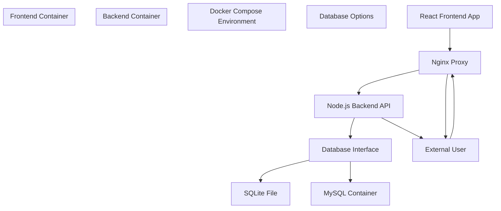
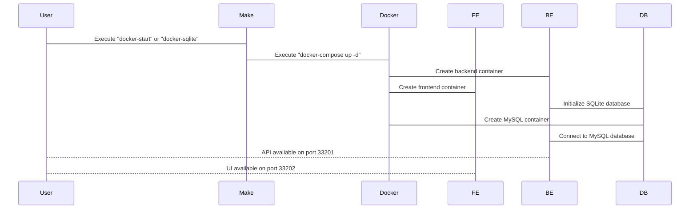
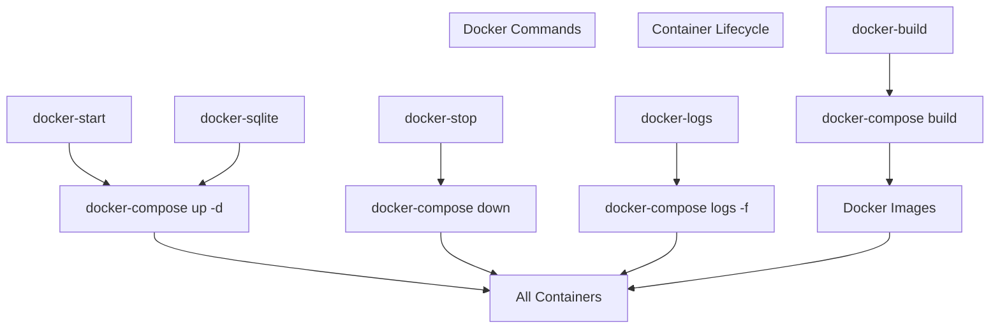

# Docker Deployment

> **Relevant source files**
> * [DEVELOPMENT.md](https://github.com/clionertr/infini-manager/blob/328b6a21/DEVELOPMENT.md)
> * [Makefile](https://github.com/clionertr/infini-manager/blob/328b6a21/Makefile)
> * [backend/Dockerfile](https://github.com/clionertr/infini-manager/blob/328b6a21/backend/Dockerfile)
> * [frontend/.env](https://github.com/clionertr/infini-manager/blob/328b6a21/frontend/.env)

This document provides technical guidance for deploying the Infini Manager system using Docker. It covers container setup, configuration, deployment commands, and troubleshooting for containerized environments. For local development setup without Docker, see [Local Development Setup](/clionertr/infini-manager/4.1-local-development-setup).

## 1. Docker Deployment Architecture

The Infini Manager system uses Docker Compose to orchestrate multiple containers that work together to provide the complete application.

### Docker Container Architecture



Sources: [Makefile L133-L166](https://github.com/clionertr/infini-manager/blob/328b6a21/Makefile#L133-L166)

 [backend/Dockerfile L1-L41](https://github.com/clionertr/infini-manager/blob/328b6a21/backend/Dockerfile#L1-L41)

 [DEVELOPMENT.md L96-L142](https://github.com/clionertr/infini-manager/blob/328b6a21/DEVELOPMENT.md#L96-L142)

## 2. Prerequisites

To deploy Infini Manager using Docker, you need:

* Docker (19.03.0+)
* Docker Compose (1.27.0+)
* Available ports: 33201 (backend) and 33202 (frontend) by default

Sources: [DEVELOPMENT.md L100-L104](https://github.com/clionertr/infini-manager/blob/328b6a21/DEVELOPMENT.md#L100-L104)

## 3. Deployment Options

Infini Manager offers two primary deployment options with Docker:

| Deployment Type | Description | Command | Database | Best For |
| --- | --- | --- | --- | --- |
| Standard Deployment | Deploys frontend, backend, and database | `make docker-start` | MySQL | Regular use cases |
| Lightweight Deployment | Focuses on minimal resource usage | `make docker-sqlite` | SQLite | Development, testing |

Sources: [Makefile L133-L149](https://github.com/clionertr/infini-manager/blob/328b6a21/Makefile#L133-L149)

 [DEVELOPMENT.md L97-L128](https://github.com/clionertr/infini-manager/blob/328b6a21/DEVELOPMENT.md#L97-L128)

## 4. Deployment Workflow



Sources: [Makefile L135-L149](https://github.com/clionertr/infini-manager/blob/328b6a21/Makefile#L135-L149)

 [DEVELOPMENT.md L116-L128](https://github.com/clionertr/infini-manager/blob/328b6a21/DEVELOPMENT.md#L116-L128)

## 5. Configuration Setup

Before deploying, you need to configure environment settings:

### 5.1 Backend Configuration

Create a `.env` file in the backend directory by copying the example:

```
cp backend/.env.example backend/.env
```

Key environment variables for Docker deployment:

| Variable | Description | Default Value | Notes |
| --- | --- | --- | --- |
| DB_TYPE | Database type (sqlite/mysql) | sqlite | Change to 'mysql' for MySQL deployment |
| DB_HOST | MySQL host address | db | Container hostname in Docker network |
| DB_PORT | MySQL port | 3306 | Internal port for container communication |
| DB_USER | MySQL username | root |  |
| DB_PASSWORD | MySQL password | password | Change for security in production |
| DB_NAME | Database name | infini_manager |  |
| DISABLE_IP_CHECK | Disable IP validation | true | Set to 'true' for Docker environments |

Sources: [DEVELOPMENT.md L107-L112](https://github.com/clionertr/infini-manager/blob/328b6a21/DEVELOPMENT.md#L107-L112)

 [DEVELOPMENT.md L226-L242](https://github.com/clionertr/infini-manager/blob/328b6a21/DEVELOPMENT.md#L226-L242)

### 5.2 Frontend Configuration

The frontend in Docker mode uses a special configuration located at `frontend/src/config.docker.ts`:

```
export const API_BASE_URL = '';  // Empty string for Nginx proxy forwarding
export const PORT = 80;
export const CONFIG = {
  environment: 'docker',
  apiBaseUrl: API_BASE_URL,
  port: PORT,
  debug: false,
  logLevel: 'info'
};
```

Sources: [DEVELOPMENT.md L266-L278](https://github.com/clionertr/infini-manager/blob/328b6a21/DEVELOPMENT.md#L266-L278)

 [frontend/.env L1-L2](https://github.com/clionertr/infini-manager/blob/328b6a21/frontend/.env#L1-L2)

## 6. Deployment Commands

### 6.1 Basic Deployment Commands

| Command | Description |
| --- | --- |
| `make docker-start` | Start all services using Docker Compose |
| `make docker-sqlite` | Start in lightweight mode with SQLite database |
| `make docker-stop` | Stop all Docker services |
| `make docker-logs` | View logs from all containers |
| `make docker-build` | Rebuild Docker images |

Sources: [Makefile L133-L166](https://github.com/clionertr/infini-manager/blob/328b6a21/Makefile#L133-L166)

 [DEVELOPMENT.md L116-L142](https://github.com/clionertr/infini-manager/blob/328b6a21/DEVELOPMENT.md#L116-L142)

### 6.2 Command Implementation Details

The Docker commands in the Makefile execute the following operations:



Sources: [Makefile L135-L166](https://github.com/clionertr/infini-manager/blob/328b6a21/Makefile#L135-L166)

## 7. Database Options in Docker

### 7.1 SQLite Configuration (Lightweight)

The SQLite configuration offers a lightweight deployment with data stored in a local file:

* Database file location: `backend/db/infini.sqlite3`
* Container setup ensures this directory exists and is writable
* Data persists between container restarts via volume mapping

To use SQLite mode:

```
make docker-sqlite
```

Sources: [Makefile L142-L149](https://github.com/clionertr/infini-manager/blob/328b6a21/Makefile#L142-L149)

 [backend/Dockerfile

26](https://github.com/clionertr/infini-manager/blob/328b6a21/backend/Dockerfile#L26-L26)

 [DEVELOPMENT.md L148-L154](https://github.com/clionertr/infini-manager/blob/328b6a21/DEVELOPMENT.md#L148-L154)

### 7.2 MySQL Configuration

MySQL provides better performance for production-like environments:

* MySQL is deployed as a separate container
* Default credentials: root/password (should be changed for production)
* Data is persisted in `./data/mysql` directory

The MySQL container is automatically configured when using:

```
make docker-start
```

Sources: [Makefile L135-L138](https://github.com/clionertr/infini-manager/blob/328b6a21/Makefile#L135-L138)

 [DEVELOPMENT.md L177-L184](https://github.com/clionertr/infini-manager/blob/328b6a21/DEVELOPMENT.md#L177-L184)

## 8. Troubleshooting

Common issues and their solutions:

| Issue | Solution |
| --- | --- |
| Containers fail to start | Check logs with `make docker-logs` |
| Port conflicts | Change port mappings in docker-compose.yml |
| Database connection issues | Verify database configuration in backend/.env |
| Container restarts continuously | Check system resource availability |

For detailed container logs:

```
make docker-logs
# or specific container
docker-compose logs -f backend
```

Sources: [Makefile L164-L166](https://github.com/clionertr/infini-manager/blob/328b6a21/Makefile#L164-L166)

 [DEVELOPMENT.md L295-L300](https://github.com/clionertr/infini-manager/blob/328b6a21/DEVELOPMENT.md#L295-L300)

## 9. Data Persistence

Data persistence is handled differently depending on the database choice:

* **SQLite**: Data is stored in `backend/db/infini.sqlite3` which is mapped to a volume
* **MySQL**: Data is stored in `./data/mysql` directory on the host

To reset the database:

* SQLite: Delete the sqlite file and restart containers
* MySQL: Use the reset script through the MySQL container

Sources: [DEVELOPMENT.md L312-L319](https://github.com/clionertr/infini-manager/blob/328b6a21/DEVELOPMENT.md#L312-L319)

## 10. Security Considerations

The default Docker deployment is not suitable for production environments due to:

* Default database credentials
* Lack of SSL/TLS configuration
* No authorization mechanism for API access

Before production deployment, ensure proper security measures are implemented.

Sources: [DEVELOPMENT.md L98-L99](https://github.com/clionertr/infini-manager/blob/328b6a21/DEVELOPMENT.md#L98-L99)