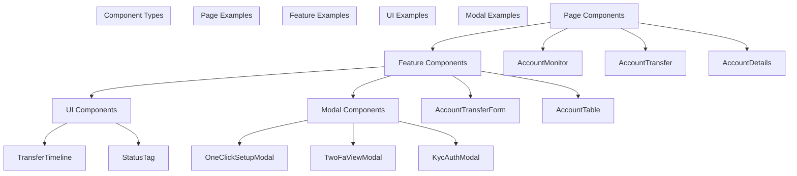
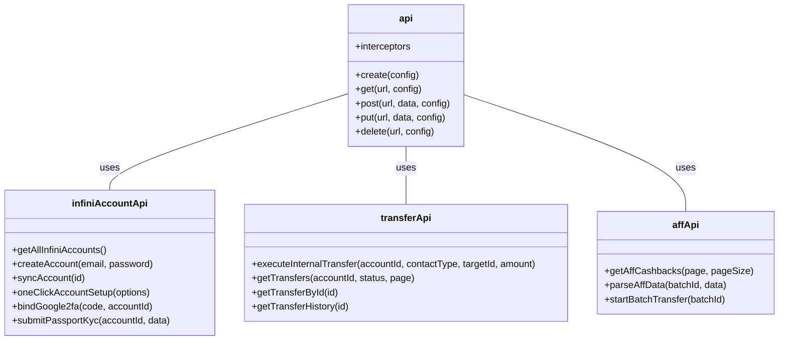
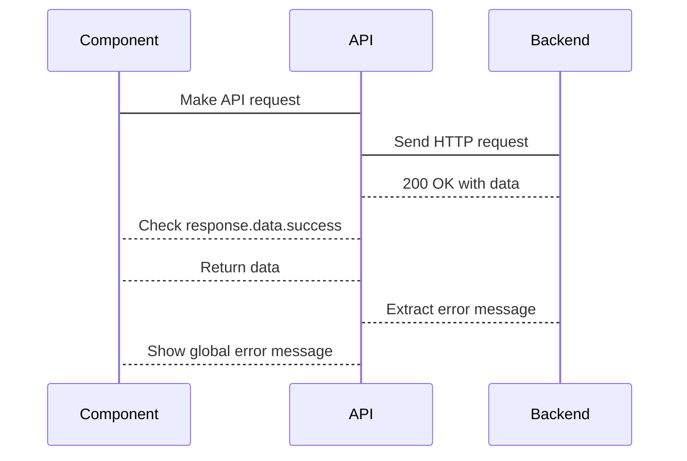
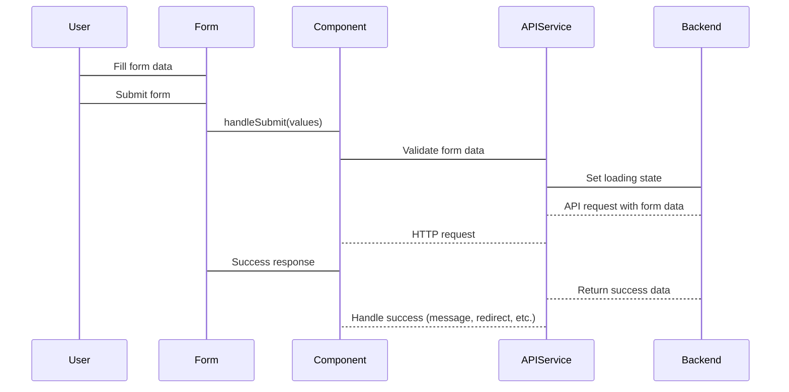
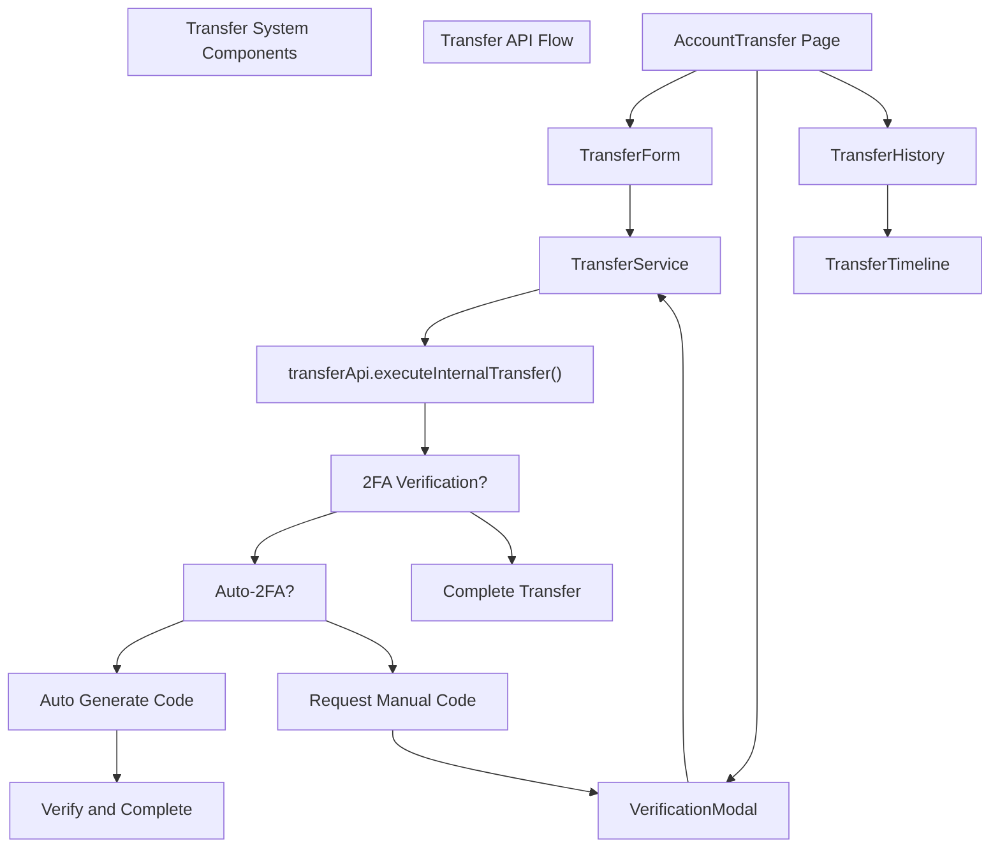
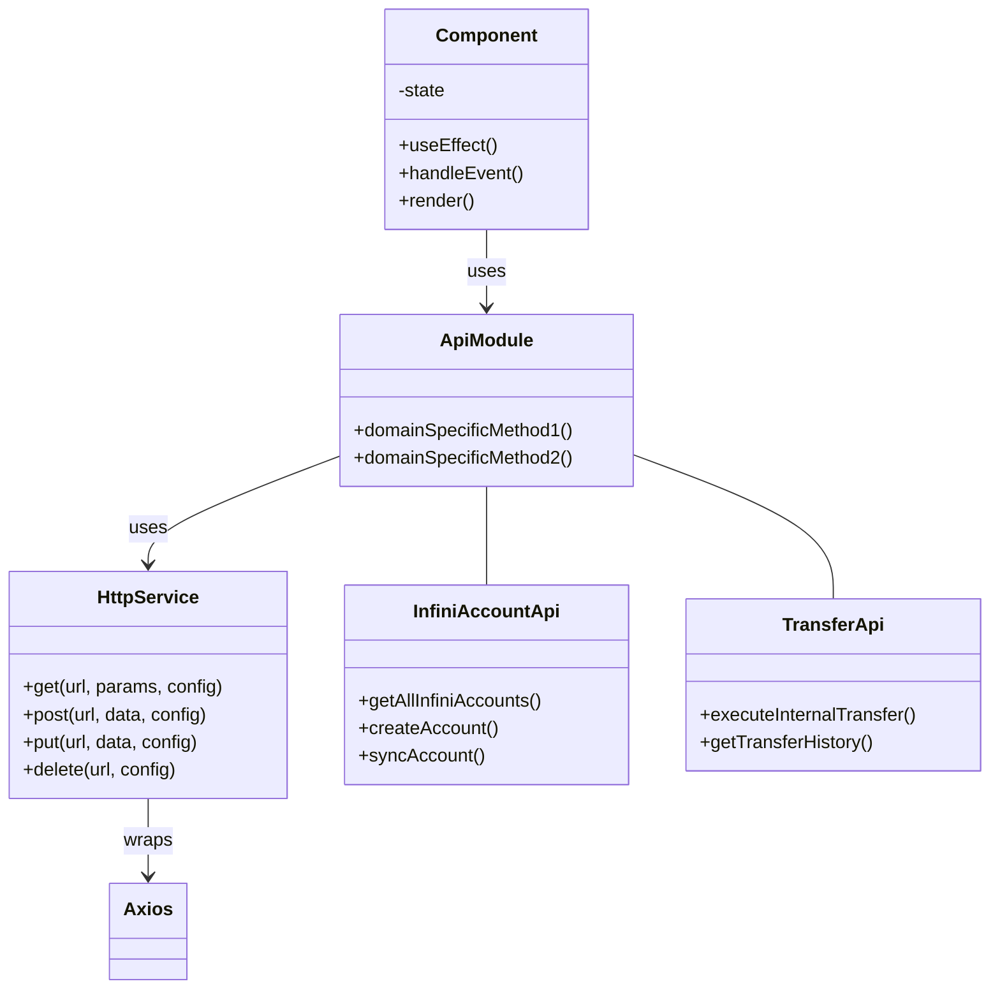
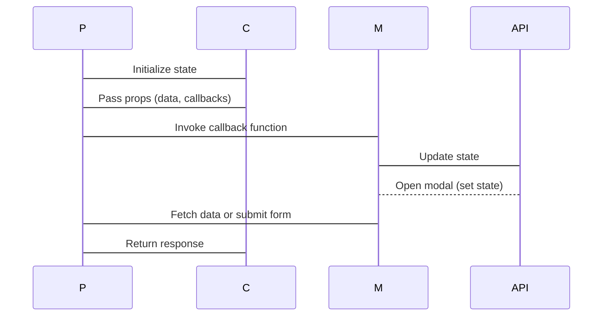
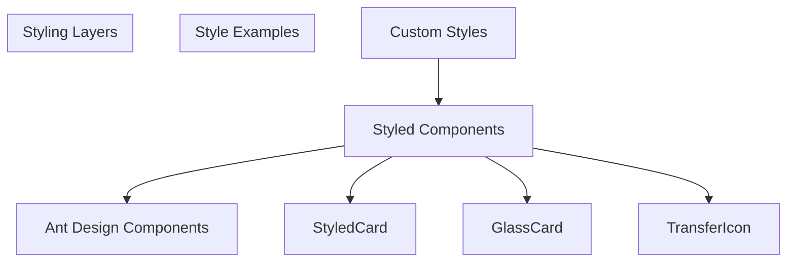

# Frontend Architecture

> **Relevant source files**
> * [frontend/src/pages/AccountDetails/index.tsx](https://github.com/clionertr/infini-manager/blob/328b6a21/frontend/src/pages/AccountDetails/index.tsx)
> * [frontend/src/pages/AccountMonitor/index.tsx](https://github.com/clionertr/infini-manager/blob/328b6a21/frontend/src/pages/AccountMonitor/index.tsx)
> * [frontend/src/pages/AccountTransfer/index.tsx](https://github.com/clionertr/infini-manager/blob/328b6a21/frontend/src/pages/AccountTransfer/index.tsx)
> * [frontend/src/services/api.ts](https://github.com/clionertr/infini-manager/blob/328b6a21/frontend/src/services/api.ts)

This document describes the architectural design of the Infini Manager frontend application, outlining its component structure, data flow patterns, and integration with the backend services. For backend architecture details, see [Backend Architecture](/clionertr/infini-manager/3-backend-architecture).

## Overview

The frontend of Infini Manager is built with React and follows a component-based architecture. It provides interfaces for managing Infini accounts, performing transfers between accounts, viewing account details, and managing AFF cashback systems.

```mermaid
flowchart TD

subgraph Frontend_Application ["Frontend Application"]
end

subgraph API_Service_Layer ["API Service Layer"]
end

subgraph Pages ["Pages"]
end

subgraph Core_UI_Components ["Core UI Components"]
end

API["api.ts"]
CoreComponents["CoreComponents"]
Backend["Backend API"]
User["User"]
AM["AccountMonitor"]
AT["AccountTransfer"]
AD["AccountDetails"]
AC["AffCashback/AffHistory"]
IAA["infiniAccountApi"]
TA["transferApi"]
RUA["randomUserApi"]
TTA["totpToolApi"]
AFA["affApi"]
OCSM["OneClickSetupModal"]
THD["TransferHistoryDetail"]
TTL["TransferTimeline"]
TFVM["TwoFaViewModal"]
KAM["KycAuthModal"]
CDM["CardDetailModal"]

    CoreComponents --> API
    API --> Backend
```

Sources: [frontend/src/services/api.ts L29-L1048](https://github.com/clionertr/infini-manager/blob/328b6a21/frontend/src/services/api.ts#L29-L1048)

 [frontend/src/pages/AccountMonitor/index.tsx L1-L80](https://github.com/clionertr/infini-manager/blob/328b6a21/frontend/src/pages/AccountMonitor/index.tsx#L1-L80)

 [frontend/src/pages/AccountTransfer/index.tsx L1-L15](https://github.com/clionertr/infini-manager/blob/328b6a21/frontend/src/pages/AccountTransfer/index.tsx#L1-L15)

 [frontend/src/pages/AccountDetails/index.tsx L1-L15](https://github.com/clionertr/infini-manager/blob/328b6a21/frontend/src/pages/AccountDetails/index.tsx#L1-L15)

## Component Hierarchy

The application is organized into a hierarchical structure of components, with several main pages serving as containers for more specialized components.

### Main Pages

The application consists of four primary page components:

| Page Component | Description | Primary Responsibility |
| --- | --- | --- |
| AccountMonitor | Main dashboard for account management | Creating, monitoring, and configuring Infini accounts |
| AccountTransfer | Interface for transferring funds | Execute internal and external transfers between accounts |
| AccountDetails | Account transaction history | View and filter transaction records |
| AffCashback/AffHistory | Affiliate cashback system | Manage affiliate relations and cashback transfers |

Each page component is responsible for its own state management, data fetching, and UI rendering.

Sources: [frontend/src/pages/AccountMonitor/index.tsx L1-L5](https://github.com/clionertr/infini-manager/blob/328b6a21/frontend/src/pages/AccountMonitor/index.tsx#L1-L5)

 [frontend/src/pages/AccountTransfer/index.tsx L1-L5](https://github.com/clionertr/infini-manager/blob/328b6a21/frontend/src/pages/AccountTransfer/index.tsx#L1-L5)

 [frontend/src/pages/AccountDetails/index.tsx L1-L5](https://github.com/clionertr/infini-manager/blob/328b6a21/frontend/src/pages/AccountDetails/index.tsx#L1-L5)

### UI Component Organization

Sources: [frontend/src/pages/AccountMonitor/index.tsx L71-L79](https://github.com/clionertr/infini-manager/blob/328b6a21/frontend/src/pages/AccountMonitor/index.tsx#L71-L79)

 [frontend/src/pages/AccountTransfer/index.tsx L5-L15](https://github.com/clionertr/infini-manager/blob/328b6a21/frontend/src/pages/AccountTransfer/index.tsx#L5-L15)

## API Service Layer

The frontend communicates with the backend through a centralized API service layer, which provides a consistent interface for making HTTP requests and handling responses.

### API Module Structure

The API service is organized into specialized API modules, each responsible for a specific domain:

Sources: [frontend/src/services/api.ts L15-L25](https://github.com/clionertr/infini-manager/blob/328b6a21/frontend/src/services/api.ts#L15-L25)

 [frontend/src/services/api.ts L256-L590](https://github.com/clionertr/infini-manager/blob/328b6a21/frontend/src/services/api.ts#L256-L590)

 [frontend/src/services/api.ts L84-L250](https://github.com/clionertr/infini-manager/blob/328b6a21/frontend/src/services/api.ts#L84-L250)

 [frontend/src/services/api.ts L798-L953](https://github.com/clionertr/infini-manager/blob/328b6a21/frontend/src/services/api.ts#L798-L953)

### Error Handling

The API service implements global error handling through axios interceptors, providing consistent error reporting across the application.

Sources: [frontend/src/services/api.ts L1051-L1168](https://github.com/clionertr/infini-manager/blob/328b6a21/frontend/src/services/api.ts#L1051-L1168)

## Data Flow Patterns

### Form Submission Flow

The application follows a consistent pattern for form submissions, especially in operations like transfers and account creation.

Sources: [frontend/src/pages/AccountTransfer/index.tsx L282-L445](https://github.com/clionertr/infini-manager/blob/328b6a21/frontend/src/pages/AccountTransfer/index.tsx#L282-L445)

 [frontend/src/pages/AccountMonitor/index.tsx L1210-L1236](https://github.com/clionertr/infini-manager/blob/328b6a21/frontend/src/pages/AccountMonitor/index.tsx#L1210-L1236)

## Key Frontend Features

### Account Monitor

The Account Monitor page serves as the central dashboard for managing Infini accounts. It provides interfaces for:

1. Creating new Infini accounts
2. Monitoring account balances and statuses
3. Configuring security features (2FA, KYC)
4. Managing account groups
5. One-click account setup

The page uses modals extensively to handle complex operations while keeping the main interface clean.

Sources: [frontend/src/pages/AccountMonitor/index.tsx L1-L1522](https://github.com/clionertr/infini-manager/blob/328b6a21/frontend/src/pages/AccountMonitor/index.tsx#L1-L1522)

### Account Transfer System

The transfer system provides functionality for moving funds between Infini accounts. Key features include:

1. Internal transfers between managed accounts
2. External transfers to Infini accounts by UID or email
3. 2FA verification for secure transfers
4. Transfer history viewing
5. Automatic 2FA handling

Sources: [frontend/src/pages/AccountTransfer/index.tsx L119-L193](https://github.com/clionertr/infini-manager/blob/328b6a21/frontend/src/pages/AccountTransfer/index.tsx#L119-L193)

 [frontend/src/pages/AccountTransfer/index.tsx L282-L568](https://github.com/clionertr/infini-manager/blob/328b6a21/frontend/src/pages/AccountTransfer/index.tsx#L282-L568)

### API Service Organization

The API service layer is a critical part of the frontend architecture, providing a clean, consistent interface for communicating with the backend.

Key features of the API service include:

1. Domain-specific API modules (infiniAccountApi, transferApi, etc.)
2. Consistent error handling through interceptors
3. Request/response logging for debugging
4. Global error message display
5. Typed API response handling

The service is structured to provide a clean abstraction over HTTP requests, allowing components to work with domain-specific methods rather than raw HTTP calls.

Sources: [frontend/src/services/api.ts L15-L25](https://github.com/clionertr/infini-manager/blob/328b6a21/frontend/src/services/api.ts#L15-L25)

 [frontend/src/services/api.ts L1051-L1168](https://github.com/clionertr/infini-manager/blob/328b6a21/frontend/src/services/api.ts#L1051-L1168)

 [frontend/src/services/api.ts L1174-L1236](https://github.com/clionertr/infini-manager/blob/328b6a21/frontend/src/services/api.ts#L1174-L1236)

## Component Communication Patterns

The frontend implements several patterns for component communication:

1. **Props Passing**: For parent-child component communication
2. **Callback Functions**: For child-to-parent communication
3. **Modal State Management**: For controlling visibility of modal components
4. **API Service as Data Layer**: Centralized data access through API services

Sources: [frontend/src/pages/AccountMonitor/index.tsx L224-L434](https://github.com/clionertr/infini-manager/blob/328b6a21/frontend/src/pages/AccountMonitor/index.tsx#L224-L434)

 [frontend/src/pages/AccountTransfer/index.tsx L585-L607](https://github.com/clionertr/infini-manager/blob/328b6a21/frontend/src/pages/AccountTransfer/index.tsx#L585-L607)

## Styling Approach

The application uses a combination of:

1. **Styled-components**: For component-specific styling with CSS-in-JS
2. **Ant Design**: For UI components and base styling
3. **Custom CSS**: For global styles and overrides

Sources: [frontend/src/pages/AccountMonitor/index.tsx L89-L122](https://github.com/clionertr/infini-manager/blob/328b6a21/frontend/src/pages/AccountMonitor/index.tsx#L89-L122)

 [frontend/src/pages/AccountTransfer/index.tsx L12-L37](https://github.com/clionertr/infini-manager/blob/328b6a21/frontend/src/pages/AccountTransfer/index.tsx#L12-L37)

## Conclusion

The frontend architecture of Infini Manager is designed to provide a modular, maintainable application structure. It separates concerns between data access (API services), presentation (components), and business logic, while providing consistent patterns for handling common operations like form submissions and error handling.

The component-based approach allows for reuse across the application, while the specialized pages address specific business needs for account management, transfers, and affiliate cashback processing.