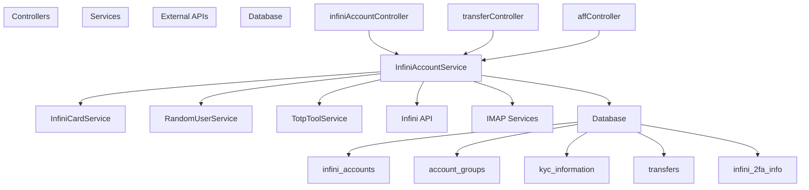
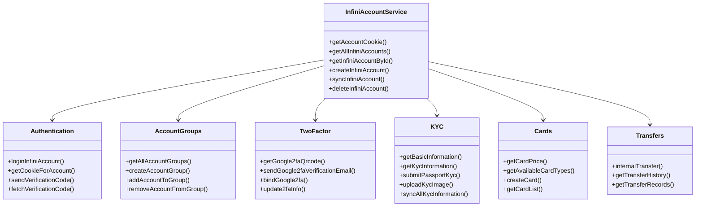
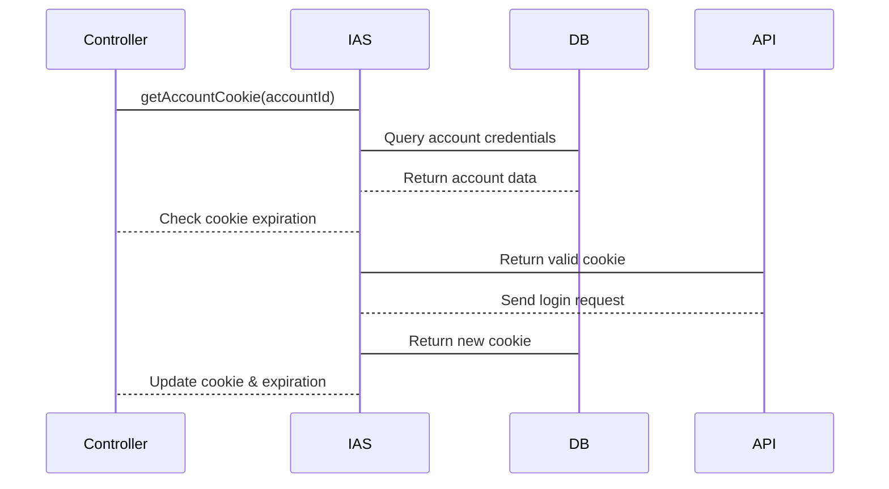
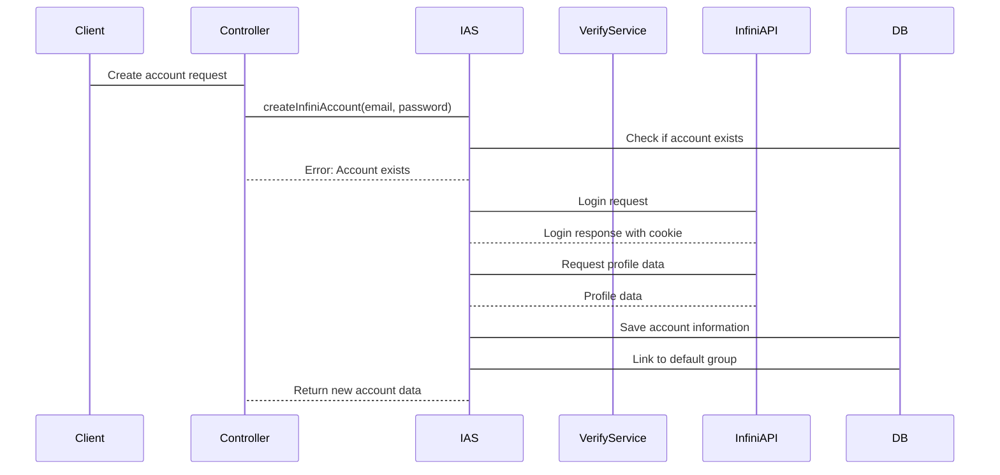
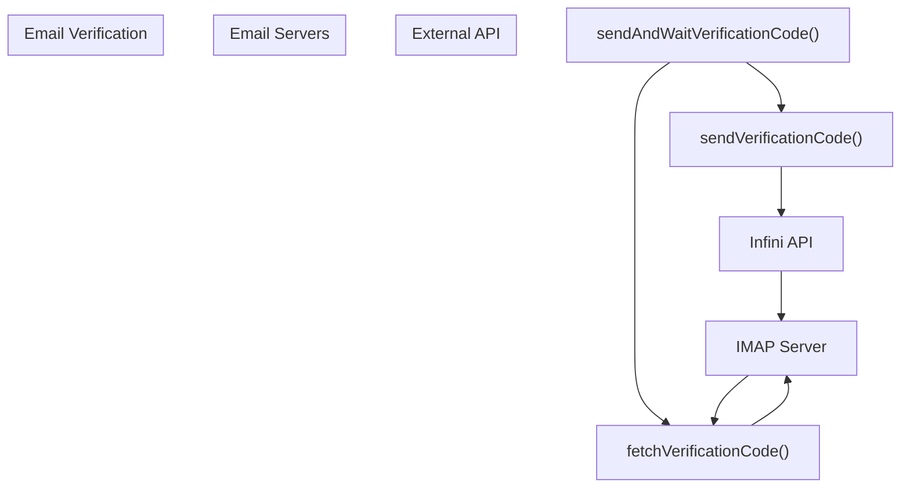
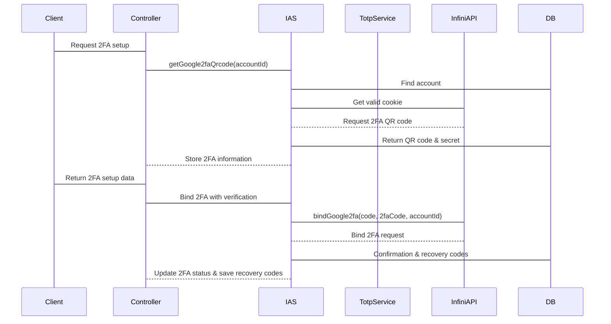
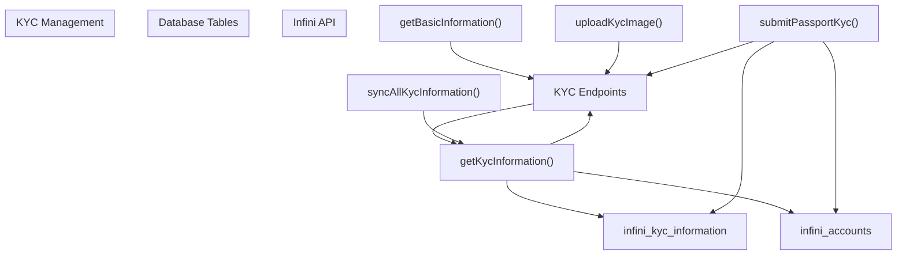
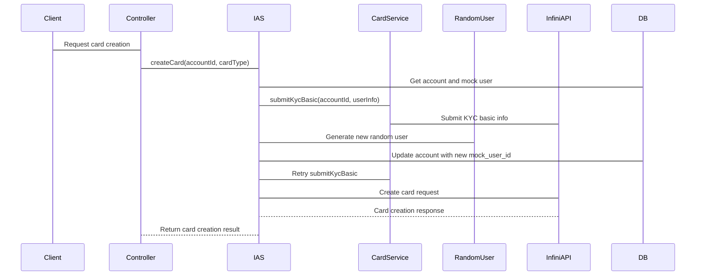
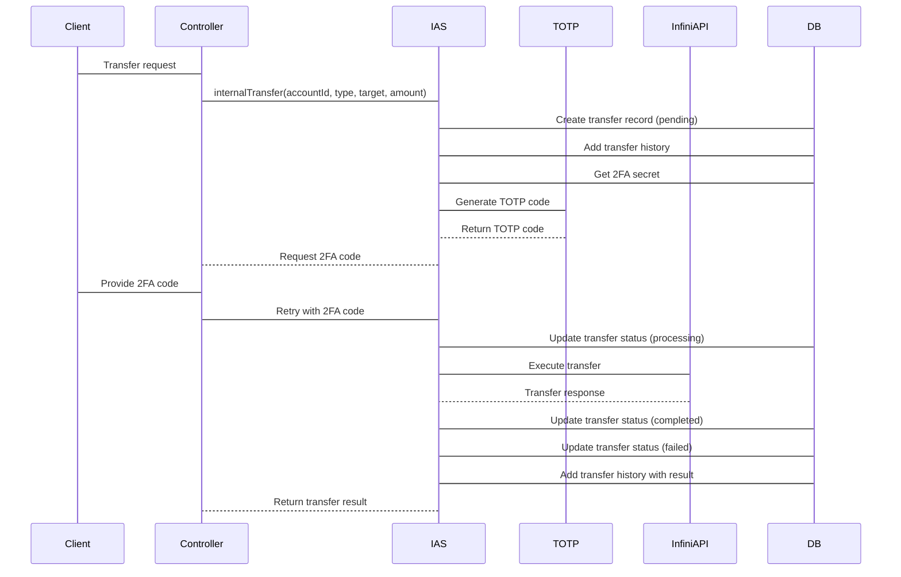

# InfiniAccountService

> **Relevant source files**
> * [backend/src/service/InfiniAccountService.ts](https://github.com/clionertr/infini-manager/blob/328b6a21/backend/src/service/InfiniAccountService.ts)

The InfiniAccountService is the core service responsible for managing Infini accounts within the Infini Manager system. It acts as a bridge between the application's controllers and the external Infini API, providing comprehensive account management capabilities while maintaining local database records for all operations.

This service handles essential account operations including authentication, registration, two-factor authentication (2FA), KYC verification, card management, account grouping, and internal transfers. It serves as the primary interface for all account-related functionality in the system.

For information about controllers that use this service, see [Backend Controllers](/clionertr/infini-manager/3.2-controllers). For API routes, see [API Routes](/clionertr/infini-manager/3.3-api-routes).

## Overview and Architecture

The InfiniAccountService interacts with both the external Infini API (`api-card.infini.money`) and the local database to provide a comprehensive account management system. It also utilizes other services such as InfiniCardService, TotpToolService, and RandomUserService to fulfill specialized operations.

### Position in System Architecture

Sources: [backend/src/service/InfiniAccountService.ts L25-L4414](https://github.com/clionertr/infini-manager/blob/328b6a21/backend/src/service/InfiniAccountService.ts#L25-L4414)

### Service Structure and Capabilities

Sources: [backend/src/service/InfiniAccountService.ts L25-L4414](https://github.com/clionertr/infini-manager/blob/328b6a21/backend/src/service/InfiniAccountService.ts#L25-L4414)

## Core Functionalities

### Authentication and Session Management

The service manages Infini account sessions through cookies. It implements a sophisticated cookie management system that automatically refreshes expired cookies by re-authenticating with stored credentials.

Sources: [backend/src/service/InfiniAccountService.ts L32-L138](https://github.com/clionertr/infini-manager/blob/328b6a21/backend/src/service/InfiniAccountService.ts#L32-L138)

 [backend/src/service/InfiniAccountService.ts L750-L856](https://github.com/clionertr/infini-manager/blob/328b6a21/backend/src/service/InfiniAccountService.ts#L750-L856)

Key methods:

* `getAccountCookie()`: Public method to retrieve a valid cookie for an account, handling re-authentication if needed
* `getCookieForAccount()`: Private method handling the cookie validation and refresh logic
* `loginInfiniAccount()`: Tests login credentials without saving the account

### Account Management

The service provides comprehensive account CRUD operations and synchronization with the Infini platform.

#### Account Registration and Creation

Sources: [backend/src/service/InfiniAccountService.ts L866-L1012](https://github.com/clionertr/infini-manager/blob/328b6a21/backend/src/service/InfiniAccountService.ts#L866-L1012)

Key account management methods:

* `createInfiniAccount()`: Creates a new Infini account and saves to database
* `getAllInfiniAccounts()`: Retrieves all accounts with optional group filtering
* `getInfiniAccountById()`: Gets detailed information for a single account
* `updateInfiniAccount()`: Updates account properties
* `syncInfiniAccount()`: Refreshes account data from Infini API
* `deleteInfiniAccount()`: Removes an account from the system
* `syncAllInfiniAccounts()`: Batch synchronizes all accounts

### Email Verification System

The service implements an email verification system for operations like registration, 2FA setup, and other security-sensitive actions. It includes:

* Sending verification codes to email addresses
* Reading verification codes from email using IMAP
* Validating verification codes for various operations

Sources: [backend/src/service/InfiniAccountService.ts L145-L552](https://github.com/clionertr/infini-manager/blob/328b6a21/backend/src/service/InfiniAccountService.ts#L145-L552)

### Two-Factor Authentication (2FA)

The service provides full 2FA lifecycle management, from setup to verification:

Sources: [backend/src/service/InfiniAccountService.ts L1509-L2446](https://github.com/clionertr/infini-manager/blob/328b6a21/backend/src/service/InfiniAccountService.ts#L1509-L2446)

Key 2FA methods:

* `getGoogle2faQrcode()`: Generates and stores 2FA QR code and secret
* `sendGoogle2faVerificationEmail()`: Sends email verification for 2FA setup
* `bindGoogle2fa()`: Completes 2FA setup with verification codes
* `update2faInfo()`: Updates stored 2FA information

### KYC (Know Your Customer) Verification

The service provides comprehensive KYC management:

Sources: [backend/src/service/InfiniAccountService.ts L1760-L2413](https://github.com/clionertr/infini-manager/blob/328b6a21/backend/src/service/InfiniAccountService.ts#L1760-L2413)

The KYC system tracks verification levels for accounts:

* Level 0: No verification
* Level 1: Basic information submitted
* Level 2: KYC verification completed
* Level 3: KYC verification in progress

### Card Management

The service integrates with InfiniCardService to offer card management capabilities:

Sources: [backend/src/service/InfiniAccountService.ts L2454-L2826](https://github.com/clionertr/infini-manager/blob/328b6a21/backend/src/service/InfiniAccountService.ts#L2454-L2826)

Key card management methods:

* `getCardPrice()`: Gets pricing information for card creation
* `getAvailableCardTypes()`: Returns available card types for an account
* `createCard()`: Creates a new card, handling necessary KYC prerequisites
* `getCardList()`: Retrieves list of cards for an account

### Account Grouping System

The service provides an account organization system through groups:

```mermaid
flowchart TD

subgraph Database_Tables ["Database Tables"]
end

subgraph Account_Group_Management ["Account Group Management"]
end

GetAll["getAllAccountGroups()"]
GetById["getAccountGroupById()"]
Create["createAccountGroup()"]
Update["updateAccountGroup()"]
Delete["deleteAccountGroup()"]
AddAcc["addAccountToGroup()"]
AddAccs["addAccountsToGroup()"]
RemoveAcc["removeAccountFromGroup()"]
RemoveAccs["removeAccountsFromGroup()"]
Groups["infini_account_groups"]
Relations["infini_account_group_relations"]
Accounts["infini_accounts"]

    GetAll --> Groups
    GetAll --> Relations
    GetById --> Groups
    GetById --> Relations
    GetById --> Accounts
    Create --> Groups
    Update --> Groups
    Delete --> Groups
    Delete --> Relations
    AddAcc --> Relations
    AddAccs --> Relations
    RemoveAcc --> Relations
    RemoveAccs --> Relations
```

Sources: [backend/src/service/InfiniAccountService.ts L2927-L3643](https://github.com/clionertr/infini-manager/blob/328b6a21/backend/src/service/InfiniAccountService.ts#L2927-L3643)

### Internal Transfer System

The service provides a robust internal transfer system with comprehensive tracking and history:

Sources: [backend/src/service/InfiniAccountService.ts L3658-L4158](https://github.com/clionertr/infini-manager/blob/328b6a21/backend/src/service/InfiniAccountService.ts#L3658-L4158)

Key transfer functionality:

* `internalTransfer()`: Executes transfers with comprehensive tracking
* `updateTransferStatus()`: Updates transfer status in database
* `addTransferHistory()`: Records detailed transfer history
* `getTransferHistory()`: Retrieves transfer history
* `getTransferRecords()`: Gets paginated transfer records

## Data Model

### Key Database Tables

The InfiniAccountService interacts with several database tables:

| Table | Description | Key Fields |
| --- | --- | --- |
| `infini_accounts` | Stores main account information | id, email, password, uid, cookie, verification_level |
| `infini_account_groups` | Defines account groups | id, name, description, is_default |
| `infini_account_group_relations` | Maps accounts to groups | infini_account_id, group_id |
| `infini_2fa_info` | Stores 2FA setup information | infini_account_id, qr_code_url, secret_key, recovery_codes |
| `infini_kyc_information` | Stores KYC verification data | id, infini_account_id, is_valid, status |
| `infini_transfers` | Records transfer transactions | id, account_id, target_identifier, amount, status |
| `infini_transfer_histories` | Detailed transfer history | transfer_id, status, message, details |

Sources: [backend/src/service/InfiniAccountService.ts L35-L37](https://github.com/clionertr/infini-manager/blob/328b6a21/backend/src/service/InfiniAccountService.ts#L35-L37)

 [backend/src/service/InfiniAccountService.ts L560-L646](https://github.com/clionertr/infini-manager/blob/328b6a21/backend/src/service/InfiniAccountService.ts#L560-L646)

 [backend/src/service/InfiniAccountService.ts L1851-L1870](https://github.com/clionertr/infini-manager/blob/328b6a21/backend/src/service/InfiniAccountService.ts#L1851-L1870)

 [backend/src/service/InfiniAccountService.ts L3658-L4158](https://github.com/clionertr/infini-manager/blob/328b6a21/backend/src/service/InfiniAccountService.ts#L3658-L4158)

## API Integration and External Systems

The InfiniAccountService integrates with several external systems:

1. **Infini API**: The primary external API providing account, KYC, card, and transfer functionality

* Base URL: `https://api-card.infini.money`
* Authentication: Cookie-based (`jwt_token`)
2. **Email (IMAP) Services**: Used to retrieve verification codes for various operations

* Uses ImapFlow library to connect to email servers
* Supports various email providers through configurable connection settings
3. **Internal Services**:

* `TotpToolService`: Generates TOTP codes for 2FA authentication
* `InfiniCardService`: Handles card-specific operations
* `RandomUserService`: Generates random user profiles for KYC data

Sources: [backend/src/service/InfiniAccountService.ts

20](https://github.com/clionertr/infini-manager/blob/328b6a21/backend/src/service/InfiniAccountService.ts#L20-L20)

 [backend/src/service/InfiniAccountService.ts L371-L383](https://github.com/clionertr/infini-manager/blob/328b6a21/backend/src/service/InfiniAccountService.ts#L371-L383)

## Error Handling and Logging

The service implements thorough error handling and logging throughout:

* Detailed error messages with context prefixes
* Comprehensive logging of API calls and responses
* Structured error responses with consistent format
* Transaction-based database operations to maintain data integrity

Source: [backend/src/service/InfiniAccountService.ts L148-L550](https://github.com/clionertr/infini-manager/blob/328b6a21/backend/src/service/InfiniAccountService.ts#L148-L550)

 [backend/src/service/InfiniAccountService.ts L1759-L2068](https://github.com/clionertr/infini-manager/blob/328b6a21/backend/src/service/InfiniAccountService.ts#L1759-L2068)

## Usage Examples

### Account Creation and Setup

The typical account creation flow:

1. Create account with `createInfiniAccount()`
2. Set up 2FA with `getGoogle2faQrcode()` and `bindGoogle2fa()`
3. Submit KYC with `uploadKycImage()` and `submitPassportKyc()`
4. Create card with `createCard()`

### Executing Transfers

Transfer execution with or without 2FA:

1. Call `internalTransfer()` with account, target, and amount
2. If 2FA required, either:
* Provide verification code directly
* Enable auto2FA flag for automatic code generation
3. Monitor transfer status and history with `getTransferHistory()`

## Conclusion

The InfiniAccountService is a comprehensive service for managing Infini accounts, providing a complete set of operations from account creation and authentication to KYC verification, card management, and transfers. It acts as the bridge between the application's controllers and the external Infini API, while maintaining local records of all operations for management and tracking.

Its robust design includes features like automatic cookie management, 2FA integration, detailed operation history, and account organization through groups, making it a central component in the Infini Manager system.