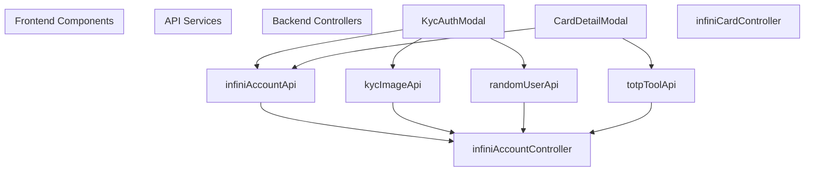
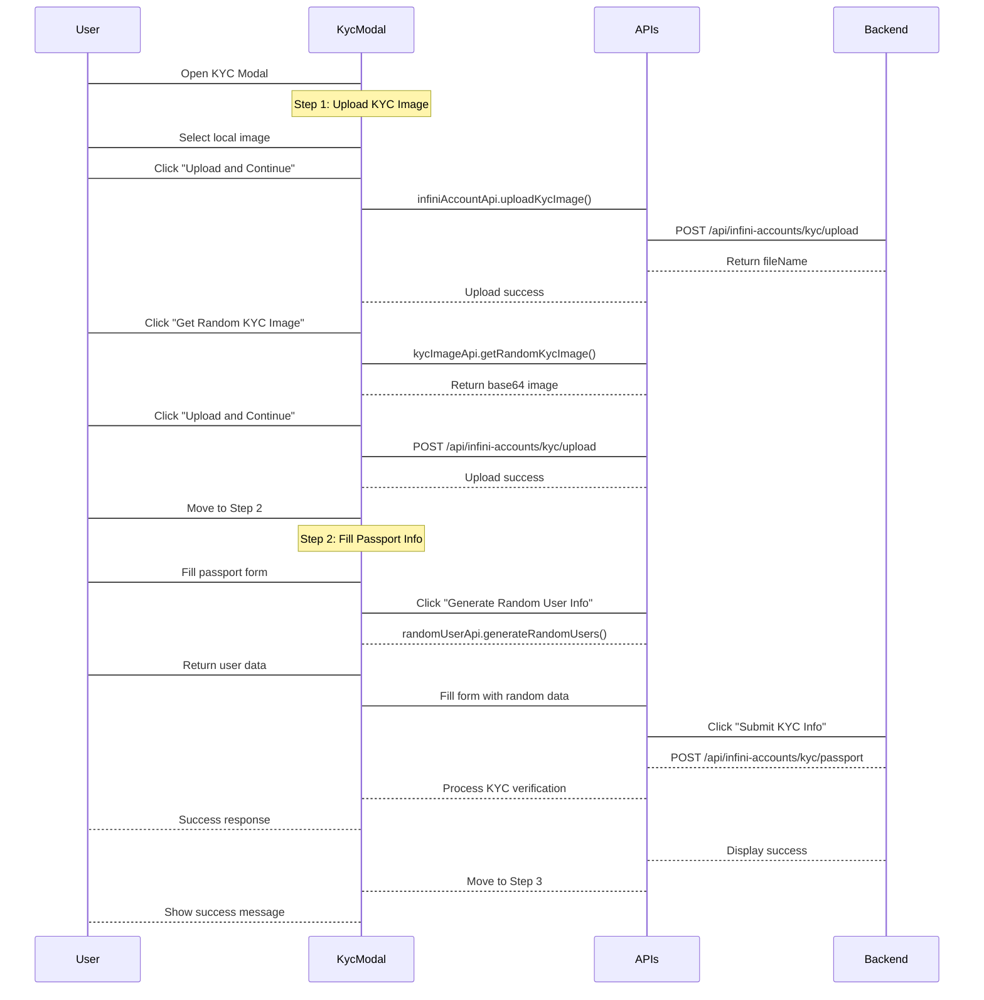
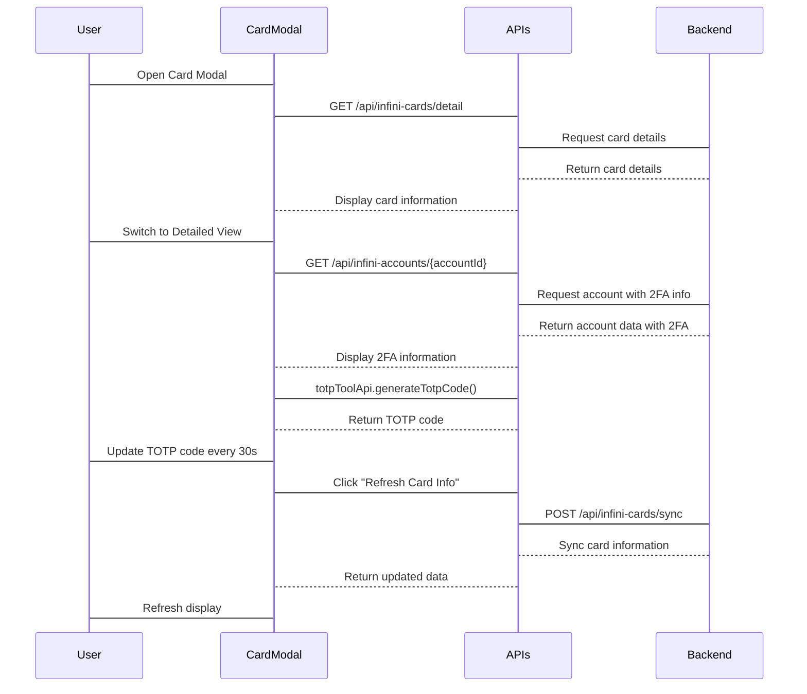
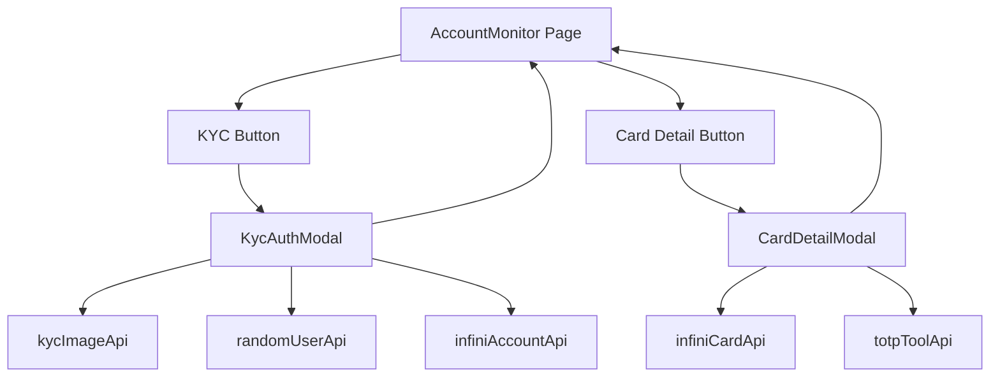

# KYC and Card Components

> **Relevant source files**
> * [frontend/src/components/CardDetailModal.tsx](https://github.com/clionertr/infini-manager/blob/328b6a21/frontend/src/components/CardDetailModal.tsx)
> * [frontend/src/components/KycAuthModal.tsx](https://github.com/clionertr/infini-manager/blob/328b6a21/frontend/src/components/KycAuthModal.tsx)

This document details the frontend UI components used for KYC (Know Your Customer) verification and card management in the Infini Manager system. These components provide user interfaces for verifying identity and viewing/managing virtual cards.

For information about authentication components, see [Authentication Components](/clionertr/infini-manager/2.6.2-authentication-components).

## 1. Overview

The KYC and Card Components consist of two primary modal dialogs:

1. **KYC Authentication Modal** - A multi-step wizard for completing KYC verification via passport information
2. **Card Detail Modal** - A modal dialog for displaying virtual card details with support for 2FA information

These components interact with backend services to process KYC verification and retrieve card information.



Sources: [frontend/src/components/KycAuthModal.tsx L1-L912](https://github.com/clionertr/infini-manager/blob/328b6a21/frontend/src/components/KycAuthModal.tsx#L1-L912)

 [frontend/src/components/CardDetailModal.tsx L1-L910](https://github.com/clionertr/infini-manager/blob/328b6a21/frontend/src/components/CardDetailModal.tsx#L1-L910)

## 2. KYC Authentication Modal

The KYC Authentication Modal (`KycAuthModal`) is a multi-step wizard that guides users through the KYC verification process. It allows users to upload identity documents, enter personal information, and submit verification data.

### 2.1 Component Structure

```

```

Sources: [frontend/src/components/KycAuthModal.tsx L63-L81](https://github.com/clionertr/infini-manager/blob/328b6a21/frontend/src/components/KycAuthModal.tsx#L63-L81)

 [frontend/src/components/KycAuthModal.tsx L549-L755](https://github.com/clionertr/infini-manager/blob/328b6a21/frontend/src/components/KycAuthModal.tsx#L549-L755)

### 2.2 KYC Verification Flow

The KYC verification process follows a three-step workflow:



Sources: [frontend/src/components/KycAuthModal.tsx L100-L504](https://github.com/clionertr/infini-manager/blob/328b6a21/frontend/src/components/KycAuthModal.tsx#L100-L504)

### 2.3 Key Features

1. **KYC Image Upload**

* Manual upload from local files
* Random KYC image generation for testing
* Image preprocessing and validation
2. **Passport Information Form**

* Manual entry of personal details
* Random data generation capability
* Validation and error handling
3. **Country and Phone Code Selection**

* Standardized options for country selection
* International phone code formats
* Proper formatting of user inputs

Sources: [frontend/src/components/KycAuthModal.tsx L39-L60](https://github.com/clionertr/infini-manager/blob/328b6a21/frontend/src/components/KycAuthModal.tsx#L39-L60)

 [frontend/src/components/KycAuthModal.tsx L624-L734](https://github.com/clionertr/infini-manager/blob/328b6a21/frontend/src/components/KycAuthModal.tsx#L624-L734)

## 3. Card Detail Modal

The Card Detail Modal (`CardDetailModal`) provides a comprehensive view of a user's virtual card information, including card number, expiration date, CVV, and related account information.

### 3.1 Component Structure

```

```

Sources: [frontend/src/components/CardDetailModal.tsx L140-L154](https://github.com/clionertr/infini-manager/blob/328b6a21/frontend/src/components/CardDetailModal.tsx#L140-L154)

 [frontend/src/components/CardDetailModal.tsx L157-L908](https://github.com/clionertr/infini-manager/blob/328b6a21/frontend/src/components/CardDetailModal.tsx#L157-L908)

### 3.2 Card Detail Flow



Sources: [frontend/src/components/CardDetailModal.tsx L391-L423](https://github.com/clionertr/infini-manager/blob/328b6a21/frontend/src/components/CardDetailModal.tsx#L391-L423)

 [frontend/src/components/CardDetailModal.tsx L196-L250](https://github.com/clionertr/infini-manager/blob/328b6a21/frontend/src/components/CardDetailModal.tsx#L196-L250)

### 3.3 Key Features

1. **Dual Display Modes**

* Simple mode showing basic card details
* Detailed mode with additional 2FA information
2. **Card Information Display**

* Masked card number with copy functionality
* Expiration date and CVV with security features
* Card status and limit information
3. **2FA Integration**

* QR code generation for 2FA setup
* Real-time TOTP code generation
* Time-based progress indicator
* One-click copy for verification codes
4. **Security Features**

* Secure copy to clipboard functionality
* Warning messages about card information security
* Proper formatting of sensitive information

Sources: [frontend/src/components/CardDetailModal.tsx L485-L906](https://github.com/clionertr/infini-manager/blob/328b6a21/frontend/src/components/CardDetailModal.tsx#L485-L906)

 [frontend/src/components/CardDetailModal.tsx L272-L340](https://github.com/clionertr/infini-manager/blob/328b6a21/frontend/src/components/CardDetailModal.tsx#L272-L340)

## 4. API Integration

Both components interact with several backend services to perform their functions:

| Component | API Service | Endpoint | Purpose |
| --- | --- | --- | --- |
| KycAuthModal | kycImageApi | GET /api/kyc-images/random | Retrieve random KYC image |
| KycAuthModal | infiniAccountApi | POST /api/infini-accounts/kyc/upload | Upload KYC image |
| KycAuthModal | infiniAccountApi | POST /api/infini-accounts/kyc/passport | Submit passport information |
| KycAuthModal | randomUserApi | GET /api/random-users/generate | Generate random user data |
| CardDetailModal | api | GET /api/infini-cards/detail | Retrieve card details |
| CardDetailModal | api | POST /api/infini-cards/sync | Sync card information |
| CardDetailModal | api | GET /api/infini-accounts/{id} | Get account info with 2FA data |
| CardDetailModal | totpToolApi | POST /api/totp-tool/generate | Generate TOTP verification code |
| CardDetailModal | totpToolApi | POST /api/totp-tool/qr-code | Generate QR code for 2FA |

Sources: [frontend/src/components/KycAuthModal.tsx

33](https://github.com/clionertr/infini-manager/blob/328b6a21/frontend/src/components/KycAuthModal.tsx#L33-L33)

 [frontend/src/components/CardDetailModal.tsx

38](https://github.com/clionertr/infini-manager/blob/328b6a21/frontend/src/components/CardDetailModal.tsx#L38-L38)

## 5. Usage and Implementation

These components are typically used within the Account Monitor page of the Infini Manager system:



Sources: [frontend/src/components/KycAuthModal.tsx L63-L81](https://github.com/clionertr/infini-manager/blob/328b6a21/frontend/src/components/KycAuthModal.tsx#L63-L81)

 [frontend/src/components/CardDetailModal.tsx L148-L155](https://github.com/clionertr/infini-manager/blob/328b6a21/frontend/src/components/CardDetailModal.tsx#L148-L155)

### 5.1 Component Props

#### KycAuthModal Props

| Prop | Type | Description |
| --- | --- | --- |
| visible | boolean | Controls modal visibility |
| onClose | function | Callback when modal is closed |
| accountId | string | ID of the account to verify |
| email | string (optional) | Email associated with account |
| onComplete | function (optional) | Callback when KYC verification completes |

#### CardDetailModal Props

| Prop | Type | Description |
| --- | --- | --- |
| visible | boolean | Controls modal visibility |
| onClose | function | Callback when modal is closed |
| accountId | number | ID of the account |
| cardId | string | ID of the card to display |
| cardInfo | object | Basic card information |
| onRefresh | function (optional) | Callback when card data is refreshed |

Sources: [frontend/src/components/KycAuthModal.tsx L63-L70](https://github.com/clionertr/infini-manager/blob/328b6a21/frontend/src/components/KycAuthModal.tsx#L63-L70)

 [frontend/src/components/CardDetailModal.tsx L148-L155](https://github.com/clionertr/infini-manager/blob/328b6a21/frontend/src/components/CardDetailModal.tsx#L148-L155)

## 6. Implementation Notes

1. **KYC Image Handling**

* Images can be uploaded directly or generated randomly
* Supports both file upload and base64 encoding
* Maximum file size of 5MB for uploaded images
2. **Card Security**

* Card numbers, expiration dates, and CVV are properly masked
* Copy functions include success notifications
* Security warnings are displayed to users
3. **Error Handling**

* Both components include comprehensive error handling
* User-friendly error messages
* Special handling for "KYC already exists" scenarios
4. **Accessibility and UX**

* Clear step indicators and progress tracking
* Responsive design with mobile support
* Loading indicators for asynchronous operations

Sources: [frontend/src/components/KycAuthModal.tsx L147-L155](https://github.com/clionertr/infini-manager/blob/328b6a21/frontend/src/components/KycAuthModal.tsx#L147-L155)

 [frontend/src/components/CardDetailModal.tsx L446-L460](https://github.com/clionertr/infini-manager/blob/328b6a21/frontend/src/components/CardDetailModal.tsx#L446-L460)

 [frontend/src/components/KycAuthModal.tsx L395-L504](https://github.com/clionertr/infini-manager/blob/328b6a21/frontend/src/components/KycAuthModal.tsx#L395-L504)