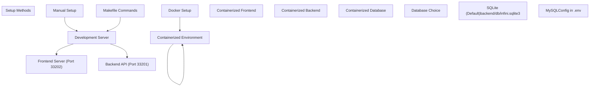
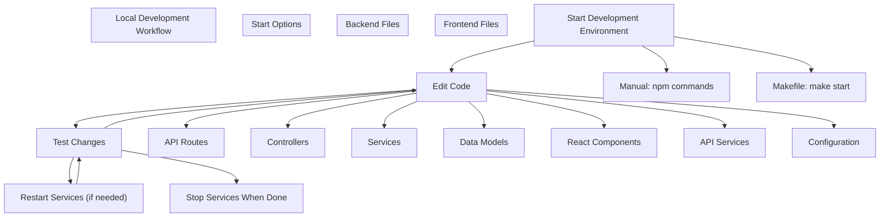
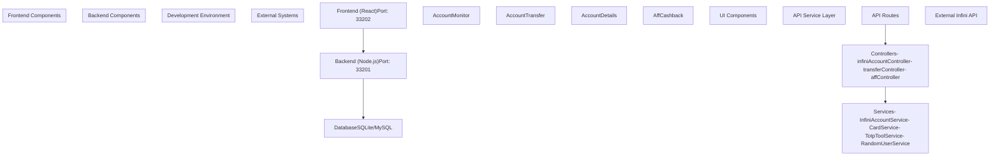

# Local Development Setup

> **Relevant source files**
> * [DEVELOPMENT.md](https://github.com/clionertr/infini-manager/blob/328b6a21/DEVELOPMENT.md)
> * [Makefile](https://github.com/clionertr/infini-manager/blob/328b6a21/Makefile)

This document provides instructions for setting up and running the Infini Manager system in a local development environment. For information about Docker deployment, see [Docker Deployment](/clionertr/infini-manager/4.2-docker-deployment), and for database configuration details, see [Database Configuration](/clionertr/infini-manager/4.3-database-configuration).

## 1. Environment Requirements

Before setting up Infini Manager for local development, ensure your system meets the following requirements:

| Requirement | Version |
| --- | --- |
| Node.js | 14.x or higher |
| npm | 6.x or higher |
| MySQL (optional) | 8.0 (if not using SQLite) |

Sources: [DEVELOPMENT.md L21-L29](https://github.com/clionertr/infini-manager/blob/328b6a21/DEVELOPMENT.md#L21-L29)

## 2. Setup Methods Overview

There are three main methods to set up Infini Manager for local development:



Sources: [DEVELOPMENT.md L31-L142](https://github.com/clionertr/infini-manager/blob/328b6a21/DEVELOPMENT.md#L31-L142)

 [Makefile L1-L239](https://github.com/clionertr/infini-manager/blob/328b6a21/Makefile#L1-L239)

## 3. Method 1: Manual Setup

This approach is recommended for development as it provides the most direct access to the codebase and services.

### 3.1 Clone Repository

```
git clone https://github.com/clionertr/infini-manager.git
cd infini-manager
```

### 3.2 Backend Setup

```
cd backend
npm install
cp .env.example .env  # Copy and modify as needed
npm run dev
```

This will start the backend API service at [http://localhost:33201](http://localhost:33201)

### 3.3 Frontend Setup

In a new terminal:

```
cd frontend
npm install
npm start
```

This will start the frontend development server at [http://localhost:33202](http://localhost:33202)

Sources: [DEVELOPMENT.md L32-L67](https://github.com/clionertr/infini-manager/blob/328b6a21/DEVELOPMENT.md#L32-L67)

## 4. Method 2: Using Makefile

The Makefile provides convenient commands for managing the development environment:

```mermaid
flowchart TD

subgraph Service_Startup_Process ["Service Startup Process"]
end

subgraph Makefile_Commands ["Makefile Commands"]
end

START["make start"]
BACKEND["make backend"]
FRONT["make front"]
STOP["make stop"]
MYSQL["make start-mysql"]
MYSQL_ALL["make start-mysql-all"]
HELP["make help"]
SERVICES["Running Services"]
TERMINATED["Terminated Services"]
INFO["Command Information"]
CHECK_PORT["Check if port is in use"]
KILL_PROCESS["Kill process if port is in use"]
CHECK_DEPS["Check if node_modules exists"]
INSTALL_DEPS["Install dependencies if needed"]
START_SERVICE["Start service"]

    START --> SERVICES
    BACKEND --> SERVICES
    FRONT --> SERVICES
    MYSQL --> SERVICES
    STOP --> TERMINATED
    HELP --> INFO
```



### 4.1 Key Makefile Commands

| Command | Description |
| --- | --- |
| `make start` | Starts both backend and frontend (SQLite) |
| `make backend` | Starts only the backend service |
| `make front` | Starts only the frontend service |
| `make start-mysql` | Starts backend with MySQL database |
| `make start-mysql-all` | Starts all services with MySQL database |
| `make stop` | Stops all running services |
| `make help` | Displays help information for all commands |

Sources: [Makefile L6-L237](https://github.com/clionertr/infini-manager/blob/328b6a21/Makefile#L6-L237)

 [DEVELOPMENT.md L69-L94](https://github.com/clionertr/infini-manager/blob/328b6a21/DEVELOPMENT.md#L69-L94)

## 5. Configuration

### 5.1 Backend Configuration

The backend configuration is managed through environment variables in the `.env` file:

| Environment Variable | Description | Default Value |
| --- | --- | --- |
| PORT | Backend service port | 33201 |
| NODE_ENV | Environment (development/production) | development |
| DB_TYPE | Database type (sqlite/mysql) | sqlite |
| DB_HOST | MySQL host address | localhost |
| DB_PORT | MySQL port | 3307 |
| DB_USER | MySQL username | root |
| DB_PASSWORD | MySQL password | password |
| DB_NAME | MySQL database name | infini_manager |
| DISABLE_IP_CHECK | Disable IP check | false |
| JWT_SECRET | JWT secret key | your_jwt_secret_key_here |

Sources: [DEVELOPMENT.md L227-L243](https://github.com/clionertr/infini-manager/blob/328b6a21/DEVELOPMENT.md#L227-L243)

### 5.2 Frontend Configuration

The frontend uses TypeScript configuration files:

* `frontend/src/config.ts` - Main configuration file
* `frontend/src/config.dev.ts` - Development environment configuration
* `frontend/src/config.docker.ts` - Docker environment configuration

Key frontend configuration parameters:

```mermaid
flowchart TD

subgraph Frontend_Configuration ["Frontend Configuration"]
end

subgraph Docker_Config_Parameters ["Docker Config Parameters"]
end

subgraph Development_Config_Parameters ["Development Config Parameters"]
end

API_URL_DOCKER["API_BASE_URL: '' (empty, proxied by Nginx)"]
CONFIG_FILE["config.ts"]
DEV_CONFIG["config.dev.ts"]
DOCKER_CONFIG["config.docker.ts"]
API_URL_DEV["API_BASE_URL: Unsupported markdown: link"]
PORT_DEV["PORT: 33202"]
DEBUG_DEV["debug: true"]
PORT_DOCKER["PORT: 80"]
DEBUG_DOCKER["debug: false"]
```



Sources: [DEVELOPMENT.md L244-L278](https://github.com/clionertr/infini-manager/blob/328b6a21/DEVELOPMENT.md#L244-L278)

## 6. Database Setup

Infini Manager supports two database options for local development:

### 6.1 SQLite (Default)

* Used by default in local development
* Database file location: `backend/db/infini.sqlite3`
* No additional configuration required

### 6.2 MySQL

For using MySQL:

1. Ensure MySQL server is running
2. Configure backend/.env file:

```
DB_TYPE=mysql
DB_HOST=localhost
DB_PORT=3306  # Your MySQL port
DB_USER=your_username
DB_PASSWORD=your_password
DB_NAME=infini_manager
```

1. Or use the Makefile command to start MySQL in Docker:

```
make mysql-start
```

This creates a Docker container with the following configuration:

* Host: localhost
* Port: 3307
* Username: root
* Password: password
* Database: infini_manager

Sources: [DEVELOPMENT.md L144-L190](https://github.com/clionertr/infini-manager/blob/328b6a21/DEVELOPMENT.md#L144-L190)

 [Makefile L168-L203](https://github.com/clionertr/infini-manager/blob/328b6a21/Makefile#L168-L203)

## 7. Development Workflow



## 8. Troubleshooting

### 8.1 Port Conflicts

If you encounter port conflicts when starting the services:

1. Check if another process is using ports 33201 (backend) or 33202 (frontend)
2. Stop the conflicting process or change the ports in configuration
3. Use `make stop` to stop all Infini Manager services if they're already running

### 8.2 Database Connection Issues

* For SQLite: Ensure the `backend/db` directory exists and has write permissions
* For MySQL: Verify connection parameters in `.env` file and check if MySQL server is running

### 8.3 Dependency Installation Problems

If npm installation fails:

```
# Clear npm cache
npm cache clean --force
# Reinstall dependencies
npm install
```

### 8.4 Reset Database

* SQLite: Delete `backend/db/infini.sqlite3` file
* MySQL: Recreate the database or use reset script if available

Sources: [DEVELOPMENT.md L280-L319](https://github.com/clionertr/infini-manager/blob/328b6a21/DEVELOPMENT.md#L280-L319)

## 9. System Architecture in Development Environment



Sources: All provided files and system architecture diagrams