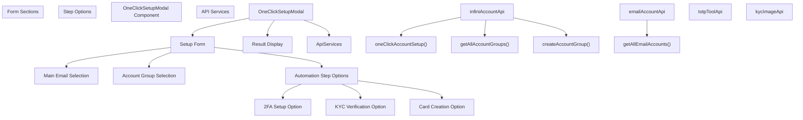
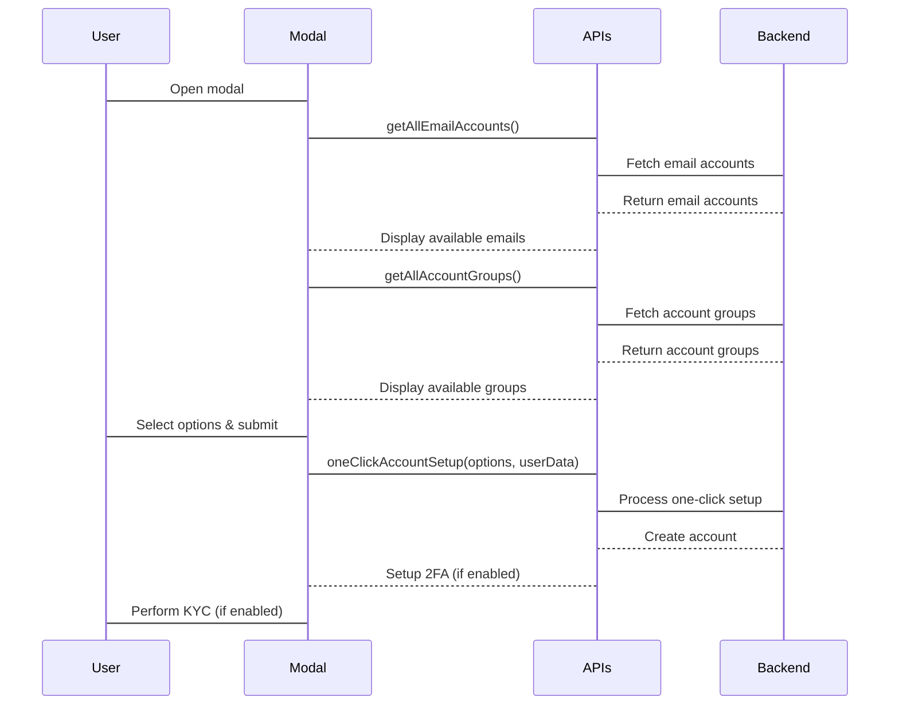
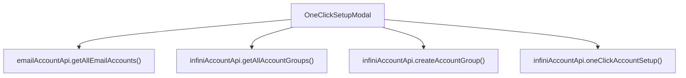

# One-Click Setup Modal

> **Relevant source files**
> * [frontend/src/components/OneClickSetupModal.tsx](https://github.com/clionertr/infini-manager/blob/328b6a21/frontend/src/components/OneClickSetupModal.tsx)

The One-Click Setup Modal is a comprehensive UI component that enables automated account provisioning in the Infini Manager system. It provides a streamlined interface for creating and configuring new Infini accounts with options for automated two-factor authentication (2FA), KYC verification, and card creation—all in a single operation.

For information about other authentication-related components, see [Authentication Components](/clionertr/infini-manager/2.6.2-authentication-components). For KYC and card management components, see [KYC and Card Components](/clionertr/infini-manager/2.6.3-kyc-and-card-components).

## Overview

The One-Click Setup Modal allows administrators to rapidly deploy fully configured Infini accounts without manual intervention at each step of the setup process. It supports selecting a main email for receiving verification codes, assigning accounts to groups, and configuring which automated setup steps should be performed.

Sources: [frontend/src/components/OneClickSetupModal.tsx L1-L553](https://github.com/clionertr/infini-manager/blob/328b6a21/frontend/src/components/OneClickSetupModal.tsx#L1-L553)

## Component Architecture

Sources: [frontend/src/components/OneClickSetupModal.tsx L109-L551](https://github.com/clionertr/infini-manager/blob/328b6a21/frontend/src/components/OneClickSetupModal.tsx#L109-L551)

 [frontend/src/components/OneClickSetupModal.tsx

35](https://github.com/clionertr/infini-manager/blob/328b6a21/frontend/src/components/OneClickSetupModal.tsx#L35-L35)

## Key Features

1. **Account Group Management**: Users can select existing groups or create new groups on-the-fly
2. **Main Email Selection**: Allows choosing which email account will receive verification codes
3. **Automated Setup Options**:
* Two-factor authentication (2FA)
* KYC verification with automatic document submission
* Card creation and activation
4. **Result Reporting**: Detailed feedback on which steps completed successfully

Sources: [frontend/src/components/OneClickSetupModal.tsx L337-L469](https://github.com/clionertr/infini-manager/blob/328b6a21/frontend/src/components/OneClickSetupModal.tsx#L337-L469)

 [frontend/src/components/OneClickSetupModal.tsx L472-L520](https://github.com/clionertr/infini-manager/blob/328b6a21/frontend/src/components/OneClickSetupModal.tsx#L472-L520)

## Data Flow

Sources: [frontend/src/components/OneClickSetupModal.tsx L251-L334](https://github.com/clionertr/infini-manager/blob/328b6a21/frontend/src/components/OneClickSetupModal.tsx#L251-L334)

 [frontend/src/components/OneClickSetupModal.tsx L125-L174](https://github.com/clionertr/infini-manager/blob/328b6a21/frontend/src/components/OneClickSetupModal.tsx#L125-L174)

## Component Props

The component accepts the following properties:

| Property | Type | Description |
| --- | --- | --- |
| `visible` | boolean | Controls the visibility of the modal |
| `onClose` | function | Callback function when modal is closed |
| `onSuccess` | function | Callback function when setup completes successfully |

Sources: [frontend/src/components/OneClickSetupModal.tsx L40-L44](https://github.com/clionertr/infini-manager/blob/328b6a21/frontend/src/components/OneClickSetupModal.tsx#L40-L44)

## State Management

The component manages several pieces of internal state:

| State Variable | Purpose |
| --- | --- |
| `loading` | Tracks whether the setup operation is in progress |
| `setupResult` | Stores the result of the setup operation |
| `mainEmail` | Stores the selected main email address (for display) |
| `selectedEmailId` | Stores the ID of the selected email account |
| `invitationCode` | Stores the invitation code for account creation |
| `emailAccounts` | List of available email accounts |
| `accountGroups` | List of available account groups |
| `selectedGroupId` | Stores the ID of the selected account group |
| `newGroupName` | Stores the name for a new group being created |

Sources: [frontend/src/components/OneClickSetupModal.tsx L111-L123](https://github.com/clionertr/infini-manager/blob/328b6a21/frontend/src/components/OneClickSetupModal.tsx#L111-L123)

## Setup Process

The setup process follows these key steps:

1. **Initial Data Loading**:

* When the modal opens, it fetches available email accounts and account groups
* Automatically selects defaults if available
2. **User Configuration**:

* User selects a main email for receiving verification codes
* User selects or creates an account group
* User chooses which automation steps to enable (2FA, KYC, Card)
* User provides an invitation code (default: "TC7MLI9")
3. **Setup Execution**:

* The form data is submitted to the backend via the `oneClickAccountSetup` API
* The backend executes each selected setup step
* Results for each step are tracked and returned
4. **Result Display**:

* Success or failure is shown with relevant details
* On success, displays the new account ID, user ID, email, and status of each step

Sources: [frontend/src/components/OneClickSetupModal.tsx L125-L174](https://github.com/clionertr/infini-manager/blob/328b6a21/frontend/src/components/OneClickSetupModal.tsx#L125-L174)

 [frontend/src/components/OneClickSetupModal.tsx L251-L334](https://github.com/clionertr/infini-manager/blob/328b6a21/frontend/src/components/OneClickSetupModal.tsx#L251-L334)

 [frontend/src/components/OneClickSetupModal.tsx L472-L520](https://github.com/clionertr/infini-manager/blob/328b6a21/frontend/src/components/OneClickSetupModal.tsx#L472-L520)

## API Integration

The component interacts with several API services:

The primary API call is to `infiniAccountApi.oneClickAccountSetup()`, which handles:

* Account creation with random user information
* Setting up two-factor authentication (if enabled)
* Completing KYC verification (if enabled)
* Creating and activating a card (if enabled)

Sources: [frontend/src/components/OneClickSetupModal.tsx

35](https://github.com/clionertr/infini-manager/blob/328b6a21/frontend/src/components/OneClickSetupModal.tsx#L35-L35)

 [frontend/src/components/OneClickSetupModal.tsx L133-L134](https://github.com/clionertr/infini-manager/blob/328b6a21/frontend/src/components/OneClickSetupModal.tsx#L133-L134)

 [frontend/src/components/OneClickSetupModal.tsx L149-L150](https://github.com/clionertr/infini-manager/blob/328b6a21/frontend/src/components/OneClickSetupModal.tsx#L149-L150)

 [frontend/src/components/OneClickSetupModal.tsx L223-L225](https://github.com/clionertr/infini-manager/blob/328b6a21/frontend/src/components/OneClickSetupModal.tsx#L223-L225)

 [frontend/src/components/OneClickSetupModal.tsx

292](https://github.com/clionertr/infini-manager/blob/328b6a21/frontend/src/components/OneClickSetupModal.tsx#L292-L292)

## Form Validation

The form includes validation for required fields:

* Main email selection
* Account group selection
* Invitation code

Each field has appropriate validation rules to ensure the setup process can proceed successfully.

Sources: [frontend/src/components/OneClickSetupModal.tsx L352-L355](https://github.com/clionertr/infini-manager/blob/328b6a21/frontend/src/components/OneClickSetupModal.tsx#L352-L355)

 [frontend/src/components/OneClickSetupModal.tsx L373-L384](https://github.com/clionertr/infini-manager/blob/328b6a21/frontend/src/components/OneClickSetupModal.tsx#L373-L384)

 [frontend/src/components/OneClickSetupModal.tsx L424-L430](https://github.com/clionertr/infini-manager/blob/328b6a21/frontend/src/components/OneClickSetupModal.tsx#L424-L430)

## Error Handling

The component includes robust error handling:

* Graceful handling of API failures
* Clear error messages displayed to the user
* Option to retry failed operations
* Separation of UI state for loading and results

Sources: [frontend/src/components/OneClickSetupModal.tsx L324-L330](https://github.com/clionertr/infini-manager/blob/328b6a21/frontend/src/components/OneClickSetupModal.tsx#L324-L330)

 [frontend/src/components/OneClickSetupModal.tsx L504-L518](https://github.com/clionertr/infini-manager/blob/328b6a21/frontend/src/components/OneClickSetupModal.tsx#L504-L518)

## Integration with Account Monitor

The One-Click Setup Modal is designed to be launched from the Account Monitor page. After successful account setup, it calls the `onSuccess` callback, which typically refreshes the account list in the parent component to show the newly created account.

Sources: [frontend/src/components/OneClickSetupModal.tsx

323](https://github.com/clionertr/infini-manager/blob/328b6a21/frontend/src/components/OneClickSetupModal.tsx#L323-L323)