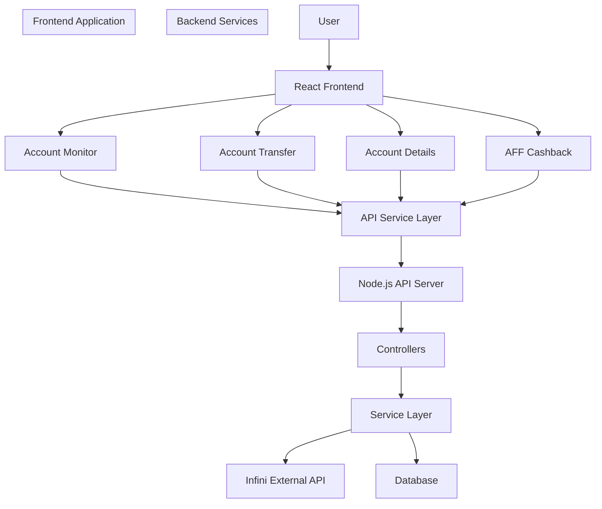
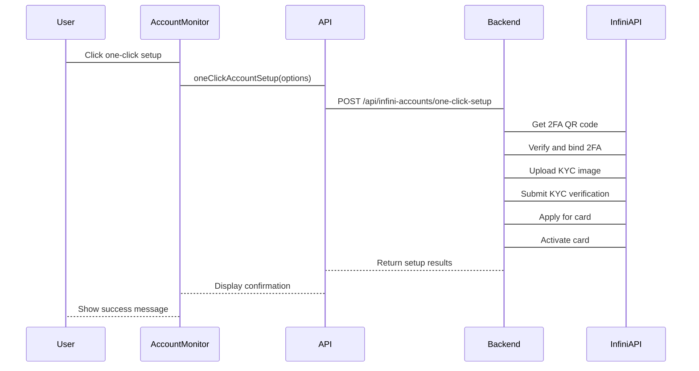
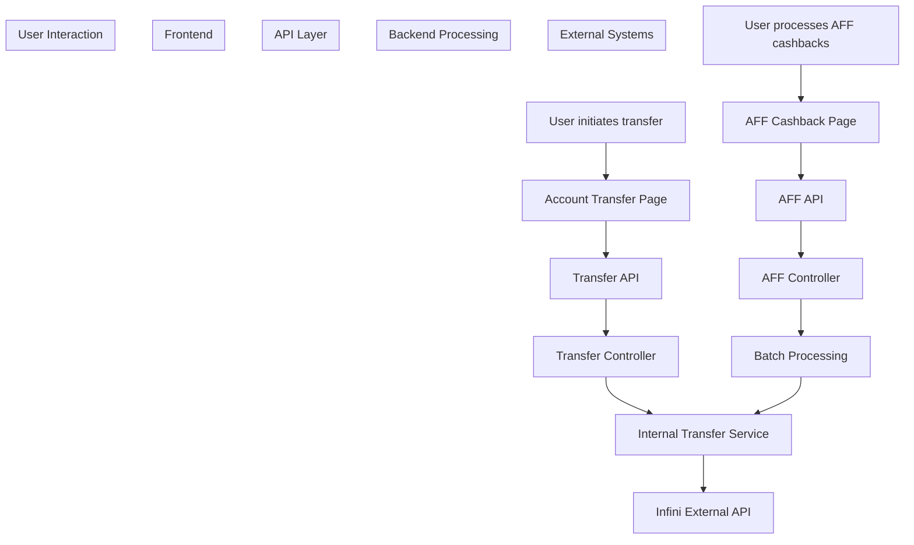

# Overview

> **Relevant source files**
> * [DEVELOPMENT.md](https://github.com/clionertr/infini-manager/blob/328b6a21/DEVELOPMENT.md)
> * [Makefile](https://github.com/clionertr/infini-manager/blob/328b6a21/Makefile)
> * [backend/src/service/InfiniAccountService.ts](https://github.com/clionertr/infini-manager/blob/328b6a21/backend/src/service/InfiniAccountService.ts)
> * [frontend/src/pages/AccountMonitor/index.tsx](https://github.com/clionertr/infini-manager/blob/328b6a21/frontend/src/pages/AccountMonitor/index.tsx)
> * [frontend/src/services/api.ts](https://github.com/clionertr/infini-manager/blob/328b6a21/frontend/src/services/api.ts)

The Infini Manager system is a comprehensive account management suite designed to automate and streamline the process of handling Infini accounts. It provides robust functionality for account monitoring, automated setup, funds transfers, KYC verification, 2FA management, and affiliate cashback processing.

For detailed information about the frontend architecture, see [Frontend Architecture](/clionertr/infini-manager/2-frontend-architecture).

## System Architecture

The Infini Manager system follows a client-server architecture with a React frontend and a Node.js backend. The system acts as a management layer above the core Infini platform, providing enhanced automation capabilities and batch operations.

### High-Level Architecture



Sources: [frontend/src/services/api.ts L15-L1240](https://github.com/clionertr/infini-manager/blob/328b6a21/frontend/src/services/api.ts#L15-L1240)

 [backend/src/service/InfiniAccountService.ts L1-L136](https://github.com/clionertr/infini-manager/blob/328b6a21/backend/src/service/InfiniAccountService.ts#L1-L136)

### Key Components

The system consists of several key components working together:

#### Frontend Components

* **Account Monitor**: Central dashboard for managing Infini accounts, supporting one-click setup including 2FA, KYC, and card creation
* **Account Transfer**: Interface for performing internal fund transfers between accounts
* **Account Details**: Displays account information and transfer histories
* **AFF Cashback**: Manages affiliate cashback processing and batch transfers
* **API Service Layer**: Centralizes API requests to the backend, providing consistent error handling

#### Backend Services

* **InfiniAccountService**: Core service that handles Infini account operations including authentication, 2FA setup, KYC verification, and balance management
* **Controllers**: API endpoints that handle HTTP requests and orchestrate business logic
* **External API Integration**: Communication with the Infini platform's external API
* **Database**: Stores account information, transactions, and system settings

Sources: [frontend/src/services/api.ts L30-L590](https://github.com/clionertr/infini-manager/blob/328b6a21/frontend/src/services/api.ts#L30-L590)

 [backend/src/service/InfiniAccountService.ts L25-L1138](https://github.com/clionertr/infini-manager/blob/328b6a21/backend/src/service/InfiniAccountService.ts#L25-L1138)

### Database Architecture

The system supports both SQLite and MySQL databases, with the following key entities:

```
#mermaid-0dvq5qvvqjn{font-family:ui-sans-serif,-apple-system,system-ui,Segoe UI,Helvetica;font-size:16px;fill:#333;}@keyframes edge-animation-frame{from{stroke-dashoffset:0;}}@keyframes dash{to{stroke-dashoffset:0;}}#mermaid-0dvq5qvvqjn .edge-animation-slow{stroke-dasharray:9,5!important;stroke-dashoffset:900;animation:dash 50s linear infinite;stroke-linecap:round;}#mermaid-0dvq5qvvqjn .edge-animation-fast{stroke-dasharray:9,5!important;stroke-dashoffset:900;animation:dash 20s linear infinite;stroke-linecap:round;}#mermaid-0dvq5qvvqjn .error-icon{fill:#dddddd;}#mermaid-0dvq5qvvqjn .error-text{fill:#222222;stroke:#222222;}#mermaid-0dvq5qvvqjn .edge-thickness-normal{stroke-width:1px;}#mermaid-0dvq5qvvqjn .edge-thickness-thick{stroke-width:3.5px;}#mermaid-0dvq5qvvqjn .edge-pattern-solid{stroke-dasharray:0;}#mermaid-0dvq5qvvqjn .edge-thickness-invisible{stroke-width:0;fill:none;}#mermaid-0dvq5qvvqjn .edge-pattern-dashed{stroke-dasharray:3;}#mermaid-0dvq5qvvqjn .edge-pattern-dotted{stroke-dasharray:2;}#mermaid-0dvq5qvvqjn .marker{fill:#999;stroke:#999;}#mermaid-0dvq5qvvqjn .marker.cross{stroke:#999;}#mermaid-0dvq5qvvqjn svg{font-family:ui-sans-serif,-apple-system,system-ui,Segoe UI,Helvetica;font-size:16px;}#mermaid-0dvq5qvvqjn p{margin:0;}#mermaid-0dvq5qvvqjn .entityBox{fill:#ffffff;stroke:#dddddd;}#mermaid-0dvq5qvvqjn .relationshipLabelBox{fill:#dddddd;opacity:0.7;background-color:#dddddd;}#mermaid-0dvq5qvvqjn .relationshipLabelBox rect{opacity:0.5;}#mermaid-0dvq5qvvqjn .labelBkg{background-color:rgba(221, 221, 221, 0.5);}#mermaid-0dvq5qvvqjn .edgeLabel .label{fill:#dddddd;font-size:14px;}#mermaid-0dvq5qvvqjn .label{font-family:ui-sans-serif,-apple-system,system-ui,Segoe UI,Helvetica;color:#333;}#mermaid-0dvq5qvvqjn .edge-pattern-dashed{stroke-dasharray:8,8;}#mermaid-0dvq5qvvqjn .node rect,#mermaid-0dvq5qvvqjn .node circle,#mermaid-0dvq5qvvqjn .node ellipse,#mermaid-0dvq5qvvqjn .node polygon{fill:#ffffff;stroke:#dddddd;stroke-width:1px;}#mermaid-0dvq5qvvqjn .relationshipLine{stroke:#999;stroke-width:1;fill:none;}#mermaid-0dvq5qvvqjn .marker{fill:none!important;stroke:#999!important;stroke-width:1;}#mermaid-0dvq5qvvqjn :root{--mermaid-font-family:"trebuchet ms",verdana,arial,sans-serif;}belongs_tocontainsmakesparticipates_incontainshasINFINI_ACCOUNTSidintPKuser_idstringemailstringpasswordstringavailable_balancedecimalcookiestringlast_sync_atdatetimeverification_levelintgoogle_2fa_is_boundbooleanmock_user_idintFKACCOUNT_GROUPSidintPKnamestringdescriptionstringis_defaultbooleanACCOUNT_GROUP_RELATIONSidintPKinfini_account_idintFKgroup_idintFKTRANSFERSidintPKaccount_idintFKtarget_identifierstringamountdecimalstatusstringAFF_CASHBACKSidintPKstatusstringcreated_atdatetimeAFF_RELATIONSidintPKcashback_idintFKaccount_idintFKamountdecimalstatusstringKYC_INFORMATIONidintPKinfini_account_idintFKfirst_namestringlast_namestringstatusint
```

Sources: [backend/src/service/InfiniAccountService.ts L558-L659](https://github.com/clionertr/infini-manager/blob/328b6a21/backend/src/service/InfiniAccountService.ts#L558-L659)

## Key Features

### Account Management

The Account Monitor provides comprehensive management capabilities for Infini accounts:

* **Account Creation**: Register new Infini accounts with email and password
* **Account Monitoring**: View and track account balances, KYC status, and security settings
* **One-Click Setup**: Automate 2FA configuration, KYC verification, and card creation
* **Batch Operations**: Perform actions on multiple accounts simultaneously

Sources: [frontend/src/pages/AccountMonitor/index.tsx L1-L4](https://github.com/clionertr/infini-manager/blob/328b6a21/frontend/src/pages/AccountMonitor/index.tsx#L1-L4)

 [frontend/src/pages/AccountMonitor/index.tsx L75-L80](https://github.com/clionertr/infini-manager/blob/328b6a21/frontend/src/pages/AccountMonitor/index.tsx#L75-L80)

### Money Transfers

Account Transfer functionality allows for:

* **Internal Transfers**: Move funds between Infini accounts
* **Transfer History**: Track and view all transfer operations
* **AFF Cashbacks**: Manage affiliate rewards through batch transfers

Sources: [frontend/src/services/api.ts L84-L249](https://github.com/clionertr/infini-manager/blob/328b6a21/frontend/src/services/api.ts#L84-L249)

### Security Features

The system provides robust security management:

* **Two-Factor Authentication**: Setup and manage 2FA for Infini accounts
* **KYC Verification**: Streamline the Know Your Customer verification process
* **Card Management**: Apply for and manage virtual cards

Sources: [frontend/src/pages/AccountMonitor/index.tsx L72-L77](https://github.com/clionertr/infini-manager/blob/328b6a21/frontend/src/pages/AccountMonitor/index.tsx#L72-L77)

## Operational Flow

### Account Setup Process



Sources: [frontend/src/pages/AccountMonitor/index.tsx L79-L1077](https://github.com/clionertr/infini-manager/blob/328b6a21/frontend/src/pages/AccountMonitor/index.tsx#L79-L1077)

 [frontend/src/services/api.ts L437-L457](https://github.com/clionertr/infini-manager/blob/328b6a21/frontend/src/services/api.ts#L437-L457)

### Transfer and Cashback Flow



Sources: [frontend/src/services/api.ts L84-L250](https://github.com/clionertr/infini-manager/blob/328b6a21/frontend/src/services/api.ts#L84-L250)

 [frontend/src/services/api.ts L798-L952](https://github.com/clionertr/infini-manager/blob/328b6a21/frontend/src/services/api.ts#L798-L952)

## Deployment Options

The Infini Manager system offers several deployment methods to accommodate different environments and requirements:

| Deployment Method | Command | Description | Use Case |
| --- | --- | --- | --- |
| Local Development | `make start` | Starts backend and frontend with SQLite | Development |
| MySQL Local | `make start-mysql-all` | Starts with MySQL database | Testing |
| Docker SQLite | `make docker-sqlite` | Docker deployment with SQLite | Light production |
| Docker MySQL | `make docker-start` | Full Docker deployment with MySQL | Production |

For detailed deployment instructions, see [Development and Deployment](/clionertr/infini-manager/4-development-and-deployment).

Sources: [Makefile L1-L240](https://github.com/clionertr/infini-manager/blob/328b6a21/Makefile#L1-L240)

## Database Configuration

The system supports both SQLite and MySQL databases:

* **SQLite**: Default for development, stores data in a local file
* **MySQL**: Recommended for production, supports higher concurrency

Database configuration is managed through environment variables in the `.env` file:

```
DB_TYPE=sqlite|mysql
DB_HOST=localhost
DB_PORT=3307
DB_USER=root
DB_PASSWORD=password
DB_NAME=infini_manager
```

For detailed database configuration, see [Database Configuration](/clionertr/infini-manager/4.3-database-configuration).

Sources: [DEVELOPMENT.md L145-L184](https://github.com/clionertr/infini-manager/blob/328b6a21/DEVELOPMENT.md#L145-L184)

## System Requirements

* **Node.js**: 14.x or higher
* **npm**: 6.x or higher
* **Optional**: Docker and Docker Compose (for containerized deployment)
* **Optional**: MySQL 8.0 (if not using SQLite or Docker)

For more information on setting up the development environment, see [Local Development Setup](/clionertr/infini-manager/4.1-local-development-setup).

Sources: [DEVELOPMENT.md L22-L29](https://github.com/clionertr/infini-manager/blob/328b6a21/DEVELOPMENT.md#L22-L29)